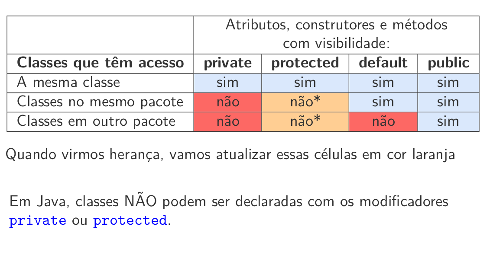

# Pacotes

* Java fornece um mecanismo de agrupamento de classes em pacotes
(em inglês, packages), com o qual podemos criar grupos de classes que mantêm uma relação entre si.
* Um pacote é uma coleção de classes relacionadas que provê acesso protegido e gerenciamento de espaço de nomes.
* Conjuntos de classes relacionadas são organizadas em pacotes para:
    * facilitar a localização e uso de tipos
    * evitar conflitos de nomes;
    * fazer controle de acesso.

Exemplo
*  Os diretórios estão diretamente relacionados aos pacotes e costumam
agrupar classes de funcionalidades similares ou relacionadas.
* Por exemplo, no pacote java.util temos as classes Date,
SimpleDateFormat e GregorianCalendar.
Todas elas trabalham com datas de formas diferentes.


## Criando pacotes de classes
* A maneira mais simples de criar um pacote de classes é criar um diretório
e colocar lá todos os códigos-fonte das classes que serão consideradas
pertencentes àquele pacote.
*  Importante: Cada classe pertencente a um pacote deve ter, no inı́cio do
arquivo, antes de qualquer outra declaração, a palavra-chave package seguida do nome do pacote (caminho de diretórios) ao qual esta classe deverá pertencer.
* Todas as classes criadas sem declaração de pertinência em pacotes pertencem ao chamado pacote default.
    *  As classes criadas assim pertencem ao mesmo pacote e não são necessárias declarações adicionais quando usamos instâncias de uma classe dentro da outra.
    *  O compilador e a máquina virtual se encarregarão de chamar os métodos dessas classes.

## Criando pacotes de classes – Exemplo

* Considere as classes Data, Hora e DataHora, que encapsula uma data e
uma hora através do mecanismo de composição.
    *  Vamos criar o pacote ufc.quixada.datahora com as três classes acima armazenadas em um diretório ufc/quixada/datahora.


# Padrão da nomenclatura dos pacotes
* As empresas usam seu nome de domı́nio na Internet de forma reversa para
nomear seus pacotes, por exemplo:
br.com.nomedaempresa.nomedoprojeto.subpacote para um pacote
denominado subpacote criado por um programador em
nomedoprojeto.nomedaempresa.com.br

* As colisões de nomes que ocorrem dentro de uma única empresa precisam
ser tratadas por convenção dentro dessa empresa, talvez incluindo a
região ou o nome do projeto após o nome da empresa.
* Os pacotes só têm letras minúsculas, não importa quantas palavras
estejam contidas neles.

## Importação de Classe
* Uma classe pode usar todas as classes do seu pacote e todas as classes
públicas de outros pacotes.
* Podemos acessar uma classe pública em outro pacote de duas formas:
* escrevendo o nome completo do pacote antes do nome da classe:
```java
java.util.Scanner input;
```
◦ Usando a palavra-chave import. A declaração import permite que
façamos referência à classe usando apenas o nome dela:
```Java
import java.util.Scanner;
Scanner input;
```
• Podemos importar todos as classes de um pacote (exceto os subpacotes)
usando o sı́mbolo ∗:

Exemplo: 
```Java
import java.util.*;
```

## Observações
```
A sintaxe import java.util.* não tem efeito negativo no tamanho
do código.
Porém, importar as classes uma por uma é considerada boa prática de
programação em Java, pois facilita a leitura para outros programado-
res.
```

* É muito importante manter a ordem:
    * primeiro aparece uma (ou nenhuma) vez o package
    * depois aparecem os imports
    * e, por último, as declarações de classe

## Cuidados com nomes conflitantes
*  Ambos os pacotes java.util e java.sql possuem uma classe Date.
* Se você escrever um programa que importe ambos os pacotes e use a
classe Date, você obterá um erro de compilação:
```Java
import java.util.*;
import java.sql.*;
...
Date today; // Erro de compilação
```
• Isso pode ser resolvido adicionando um import especı́fico:
```Java
import java.util.*;
import java.sql.*;
import java.util.Date;
```


## Cuidados com nomes conflitantes
*  Se você realmente quiser usar as duas classes, então terá que usar o nome
completo do pacote juntamente ao nome da classe.
```Java
java.util.Date deadline = new java.util.Date();
java.sql.Date.today = new java.sql.Date(...);
```
*  Obs.: Os bytecodes nos arquivos .class usam os nomes completos dos
pacotes para se referirem a outras classes.
*  Observação O import do Java não tem nada em comum com o
#include do C++
*  Em C++, um análogo ao mecanismo de pacotes do Java é o
namespace.
* Assim, package e import no Java teriam como análogos no
C++ o namespace e a diretiva using, respectivamente.


## Organização do código e das classes
*  Se houverem múltiplas classes em um mesmo arquivo, somente uma delas
pode ser public, e deve ter o mesmo nome do arquivo-fonte.
*  Uma boa prática consiste em colocar uma classe por arquivo.
*  Uma vez que outros programadores irão utilizar essa classe, quando
precisarem olhar o código da mesma, fica mais fácil encontrá-la
sabendo que ela está no arquivo de mesmo nome.
*  Somente os membros public de um pacote são visı́veis fora do pacote,
isso inclui as classes, seus construtores, atributos e métodos.


## Static imports
* Também é possı́vel importar métodos e atributos estáticos (static)
* Conhecemos a classe Math, do pacote java.lang, que possui vários
métodos estáticos como, por exemplo:
* Math.sqrt(), Math.sin(), Math.cos(), Math.abs(), Math.pow(), etc.
* É possı́vel usar os métodos estáticos da classe Math sem ter de colocar o
nome da classe antes do nome do método. Para isso, basta colocar um
static import no inı́cio do arquivo que usa esses métodos:
```Java
import static java.lang.Math.*;
```
```Java
import static java.lang.Math.*;

public class StaticImport {
    public static void main(String[] args) {
        System.out.println("sqrt(900.0) = " + sqrt(900.0));
        System.out.println("ceil(-9.8) = " + ceil(-9.8));
        System.out.println("PI = " + PI);
        System.out.println("E = " + E);
    }
} 
```

## O pacote default
* Se nenhum nome de pacote for utilizado, seus tipos serão membros de um
pacote default, que é um pacote sem nome.
* Caso as classes sejam declaradas sem serem pertencentes a pacotes, serão
consideradas parte do pacote default, e campos e métodos declarados sem
modificadores serão públicos para todas as outras classes do pacote
default.
* Esta prática só faz sentido em aplicações muito pequenas, de caráter
temporário, ou em uma fase inicial da programação.

## Modificadores de acesso e pacotes



## Modificadores de acesso e pacotes
Construtores
* Em Java, construtores podem ser protected.
* Tornar um construtor protegido previne que usuários possam criar uma
instância da classe fora do pacote (o mesmo efeito do package access)
◦ Um construtor protegido só pode ser acessado dentro do pacote em
que ele foi definido ou fora do pacote por uma classe herdeira.
◦ Analisar o código do Projeto Animal

```Java
package zoo;

public class Girafa {
    String nome;

    protected Girafa(String nome) {
        this.nome = nome;
    }
}
```

```Java
package zoo;

public class Zebra {
    String nome;

    public Zebra(String nome) {
        this.nome = nome;
    }
}
```

```Java
package zoo;

import java.util.ArrayList;

public class Manada {
    public static void main(String[] args) {
        ArrayList<Girafa> manadaDeGirafas = new ArrayList<>();

        manadaDeGirafas.add(new Girafa("lili")); // ok
        manadaDeGirafas.add(new Girafa("beta")); // ok
        manadaDeGirafas.add(new Girafa("toni")); // ok

        for(Girafa g : manadaDeGirafas)
            System.out.println(g);
    }
}
```

```Java
import zoo.Girafa; // A classe Girafa é visível pois é pública
import zoo.Zebra;

public class App {
    public static void main(String[] args) throws Exception {
        Zebra zeze = new Zebra("zeze");
        System.out.println(zeze);
        
        //Girafa gigi = new Girafa("gigi"); // erro: não é possível instanciar
        //System.out.println(gigi);
    }
}
```


* Em Java, construtores podem ser private.
* Definir todos os construtores de uma classe como privado, impossibilita
instanciar objetos da classe. Isso pode ser útil se você tiver uma classe
que apenas tem métodos e atributos static (uma biblioteca).
* Construtores privados podem ser utilizados também para limitar o
número de objetos instanciados. Exemplo: Ver os arquivos
ClasseLimitada.java e ClasseLimitadaTeste

```Java
/**
 * A ClasseLimitada permite que sejam instanciadas no
 * máximo cinco objetos desta classe.
 */
public class ClasseLimitada {
    private static final byte MAX = 5; // número máximo de objetos instanciados
    private static int contador = 0; // número de objetos instanciados

    /**
     * Construtor privado!
     */
    private ClasseLimitada() {
        contador++; 
        System.out.println("Objeto " + contador + " criado");
    }

    public static ClasseLimitada getInstance() {
        if(contador < MAX) 
            return new ClasseLimitada();
        else 
            return null;
    }
}


```

```Java
public class ClasseLimitadaTeste {
    public static void main(String[] args) {
            ClasseLimitada obj1 = ClasseLimitada.getInstance();
            ClasseLimitada obj2 = ClasseLimitada.getInstance();
            ClasseLimitada obj3 = ClasseLimitada.getInstance();
            ClasseLimitada obj4 = ClasseLimitada.getInstance();
            ClasseLimitada obj5 = ClasseLimitada.getInstance();
            ClasseLimitada obj6 = ClasseLimitada.getInstance();
            ClasseLimitada obj7 = ClasseLimitada.getInstance();
            System.out.println(obj1);
            System.out.println(obj2);
            System.out.println(obj3);
            System.out.println(obj4);
            System.out.println(obj5);
            System.out.println(obj6);
            System.out.println(obj7);
    }
}

/*
Objeto 1 criado
Objeto 2 criado
Objeto 3 criado
Objeto 4 criado
Objeto 5 criado
ClasseLimitada@764c12b6
ClasseLimitada@c387f44
ClasseLimitada@4e0e2f2a
ClasseLimitada@73d16e93
ClasseLimitada@659e0bfd
null
null
*/
```

## Documentação de classes
*  Java possui um mecanismo de geração de documentação que cria documentos em HTML a partir de comentários escritos no próprio código.
*  Isso facilita a tarefa do programador — em um mesmo documento ele
escreve o que o código faz e quais informações pertinentes devem ser
incluı́das na documentação.
*  Tudo o que for escrito entre os conjuntos de caracteres /** e */ é
considerado comentário. Se o conteúdo entre /** e */ seguir certas
regras, poderemos documentar classes e métodos usando os próprios
comentários.

## Documentação da classe

* Para documentar uma classe, devemos criar um único comentário
imediatamente antes da declaração da classe.

```Java
package ufc.quixada.datahora;

/**
 * A classe data encapsula os dados de uma data qualquer e
 * faz parte do pacote ufc.quixada.datahora
 * @author Atilio Gomes
 * @version 1.0
 */
public class Data {
    /**
     * Esse campo encapsula o dia
     */
    protected byte dia;
    /**
     * Esse campo encapsula o mês
     */
    protected byte mes;
    /**
     * Esse campo encapsula o ano
     */
    protected short ano;

    private static final int[] diasPorMes = 
        {0, 31, 28, 31, 30, 31, 30, 31, 31, 30, 31, 30, 31};

    /**
     * O Construtor da classe, que recebe argumentos para 
     * inicializar os atributos da classe. Note que o 
     * construtor é declarado como sendo público, caso 
     * contrário ele não poderá ser chamado de fora do pacote.
     * @param dia o dia a ser encapsulado por uma instância 
     *  dessa classe
     * @param mes o mês a ser encapsulado por uma instância 
     *  dessa classe
     * @param ano o ano a ser encapsulado por uma instância 
     *  dessa classe
     * @throws IllegalArgumentException no caso de uma data 
     *  inválida
     */
    public Data(byte dia, byte mes, short ano) {
        // checa se o mês está dentro do intervalo
        if(mes < 1 || mes > 12) {
            throw new IllegalArgumentException("mês(" + mes + ") deveria ser 1-12");
        }

        // checa se o dia está dentro do intervalo esperado para o mês
        if(dia <= 0 || (dia > diasPorMes[mes] && !(mes == 2 && dia == 29))) {
            throw new IllegalArgumentException("dia(" + dia + ") fora do intervalo");
        }

        // checa se o ano é bissexto no caso do dia ser 29 e o mês ser 2
        if(mes == 2 && dia == 29 && !(ano % 400 == 0 ||
            (ano % 4 == 0 && ano % 100 != 0))) {
                throw new IllegalArgumentException("dia(" + dia + ") fora do intervalo");
        }

        this.dia = dia;
        this.mes = mes;
        this.ano = ano;
    }

    public byte getDia() {
        return dia;
    }

    public byte getMes() {
        return mes;
    }
    
    public short getAno() {
        return ano;
    }

    /**
     * Este método devolve um objeto String contendo a 
     * data no formato dd/mm/aaaa
     * @return uma String contendo a data no formato dd/mm/aaaa
     */
    public String toString() {
        return String.format("%02d/%02d/%04d", dia, mes, ano);
    }
}
``` 

## Marcadores
*  Comentários de documentação de classe podem conter marcadores (tags)
especiais, que devem estar em linhas separadas. Exemplos:
    * @author: pode ser seguido de um nome de autor. Podemos ter múltiplos marcadores author, se houver vários autores por classe.
    * @version: pode ser seguido de um identificador de versão.
    * @see: pode ser usado em qualquer lugar para referenciar uma outra classe ou um método de outra classe que podem ser de interesse para o programador que utiliza essa classe. Esse marcador geralmente assume uma das duas forma a seguir:
    * @see nome-da-classe
    * @see nome-da-classe#nome-do-método


Os comentários de documentação podem conter múltiplos tags @see.


## Documentação de atributos
*  Comentários de atributos devem estar imediatamente antes da declaração
dos atributos.
*  Por default, somente os atributos protegidos e públicos de uma classe
serão incluı́dos na documentação, e devem ser comentados
separadamente.

## Documentação de métodos e construtores
*  Comentários de métodos e construtores também devem ser escritos imediatamente antes da declaração dos métodos e construtores.
*  Comentários de métodos e construtores também podem conter alguns
marcadores especiais:
    * @param: deve ser seguido de um nome de parâmetro e de uma descrição simples deste parâmetro. Devemos ter um marcador destes para cada argumento passado para o método, e cada marcador deve estar em uma linha do comentário de documentação. O marcador @param pode ser usado apenas com métodos e construtores. Os comentários de documentação podem conter múltiplos tags @param.
    * @return: deve ser seguido de uma descrição do que o método retorna, se o método for declarado como retornando algo que não seja void.
    * @throws: especifica as exceções lançadas pelo método. Deve ser fornecido para cada tipo de exceção lançado pelo método.

## Outros marcadores


## javadoc

* Para gerar a documentação HTML, basta acessar, via terminal, o
diretório onde estão os arquivos .java e digitar o comando:
javadoc -version -author -d doc *java
*  A documentação será então gerada e os arquivos resultantes serão
colocados dentro do subdiretório doc do diretório atual. O nome desse
diretório pode ser alterado mudando-se a palavra que segue a flag -d.
*  Podemos forçar o javadoc a gerar documentação também para a parte
privada. Basta acrescentar a flag -private na linha de comando acima.
*  Uma de várias outras possibilidades é abrir o terminal na pasta do projeto
e digitar o comando:
javadoc -version -author -private -d doc
ufc.quixada.datahora


