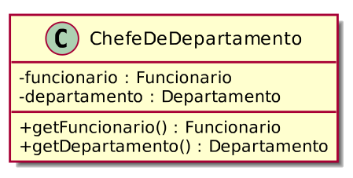

# Herança

## Reuso de Classe

* Até agora 3 relacionamentos entre objetos que permitem o reuso de classes:
    * Associação, Agregação e Composição
* Nestes relacionamentos, um objeto de uma classe contém uma
referência para um objeto de outra classe.
  * A tem um B
  * A contém B
  * A é formada por B
* Esse mecanismo é chamado de delegação.
* Porém, nem sempre o mecanismo de delegação é o mais natural para a
reutilização de classes já existentes.


* Temos duas classes Pessoa e Funcionario tal que uma instância de Pessoa é declarada dentro da classe Funcionario para representar os dados da pessoa/funcionário.


* Queremos criar uma classe ChefeDeDepartamento. Um chefe de
departamento é um funcionário que é responsável por um departamento.
Usando o mecanismo de delegação, podemos declarar uma instância de Funcionario dentro da classe ChefeDeDepartamento e acrescentar alguns campos que diferenciam
ChefeDeDepartamento de Funcionario.




Problema: Declarar que ChefeDeDepartamento contém um funcionário soa artificial — um chefe de departamento é um tipo de funcionário, que tem campos adicionais para representar dados especı́ficos de um chefe de departamento, e métodos para manipular esses campos.


## Herança
* Herança é um tipo de relacionamento entre classes que permite que uma
classe herde todos os dados e comportamentos de outra classe.
* O mecanismo de herança é o mais apropriado para criar relações
é-um-tipo-de entre classes.
* Superclasse: é a classe cujas propriedades são herdadas por outra
classe. É também chamada de classe base ou classe pai.
* Subclasse: é a classe que herda propriedades da classe base. É
também chamada de classe derivada ou classe filha.

## Herança


## Herança — Superclasses e subclasses

* Uma subclasse é uma forma
especializada da superclasse.
*  Uma subclasse também pode vir a ser uma superclasse.
*  A superclasse direta é a superclasse da
qual a subclasse herda explicitamente.
* As outras são consideradas
superclasses indiretas.


## Herança Única × Herança Múltipla

* Herança múltipla é quando uma
subclasse pode herdar de mais de
uma superclasse direta.
*  Na Herança única, uma subclasse
herda somente de uma
superclasse direta.
Exemplo de herança múltipla
* C++ permite herança múltipla, porém Java não permite herança múltipla.
* No entanto, é possı́vel utilizar interfaces para desfrutar de alguns dos benefı́cios da herança múltipla.


## Herança em Java
* Em Java, para se estabelecer que uma classe é herdeira de outra, após o nome da subclasse que está sendo declarada coloca-se a cláusula extends
seguido do nome da superclasse. 
Por exemplo:

```Java
class Funcionario extends Pessoa {...}
```
*  Com o mecanismo de herança, podemos declarar a classe Funcionario como sendo um tipo de Pessoa, e a classe Funcionario herdará todos os campos e métodos da classe Pessoa, não sendo necessária a sua
redeclaração.
*  Atenção: Os atributos privados são herdados, mas, como só podem ser acessados e modificados pelas classes que os declararam diretamente, não podem ser acessados diretamente pela subclasse.

## Exemplo
Suponha um negócio de banco que possui uma conta comum e uma conta para empresas, sendo que a conta para empresa possui todos membros da conta comum, mais um limite de empréstimo e uma operação de realizar empréstimo.


## Herança permite o reuso de atributos e métodos


## Herança e Construtores
* A subclasse ContaEmpresarial invoca o construtor da superclasse
explicitamente através da instrução
super(numero, titular, saldo);
* Construtores não são herdados.
  * A primeira tarefa de qualquer construtor é invocar o construtor da superclasse direta de forma implı́cita ou explı́cita.
* Se não houver uma chamada explı́cita ao construtor da superclasse direta,
o compilador invoca o construtor default.
  * Construtor default: construtor sem argumentos.
  * Atenção: Se a superclasse direta não tiver um construtor default, o
compilador lançará uma exceção.


## Modificadores de acesso
* public: Os membros public de uma classe são acessı́veis em qualquer parte de um programa em que haja uma referência a um objeto da classe ou das subclasses.
* private: Membros private são acessı́veis apenas dentro da própria
classe.
* protected: Membros protected podem ser acessados por por membros da própria classe, por membros de subclasses e de classes do mesmo pacote.

## Modificadores de acesso


## Upcasting e Downcasting


* Upcasting
  * Casting da subclasse para a superclasse
  * Uso comum: polimorfismo
* Downcasting
  * Casting da superclasse para a subclasse
  * Palavra instanceof
  * Uso comum: métodos que recebem
parâmetros genéricos (ex.: equals)


```Java
import java.util.ArrayList;

public class TesteConta{
    
    public static void main(String[] args) {
        
        ContaEmpresarial c1 = new ContaEmpresarial(1, "zezinho enterprise", 10000.0, 20000.0);
        Conta c2 = new ContaPoupanca(2, "ze", 5000.0, 1.13);
        ArrayList<Conta> contas = new ArrayList<Conta>();
        contas.add( c1 );
        contas.add( c2 );
        for(Conta c : contas){
            System.out.println(c);
        }
    }
}
/*
Output:
numero: 1, titular: zezinho enterprise, saldo: 10000.0, limite de emprestimo: 20000.0
numero: 2, titular: ze, saldo: 5000.0, taxa de juros: 1.13
*/

```


## Problemas comuns com métodos herdados
* Problema 1: uma subclasse pode herdar métodos que não precisa ou que
não deveria ter.
  * Solução: Podemos declarar um método como final a fim de forçar que este método não seja herdado pelas subclasses de uma superclasse.
* Problema 2: o método herdado pode ser necessário na subclasse, mas
inadequado.
  * Solução: A classe pode sobrescrever/sobrepor (override) um método herdado para adequá-lo.
  * Definição: Sobreposição de métodos é a declaração de métodos com a mesma assinatura que métodos de classes ancestrais.
  * Exemplo: o método toString()

## A anotação @Override
* Para sobrescrever um método de superclasse, uma subclasse deve declarar um método com a mesma assinatura do método de superclasse.
  * Exemplo: O método toString da classe Pessoa sobrescreve o
método toString da classe Object.
* Usa-se a anotação @Override antes da declaração de um método para indicar que o método sendo declarado deve sobrescrever o método de uma superclasse existente.
  * Essa anotação força o compilador a capturar erros comuns.


## A anotação @Override

Dica de prevenção de erro: Embora seja opcional, declare métodos sobrescritos com @Override para assegurar em tempo de compilação que suas assinaturas foram definidas corretamente.

Sempre é melhor encontrar erros em tempo de compilação em vez de em tempo de execução.


## Regras para sobreposição de métodos
1. A sobreposição de um método em uma subclasse não elimina o acesso ao método de mesma assinatura na classe ancestral – este pode ser acessado, de dentro da classe herdeira, com a palavra-chave super, contanto que
não tenha sido declarado como private.
2. Métodos declarados em uma subclasse com o mesmo nome mas
assinaturas diferentes dos métodos da superclasse não sobrepõem estes métodos.
3. Métodos podem ser sobrepostos com diferentes modificadores de acesso, contanto que os métodos sobrepostos tenham modificadores de acesso menos restritivos.
   * Exemplo: podemos declarar um método na superclasse com o modificador de acesso private e sobrepor este método em uma subclasse com o modificador de acesso public, mas não podemos fazer o contrário.
Regras para sobreposição de métodos
4. Métodos estáticos declarados em classes ancestrais não podem ser sobrepostos em classes descendentes, nem mesmo se não forem declarados como estáticos.
5. Qualquer método da classe herdeira pode chamar qualquer método da classe ancestral que tenha sido declarado como public, protected ou sem declaração explı́cita de modificador. Métodos declarados como
private não são acessı́veis diretamente.
6. Métodos declarados como final são herdados por subclasses, mas não podem ser sobrepostos (a não ser que a sua assinatura seja diferente).

## A palavra-chave super
* As subclasses podem ter acesso a métodos das superclasses, usando a
palavra-chave super.
* O acesso a métodos de classes ancestrais é útil para aumentar a
reutilização de código.
  * Atenção: Métodos private não são acessı́veis nas subclasses.


## A palavra-chave super
* Existem duas maneiras de se reutilizar métodos de classes que não tenham sido declarados como private:
1. Se a execução do método for a mesma para a superclasse e a subclasse,
então instâncias da subclasse podem chamar diretamente o método como se fosse delas mesmas — é o caso do método
depositar(valor) definido na classe Conta, e que também pode ser invocado por instâncias de suas subclasses.
2. Se um método na classe ancestral realiza operações necessárias, é preferı́vel que ele seja chamado, ao invés de duplicarmos o código. Isso reduz a manutenção de código.


Suponha que, na classe ContaEmpresarial, a regra para saque seja realizar o saque normalmente da superclasse, e só depois descontar mais 2.0.

```Java
@Override
public void sacar(Double valor) {
super.sacar(valor);
saldo -= 2.0;
}
```

## Regras para uso de super
Algumas regras para uso da palavra-chave super para chamar métodos de classes ancestrais como sub-rotinas são:
1. Construtores são chamados pela palavra-chave super seguida dos argumentos a serem passados para o construtor entre parênteses. Se não houver argumentos, a chamada deve ser feita como super().
   * Obs.: O construtor de uma subclasse SEMPRE chama o construtor de uma superclasse, mesmo que a chamada não seja explı́cita. Quando a chamada não é explı́cita, o construtor chamado é o construtor vazio – se este construtor não estiver definido, haverá um erro de compilação.

2. Construtores de superclasses só podem ser chamados de dentro de construtores de subclasses e DEVEM ser declarados na primeira linha de código do construtor da subclasse.
   * Obs.: Métodos não podem chamar construtores de superclasses.
3. Métodos são chamados pela palavra-chave super seguida de um ponto e do nome do método (seguido dos possı́veis argumentos).
   * Exemplo: super.toString()
4. Somente os métodos e construtores da superclasse direta podem ser chamados usando a palavra-chave super
5. Se um método de uma classe ancestral for herdado pela classe descendente, ele pode ser chamado diretamente sem necessidade da palavra super.


## Atributos, Métodos e classes final
*  Uma variável ou atributo declarado com o modificador final é constante
   * Ou seja, depois de inicializada não pode ser modificada.
* Um método declarado com o modificador final não pode ser sobrescrito na classe filha.
* Uma classe declarada com o modificador final não pode ser herdada.
  * A declaração de uma classe como final efetivamente impede o mecanismo de herança — o compilador não compilará uma classe declarada como herdeira de uma classe final.
  * Exemplo: A classe String do java é final