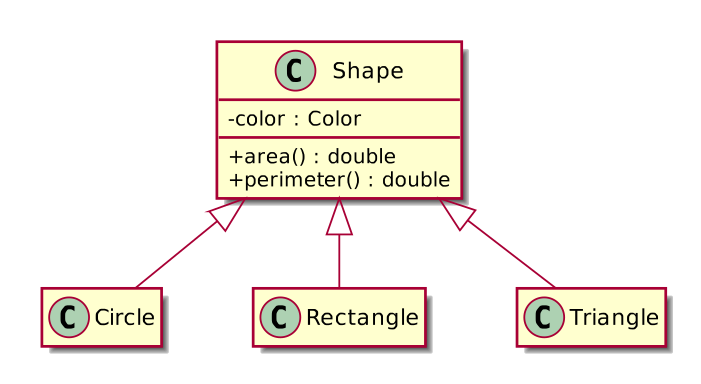
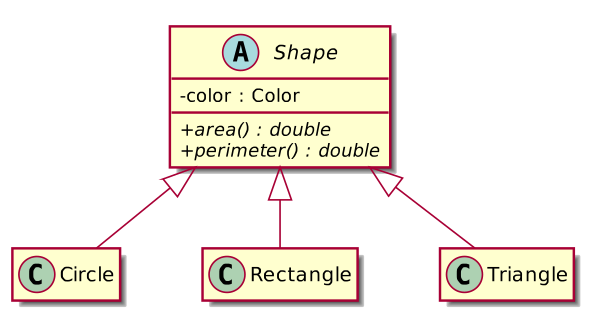
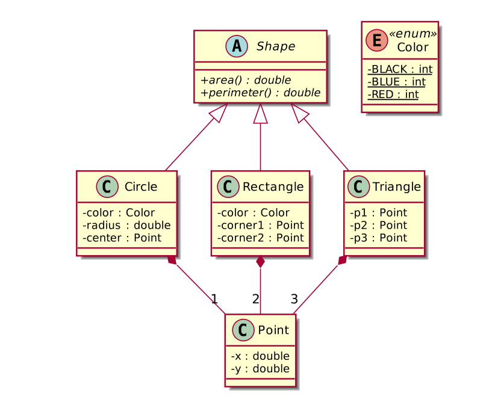
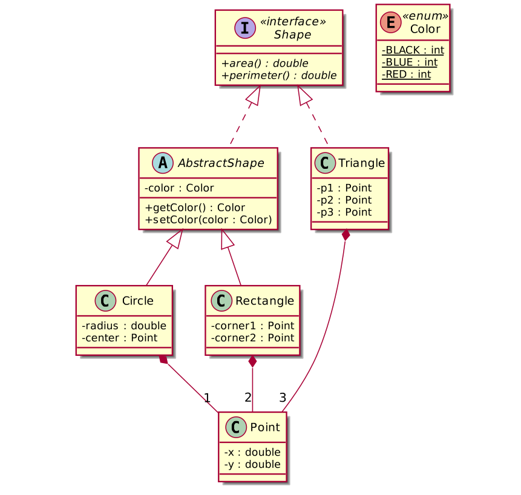
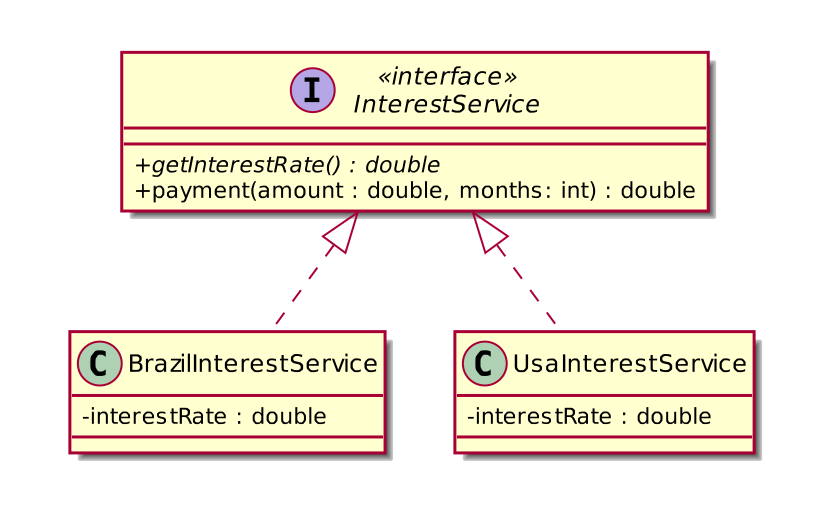
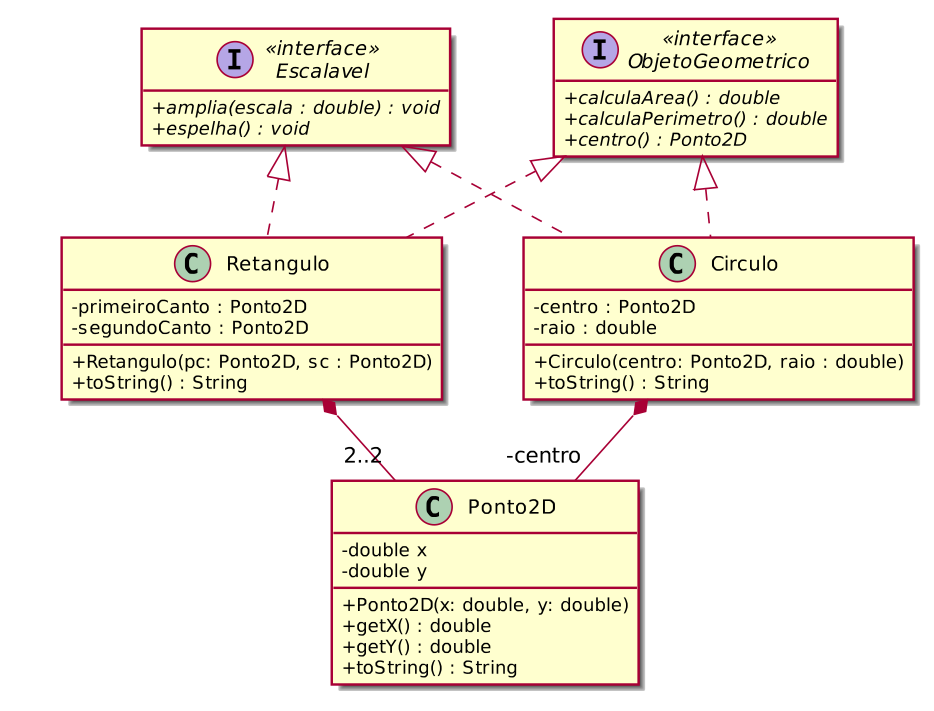
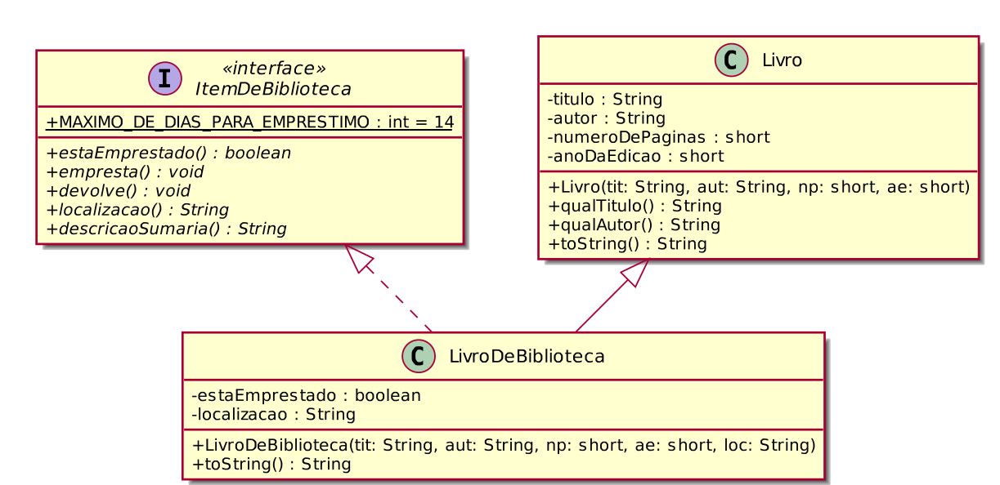
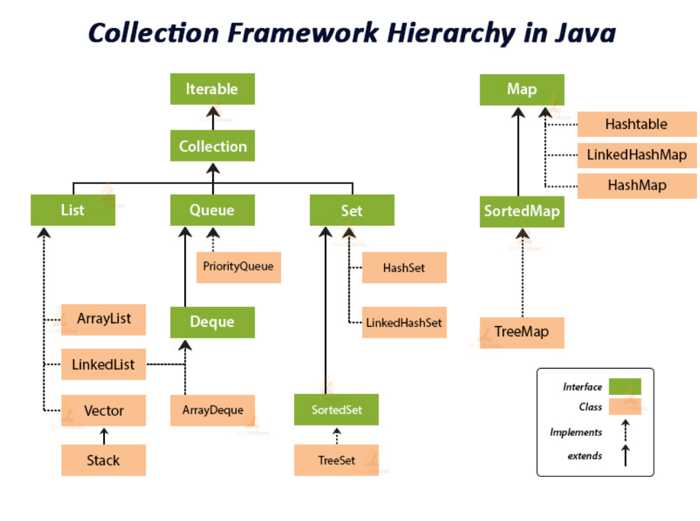

# Classes Abstratas e Interfaces

[](toc)
- [Classes Abstratas e Interfaces](#classes-abstratas-e-interfaces)
  - [Cenário 1: Formas Geométricas](#cenário-1-formas-geométricas)
  - [Observações sobre essa hierarquia de herança](#observações-sobre-essa-hierarquia-de-herança)
  - [Cenário 2: Pessoa fı́sica e Pessoa jurı́dica](#cenário-2-pessoa-fı́sica-e-pessoa-jurı́dica)
  - [Questionamento](#questionamento)
  - [Classes abstratas e Interfaces](#classes-abstratas-e-interfaces-1)
  - [Métodos abstratos e classes abstratas](#métodos-abstratos-e-classes-abstratas)
  - [Classes Abstratas – Observações](#classes-abstratas--observações)
  - [Classes Abstratas – Observações](#classes-abstratas--observações-1)
  - [Interface](#interface)
  - [Interface](#interface-1)
  - [Interface vs. Classe Abstrata](#interface-vs-classe-abstrata)
  - [Exemplo](#exemplo)
  - [Interfaces — métodos default](#interfaces--métodos-default)
  - [Calculando o juros](#calculando-o-juros)
  - [Herança múltipla usando Interfaces](#herança-múltipla-usando-interfaces)
  - [Herança múltipla usando Interfaces](#herança-múltipla-usando-interfaces-1)
  - [A interface Comparable do Java](#a-interface-comparable-do-java)
  - [Classe Pessoa](#classe-pessoa)
  - [Collections.sort()](#collectionssort)
  - [Interface Comparator](#interface-comparator)
[](toc)

## Cenário 1: Formas Geométricas



* Queremos guardar uma lista de formas geométricas (cı́rculos, retângulos ou triângulos) para depois imprimir a área e o perı́metro delas.

* As formas geométricas podem ter uma cor associada.

```Java
public static void printAreas(List<Shape> list)
{
    for(Shape figure : list) 
        System.out.println(figure.area());
}

public static void printPerimeters(List<Shape> list)
{
    for(Shape figure : list) 
        System.out.println(figure.perimeter());
}
```

## Observações sobre essa hierarquia de herança
* Obs. 1: Não faz sentido ter um objeto Shape no sistema, já que não sabemos calcular a área e perı́metro de tal objeto.
* Obs. 2: Não precisamos ter um objeto Shape no sistema. Estamos usando essa classe apenas para o polimorfismo.
    * Em alguns sistemas, como é neste caso, usamos uma classe com apenas esse intuito: ganhar polimorfismo para criar métodos mais genéricos, que se encaixem a diversos objetos.


## Cenário 2: Pessoa fı́sica e Pessoa jurı́dica
* Suponha que, em um negócio relacionado a banco, apenas Pessoa fı́sica e Pessoa jurı́dica são permitidas.
* Imagine a superclasse Pessoa e duas filhas: PessoaFisica e PessoaJuridica.
* Quando puxamos relatórios de nossos clientes (um ArrayList de Pessoa, por exemplo), queremos que cada um deles seja ou uma PessoaFisica ou uma PessoaJuridica.
* A classe Pessoa, neste caso, estaria sendo usada apenas para ganhar o polimorfismo e herdar algumas coisas: não faz sentido permitir instanciá-la.

## Questionamento
* Se a classe Pessoa não pode ser instanciada, por que simplesmente não criar somente PessoaFisica e PessoaJuridica?
* Resposta:
    * Reuso
    * Polimorfismo: a superclasse genérica nos permite tratar de forma fácil e uniforme todos os tipos de pessoa, inclusive com polimorfismo se for o caso. Por exemplo, você pode colocar todos tipos de contas em uma mesma coleção.

## Classes abstratas e Interfaces
* A linguagem Java tem dois mecanismos que permitem a criação de tipos que somente contêm descrições de atributos e métodos que devem ser implementados, mas sem efetivamente implementar os métodos:
    * Classes abstratas
    * Interfaces

## Métodos abstratos e classes abstratas

* Método abstrato é um método que é declarado com o modificador abstract e é declarado sem uma implementação.

Exemplo: 
```Java
abstract class Shape{
    abstract double area();
}
```

* Classes abstratas são classes que não podem ser instanciadas, mas podem ser herdadas.

* Uma classe abstrata é declarada com o modificador abstract.

* Uma classe abstrata pode ou não ter métodos abstratos. Se ela tiver, automaticamente é abstrata e deve ser declarada com o modificador abstract.

* É uma forma de garantir herança total: somente subclasses concretas podem ser instanciadas, mas nunca a superclasse abstrata.

*** 
```Java
public enum Color {
    BLACK, BLUE, RED;
}

public abstract class Shape {
    private Color color;
    public abstract double area();
    public abstract double perimeter();

    public Shape(Color color) { this.color = color; }
    public Color getColor() { return color; }
    public void setColor(Color color) { this.color = color; }
    
    @Override public final String toString() {
        return getClass().getName();
    }
}
```



* identificadores de classes e métodos abstratos em itálico.


## Classes Abstratas – Observações
* Se uma classe tiver métodos abstratos, ela também deverá obrigatoriamente ser declarada como abstract.
* Classes abstratas podem ter atributos e podem implementar alguns métodos (implementação parcial).
* Uma subclasse de uma superclasse abstrata deve, obrigatoriamente, implementar todos os métodos abstratos da superclasse, se houver algum. Caso não haja, nenhuma implementação é obrigatória.
* Se uma subclasse de uma classe abstrata deixar de implementar algum método abstrato que estiver na superclasse, automaticamente a subclasse torna-se abstrata e deve ser declarada com o modificador abstract.

## Classes Abstratas – Observações
* Construtores de classes abstratas não podem ser abstract.
  * Mesmo que a classe abstrata não possa ser instanciada, seus construtores podem inicializar os campos da classe que serão usados por subclasses, sendo imprescindı́veis em praticamente todos os casos.
* Uma classe abstrata pode ter métodos estáticos, contanto que eles não sejam abstratos. Ela também pode ter atributos estáticos. O funcionamento desses atributos e métodos estáticos é igual ao que já
conhecemos.

## Interface

* Uma interface é um tipo que define um conjunto de operações que uma classe deve implementar.

* A interface estabelece um contrato que a classe deve cumprir.

* Uma interface é definida através da palavra-chave interface.

* Para uma classe implementar uma interface, é usada a palavra-chave
implements.
```Java
interface Shape {
double area();
double perimeter();
}
```
* Pra quê interfaces?
  * Para criar sistemas com baixo acomplamento e flexı́veis.

## Interface
* Uma interface não pode ser instanciada.
* Todos os métodos em uma interface são implicitamente abstract e public.
* Todos os atributos em uma interface são implicitamente static e final, devendo, portanto, ser inicializados na sua declaração.
```Java
interface Shape {
double area();
double perimeter();
}
```

## Interface vs. Classe Abstrata
* Em Java, uma subclasse somente pode herdar de uma única superclasse (abstrata ou não).
* Porém, qualquer classe em Java pode implementar várias interfaces simultaneamente.


* Interfaces como bibliotecas de constantes: já que todos os atributos de uma interface são declarados como static e final, podemos escrever interfaces que somente contêm atributos, e qualquer classe que implementar essa interface terá acesso a estas constantes.
* Interfaces ainda são bem diferentes de classes abstratas. Interfaces não possuem recursos tais como construtores e atributos que não sejam constantes.


## Exemplo
* Agora, queremos guardar uma lista de formas geométricas dos tipos retângulo, cı́rculo e triângulo. Sendo que, retângulos e cı́rculos possuem
cor, mas triângulos não possuem cor.
* Queremos guardar essas formas em uma mesma lista e imprimir a área de
cada uma delas.
* Como modelar as classes a fim de obter esse resultado?




* Ponto Negativo: O atributo color está repetido em Circule e Rectangle



## Interfaces — métodos default
* A partir do Java SE 8 as interfaces podem conter métodos concretos.
* Se o método tiver uma implementação, antes da sua definição deve ser
colocada a palavra-chave default.
* A intenção básica é prover implementação padrão para métodos, de modo
a evitar:
  1. repetição de implementação em toda classe que implementa a interface
  2. a necessidade de se criar classes abstratas para prover reuso de implementação


## Calculando o juros

* Fazer um programa para ler uma quantia e a duração em meses de um empréstimo. Informar o valor a ser pago depois de decorrido o prazo de
empréstimo.
* O valor a ser pago deve ser calculado conforme regras de juros do Brasil e também conforme regras de juros dos Estados Unidos.
* A regra de cálculo do Brasil é juro composto padrão de 2% ao ano e a regra de cálculo dos EUA é juro composto padrão de 1% ao ano.



```Java
public interface InterestRate {
    double getInterestRate();
    
    default double payment(double amount, int months) {
        return amount * Math.pow((1.0 + getInterestRate()/100.0), months);
    }
}
```

## Herança múltipla usando Interfaces
* A principal diferença entre herança usando classes abstratas e usando interfaces é que uma classe pode herdar somente de uma única classe,
enquanto pode implementar diversas interfaces.
* Um exemplo desse mecanismo é mostrado a seguir:
* Exemplo: Queremos programar objetos geométricos que possam ser escaláveis, isto é, o seu tamanho original pode ser modificado usando-se um valor como escala. Os dados que representam o tamanho do objeto
seriam modificados por um método que recebesse a escala como argumento.



***
Interface Escalável

```Java
/**
 * A interface Escalavel define que métodos um objeto que seja escalável
 * (isto é, que pode ter seu tamanho modificado como uma função do tamanho anterior)
 * deve conter. Esta interface não declara nenhum atributo.
 */
public interface Escalavel {
    /**
     * O método amplia modifica os campos do objeto para alterar o seu tamanho.
     * @param escala a escala para modificação do objeto
     */
    public void amplia(double escala);

    /**
     * O método espelha modifica os campos do objeto para alterar a sua posição
     * (fazendo com que o objeto fique refletido nas suas coordenadas horizontais)
     */
    public void espelha();
}
```

***

```Java
/**
 * A interface ObjetoGeometrico define que métodos um objeto geométrico
 * genérico bidimensional deve conter. Esta interface não declara nenhum campo.
 */
public interface ObjetoGeometrico {
    /**
     * O método centro retorna o ponto em duas dimensões que corresponde
     * ao centro do objeto geométrico
     * @return uma instância da classe Ponto2D representando o 
     * centro do objeto geométrico.
     */
    public Ponto2D centro();

    /**
     * Esse método calcula a área do objeto geométrico e retorna a área
     * como um valor do tipo double
     * @return a área deste objeto geométrico
     */
    public double calculaArea();

    /**
     * Esse método calcula o perímetro do objeto geométrico e retorna o perímetro
     * como um valor do tipo double
     * @return o perímetro deste objeto geométrico
     */
    public double calculaPerimetro();
}
```

***
```Java
/**
 * A classe CirculoEscalavel implementa as interfaces ObjetoGeometrico e
 * Esclavel, e representa um círculo cujo tamanho pode ser modificado em
 * função de seu tamanho anterior.
 * Esta classe encapsula o ponto central do círculo e seu raio.
 * Todos os métodos declarados nas interfaces ObjetoGeometrico e
 * Escalavel são implementados.
 */
public class CirculoEscalavel implements ObjetoGeometrico, Escalavel {
    /**
     * Declaração dos campos da classe
     */
    private Ponto2D centro;
    private double raio;

    /**
     * Construtor "completo"
     * @param centro o centro do círculo (uma instância da classe Ponto2D)
     * @param raio o raio do círculo
     */
    public CirculoEscalavel(Ponto2D centro, double raio) {
        this.centro = centro;
        this.raio = raio;
    }

    /**
     * Este método centro retorna o ponto em duas dimensões 
     * representando o centro do círculo
     * @return uma instância da classe Ponto2D representando 
     * o centro do círculo
     */
    @Override
    public Ponto2D centro() {
        return centro;
    }

    /**
     * Retorna a área do círculo como um valor do tipo double
     * @return a área deste círculo
     */
    @Override
    public double calculaArea() {
        return Math.PI * raio * raio; // PI vezes o quadrado do raio
    }

    /**
     * Retorna o perímetro do círculo como um valor do tipo double
     * @return o perímetro deste círculo
     */
    @Override
    public double calculaPerimetro() {
        return 2.0 * Math.PI * raio; // 2 vezes PI vezes o raio
    }

    /**
     * O método amplia modifica o raio do círculo de acordo com o
     * valor passado como argumento, efetivamente modificando o tamanho
     * do círculo
     * @param escala a escala para modificação do círculo
     */
    @Override
    public void amplia(double escala) {
        raio *= escala;
    }

    /**
     * O método espelha modifica o centro do círculo para alterar a sua posição
     * (fazendo com que o círculo fique refletido nas suas coordenadas horizontais)
     */
    @Override
    public void espelha() {
        centro = new Ponto2D(-centro.getX(), centro.getY());
    }

    /**
     * toString
     * @return uma string contendo uma representação dos campos do Círculo
     */
    @Override
    public String toString() {
        // o método toString da classe Ponto2D é chamado implicitamente
        return "Círculo com centro em " + centro + " e raio " + raio;
    }

}
```

## Herança múltipla usando Interfaces
* Também é possı́vel implementar herança múltipla em Java fazendo com que uma classe herde de outra mas implemente uma ou mais interfaces.
* Um exemplo de herança múltipla de classes e interfaces é dada a seguir, onde consideramos uma hierarquia de classes e interfaces que representam itens de uma biblioteca.



```Java
/**
 * A interface ItemDeBiblioteca declara os campos e métodos que qualquer
 * item em uma biblioteca deve ter.
 */
public interface ItemDeBiblioteca {
    /**
     * Declaração dos campos da interface. Note que todo campo em
     * uma interface é considerado como public final, não podendo variar.
     */
    int maximoDeDiasParaEmprestimo = 14;

    /**
     * O método estaEmprestado retorna true se o item estiver emprestado e
     * retorna false caso contrário
     * @return true se o item estiver emprestado e false caso contrário
     */
    public boolean estaEmprestado();

    /**
     * O método empresta modifica o estado de um campo que indica se o item está
     * emprestado ou não para true
     */
    public void empresta();

    /**
     * O método devolve modifica o estado de um campo que indica se o item está
     * emprestado ou não para false
     */
    public void devolve();

    /**
     * O método localização retorna a localização do item na biblioteca
     * @return a localização do item na biblioteca
     */
    public String localizacao();

    /**
     * O método descricaoSumaria retorna uma string contendo uma descrição sumária
     * do item da biblioteca
     * @return a descrição sumária do item da biblioteca
     */
    public String descricaoSumaria();
}
```

***

```Java
/**
 * A classe Livro encapsula os dados de um livro. Para simplificar,
 * somente os campos e métodos mais básicos são implementados nesta classe.
 */
public class Livro {
    /**
     * Declaração dos campos da classe
     */
    private String titulo, autor;
    private short numeroDePaginas;
    private short anoDaEdicao;

    /**
     * Construtor "Completo"
     * @param tit o título do livro
     * @param aut os nomes dos autores do livro
     * @param np o número de páginas do livro
     * @param ae o ano da edição do livro
     */
    public Livro(String tit, String aut, short np, short ae) {
        titulo = tit;
        autor = aut;
        numeroDePaginas = np;
        anoDaEdicao = ae;
    }

    /**
     * O método qualTitulo retorna o título deste livro
     * @return o título do livro
     */
    public String qualTitulo() {
        return titulo;
    }

    /**
     * O método qualTitulo retorna o autor deste livro
     * @return o autor do livro
     */
    public String qualAutor() {
        return autor;
    }

    /**
     * Método toString
     * @return uma string contendo uma representação dos campos desta classe
     */
    @Override
    public String toString() {
        return "Título            :"+titulo+"\n"+
               "Autor             :"+autor+"\n"+
               "Número de páginas :"+numeroDePaginas+"\n"+
               "Ano da Edição     :"+anoDaEdicao+"\n";
    }
}
```


## A interface Comparable do Java
* A interface Comparable é usada para permitir que uma colletion ordene objetos de uma classe definida pelo usuário com base em sua ordem
natural.
* Essa interface é encontrada no pacote java.lang e contém apenas um método chamado compareTo
```Java
public interface Comparable<T>
{
    int compareTo(T other);
}
```

* O tipo T é um “tipo genérico” que deve ser substituı́do pelo nome da classe que implementa esta interface.
* A ordenação natural de elementos é imposta pela implementação do método compareTo().

* Para que qualquer classe suporte a ordenação natural, ela deve
implementar a interface Comparable e implementar o método compareTo(). Este método recebe um objeto como argumento e retorna um inteiro.
* int compareTo (T obj): É usado para comparar o objeto atual com o
objeto passado como argumento. Devolve:
  * inteiro negativo, se o objeto atual for menor que o argumento.
  * zero, se o objeto atual for igual ao argumento.
  * inteiro positivo, se o objeto atual for maior que o argumento.


## Classe Pessoa

* Temos uma classe Pessoa que possui apenas dois atributos: id e nome.
* Gostarı́amos de comparar duas pessoas pelo id delas.
* Para isso, a classe Pessoa deve implementar a interface Comparable
public class Pessoa implements Comparable<Pessoa> {...}
* Como Pessoa implementa esta interface, ela deve obrigatoriamente
fornecer uma implementação para o método compareTo:
```Java
    public int compareTo(Pessoa p) {
        return Integer.compare(this.id, p.getId());
    }
```

***

```Java
public class Pessoa implements Comparable<Pessoa> {
    private int id;
    private String nome;

    public Pessoa(int id, String nome) {
        this.id = id;
        this.nome = nome;
    }

    public int getId() { return id; }
    public String getNome() { return nome; }

    @Override public int compareTo(Pessoa p) {
        return Integer.compare(this.id, p.getId());
    }

    @Override public String toString() {
        return getClass().getName() + 
            "[" + id + ":" + nome + "]";
    }
}
```

* Suponha que exista um método de ordenação que promete ordenar listas de objetos, contanto que eles implementem a interface Comparable.
* Agora, podemos passar uma lista de objetos do tipo Pessoa para esse método e ele ordenará nossos objetos de acordo com o id deles!!

* Como já vimos, a classe java.util.Arrays contém vários métodos que permitem a manipulação e o processamento de arrays.
* Por exemplo, o método sort(T arr[]) da classe Arrays promete
ordenar um vetor de objetos sob uma condição:
* Os objetos contidos no vetor devem pertencer a uma classe que implemente a interface Comparable.
* Exemplo: Suponha que temos um vetor com objetos do tipo Pessoa e gostarı́amos de usar o método Arrays.sort() da classe Arrays para ordenar esse vetor. Para tornar isso possı́vel basta modificar a classe para que ela implemente a interface Comparable.

```Java
import java.util.Arrays;

public class App1 {
    public static void main(String[] args) {
        Pessoa v[] = new Pessoa[4];
        v[0] = new Pessoa(4,"Carlos");
        v[1] = new Pessoa(3,"Tábata");
        v[2] = new Pessoa(1,"Lúcia");
        v[3] = new Pessoa(2,"João");

        System.out.println(Arrays.toString(v)); // imprime array original

        Arrays.sort(v); // ordena array

        System.out.println(Arrays.toString(v)); // imprime array ordenado
    }
}
/*
[Pessoa[4:Carlos], Pessoa[3:Tábata], Pessoa[1:Lúcia], Pessoa[2:João]]
[Pessoa[1:Lúcia], Pessoa[2:João], Pessoa[3:Tábata], Pessoa[4:Carlos]]
*/
```



## Collections.sort()
* O Java também possui o método estático sort() que pertence à classe Collections do pacote java.util
* Este método pode ordenar diversas coleções de objetos como, por exemplo, ArrayLists e LinkedLists.
* Porém, se os objetos da coleção pertenceram a uma classe definida pelo usuário, o método sort não funcionará adequadamente, pois ele não sabe automaticamente como comparar dois objetos definidos pelo usuário.
Desta forma, o usuário tem que “ensiná-lo” como comparar.
  * Uma das formas de fazer isso é sua classe implementar a interface Comparable.
  * Com o método compareTo definido na sua classe, agora o métodosort saberá como comparar dois objetos da sua classe e poderá ordenar corretamente a usa ArrayList.

```Java
import java.util.ArrayList;
import java.util.Collections;

public class App2 {
    public static void main(String[] args) {
        ArrayList<Pessoa> al = new ArrayList<Pessoa>(4);
        al.add(new Pessoa(4,"Carlos"));
        al.add(new Pessoa(3,"Tábata"));
        al.add(new Pessoa(1,"Lúcia"));
        al.add(new Pessoa(2,"João"));

        System.out.println(al); // imprime ArrayList

        Collections.sort(al); // ordena ArrayList

        System.out.println(al); // imprime ArrayList ordenado
    }
}
```

## Interface Comparator

* Vimos que podemos ordenar um array de Strings usando o método estático sort() da classe Arrays, porque a classe String implementa a interface Comparable.
  * Essa ordenação compara as strings de acordo com a ordem alfabética delas.
* Suponha, agora, que queremos ordenar as strings em ordem crescente de tamanho. Como fazer isso?
  * Não podemos fazer com que a classe String implemente o método compareTo de duas formas diferentes.
  * Na verdade, nem sequer temos como modificar a implementação desta classe!
* A fim de lidar com essa situação, existe uma versão sobrecarregada do método Arrays.sort(), cujos parâmetros são um array e um comparator (uma instância de uma classe que implementa a interface Comparator do Java).

```Java
public interface Comparator<T>
{
    int compare(T first, T second);
}
```

* A interface Comparator do Java, possui apenas o método compare. Esse
método recebe dois objetos do mesmo tipo e devolve:
  * zero, se eles forem iguais;
  * um inteiro negativo, se o primeiro for menor que o segundo;
  * um inteiro positivo se o primeiro for maior que o segundo.

* Para comparar duas string por tamanho, defina uma classe que
implemente a interface Comparator<String>.


```Java
class LengthComparator implements Comparator<String>{
    
    public int compare(String first, String second){
        return first.length() - second.length();
    }

}
```

Para ordenar um array de strings pelo tamanho delas, passe um objeto da
classe LengthComparator para o método Arrays.sort:

```Java
import java.lang.*;
import java.util.*;

class LengthComparator implements Comparator<String>{
    @Override
    public int compare(String first, String second){
        return first.length() - second.length();
    }

}

public class TesteComparator {
   
    public static void main(String[] args) {
        ArrayList<String> friends = new ArrayList<String>();

        friends.add("Pedro");
        friends.add("Jose");
        friends.add("Andre");
        friends.add("Wladimir"); 
        Collections.sort( friends, new LengthComparator() );
        for(String friend : friends){
            System.out.println(friend);
        }


    }

}
```

