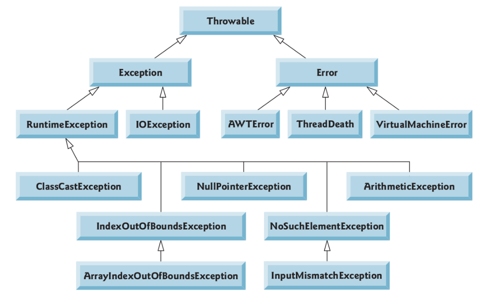
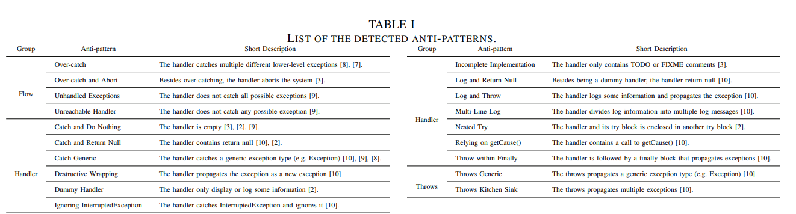
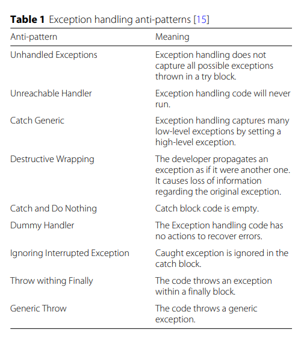
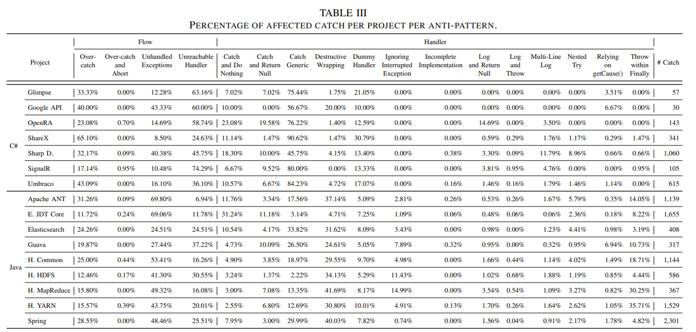
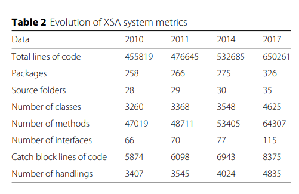
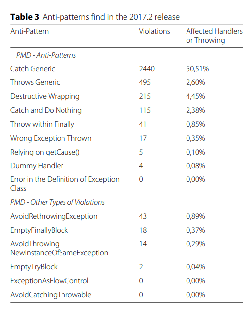

# Exceção 

[](toc)
[](toc)


* Na programação orientada a objetos, uma exceção é um evento que ocorre durante a execução de um programa e quebra o fluxo normal de execução das instruções.

* É uma condição anormal, possivelmente um erro, que deve ser tratada
pelo programa.

* Tratar uma exceção significa identificar quando uma exceção pode ocorrer e possibilitar uma correção do problema ou, então, finalizar a execução do programa de forma elegante e segura.

* Linguagens orientadas a objetos, como C++ e Java, fornecem suporte
para o tratamento sistemático de exceções.

* O tratamento de exceções permite separar o código relativo ao
tratamento de exceções do resto do código da aplicação.
    * Misturar a lógica do programa com a lógica do tratamento de erros pode tornar os programas difı́ceis de ler, modificar, manter e depurar.

* O tratamento de exceções permite que os programadores criem programas
mais robustos e tolerantes a falhas.


## Exemplos de situações anormais
* Erros de lógica de programação:
    * Devem ser corrigidos pelo programador;
    * Exemplos: 
    (a) limite do vetor ultrapassado; 
    (b) divisão por zero;
* Erros devido a condições do ambiente de execução:
    * Fogem ao controle do programador, mas podem ser contornados;
    * Exemplos: 
    (a) arquivo não encontrado; 
    (b) conexão não estabelecida;
* Erros graves, onde não há recuperação:
    * Fogem ao controle do programador e não podem ser contornados;
    * Exemplos: 
    (a) falta de memória; 
    (b) erro interno da JVM.


## Exemplos de Exceções Comuns
* NullPointerException — ocorre quando uma referência null é utilizada onde um objeto é esperado.

```Java
class NullPointer{
    
    static void doSomething(Integer number){
        if(number > 0){
            System.out.println("Numero positivo");
        }
    }

    public static void main(String[] args) {
        doSomething(null);
    }
}
/*
Exception in thread "main" java.lang.NullPointerException: Cannot invoke "java.lang.Integer.intValue()" because "<parameter1>" is null
	at NullPointer.doSomething(NullPointer.java:4)
	at NullPointer.main(NullPointer.java:10)
*/

```


* IndexOutOfBoundsException — ocorre quando é feita uma tentativa
de acessar um elemento fora dos intervalos de ı́ndice válidos de uma lista.

```java
import java.util.ArrayList;

public class IndexBound {
    public static void main(String[] args) {
        ArrayList <Integer> lista = new ArrayList<Integer>();

        lista.add(5);
        lista.add(8);

        System.out.println( lista.get(5) );
    }
}

/*
 * Exception in thread "main" java.lang.IndexOutOfBoundsException: Index 5 out of bounds for length 2
	at java.base/jdk.internal.util.Preconditions.outOfBounds(Preconditions.java:100)
	at java.base/jdk.internal.util.Preconditions.outOfBoundsCheckIndex(Preconditions.java:106)
	at java.base/jdk.internal.util.Preconditions.checkIndex(Preconditions.java:302)
	at java.base/java.util.Objects.checkIndex(Objects.java:359)
	at java.base/java.util.ArrayList.get(ArrayList.java:427)
	at IndexBound.main(IndexBound.java:10)
*/
```

* ClassCastException — ocorre quando você tenta converter um objeto em outro objeto que não é da mesma hierarquia de herança.

```java
public class ClassCast {
    public static void main(String[] args) {
        Object valor = 15;
        String s = (String) valor;

        //System.out.println(s);
    }
}
/*
Exception in thread "main" java.lang.ClassCastException: class java.lang.Integer cannot be cast to class java.lang.String (java.lang.Integer and java.lang.String are in module java.base of loader 'bootstrap')
	at ClassCast.main(ClassCast.java:4)
*/
```

* ArithmeticException — é lançada quando ocorre um erro aritmético, como por exemplo, divisão inteira por zero.

```Java
public class Arithmetic {
    public static void main(String[] args) {
        Integer num = 15;
        Integer den = 0;

        System.out.println( num/den );
    }
}
/*
 *
 Exception in thread "main" java.lang.ArithmeticException: / by zero at Arithmetic.main(Arithmetic.java:6)
*/
```

## Stack trace (rastreamento de pilha)

* Um stack trace mostra uma lista de chamadas de método que levam ao lançamento da exceção, junto com os nomes de arquivo e números de linha em que as chamadas ocorreram.


## Tratamento de Exceção - Geração e Captura
As duas atividades associadas ao tratamento de uma exceção são:
* Geração: a sinalização de que uma situação excepcional ocorreu.
* Captura: o tratamento da situação excepcional, onde as ações necessárias para a recuperação da situação de erro são definidas.

## Blocos try-catch-finally
A captura e o tratamento de exceções em Java se dá através da especificação de blocos try, catch e finally, definidos através destas mesmas palavras reservadas da linguagem.

```Java
try{

}catch(Exception exception){

}catch(Exception exception){

}finally{

}
```


* Bloco try contém o código que pode lançar (throw) uma exceção.
* Consiste na palavra-chave try seguida por um bloco de código entre chaves.
* Se ocorrer uma exceção em algum ponto, o restante do código contido no bloco try não será executado.

* Um bloco catch captura (recebe) e trata uma exceção.
* Esse bloco recebe um parâmetro de exceção, que identifica o tipo de exceção e permite que o bloco catch interaja com o objeto da exceção capturada.
* Se o tipo do parâmetro de exceção de um bloco catch corresponder exatamente ao tipo de exceção lançada ou for uma superclasse dele, então esse bloco catch executará. A isso chamamos captura da exceção.

* Exceção não-capturada — uma exceção que ocorre para a qual não há nenhum bloco catch correspondente.
  * Faz com que o programa termine se o programa tiver somente um thread; do contrário apenas o thread atual é terminado e pode haver efeitos adversos no restante do programa.

* O bloco finally é sempre executado. Em geral, ele inclui comandos que liberam recursos que eventualmente possam ter sido alocados durante o processamento do bloco try e que podem ser liberados, independentemente de a execução ter encerrado com sucesso ou ter sido interrompida por uma condição de exceção.
  * A presença desse bloco é opcional.

## ArrayIndexOutOfBoundsException

```Java
public class TesteException1 {
    public static void main(String[] args) {
        int[] vet = {1, 2, 3, 4, 5};
        try {
            // Esse laço tentará acessar uma região fora do
            // intervalo do vetor: uma exceção será lançada
            for(int i = 0; i <= 9; i++)
                System.out.println( vet[i] );
        }
        catch(ArrayIndexOutOfBoundsException excp) {
            System.out.println(excp); // toString implícito
        }
        catch(Exception e) {
            System.out.println("Execução do catch Exception");
            System.out.println(e); // toString implícito
        }
        finally {
            System.out.println("finally sempre executado");
        }
    }
}
```

## DivideByZeroWithExceptionHandling

```Java
import java.util.InputMismatchException;
import java.util.Scanner;

public class DivisaoComTratamento {
   /**
    * Método que calcula a divisão inteira entre dois inteiros
    * @param numerador o numerador da divisão
    * @param denominador o denominador da divisão
    * @return um inteiro, quociente da divisão
    * @throws ArithmeticException quando uma divisão por 0 for realizada
    */
   public static int quociente(int numerador, int denominador) throws ArithmeticException {
      return numerador / denominador; // possível divisão por zero
   } 

   public static void main(String[] args) throws Exception {
      Scanner scanner = new Scanner(System.in); 
      boolean continuarLoop = true; // determina se mais entrada será necessária

      do {                                                               
         try {          
                    
            System.out.print("Entre um numerador (inteiro): ");    
            int numerador = scanner.nextInt();                            
            System.out.print("Entre um denominador (inteiro): ");  
            int denominador = scanner.nextInt();                          
                                                                          
            int resultado = quociente(numerador, denominador);              
            System.out.printf("%nResultado: %d / %d = %d%n", numerador, denominador, resultado);                                     
            continuarLoop = false;
            //System.exit(0);       
         }  
         catch (InputMismatchException e) {        
            System.err.printf("%nExceção: %s%n",e);                                  
            scanner.nextLine(); // decarta entrada para que usuário possa tentar novamente    
            System.out.printf("Você deve entrar inteiros. Por favor, tente novamente.%n%n");          
         }                                                              
         catch (ArithmeticException e) {              
            System.err.printf("%nExceção: %s%n", e);
            System.out.printf("Zero não é um denominador válido. Tente novamente.%n%n");   
         } 
         catch(Exception e) {
            System.out.println(e);
         }                                                              
         finally {
            System.out.println("\nfinally executado");
         }                                                          
      } while (continuarLoop);                                           
   } 
} 
```


## Blocos try-catch-finally (Regras)
* O bloco try deve ser seguido por pelo menos um bloco catch, ou por um bloco finally;
* Os blocos não podem ser separados por outros comandos – um erro de sintaxe seria detectado pelo compilador Java neste caso.
* Cada bloco try pode ser seguido por zero ou mais blocos catch.
* Geralmente, cada bloco catch trata de apenas uma exceção. Porém, se os corpos de vários blocos catch forem iguais, você pode usar um multi-catch para capturar todas essas exceções em um único bloco catch e realizar a mesma tarefa para cada uma delas.
```Java
catch (Type1 | Type2 | Type3 exception)
```

* Caso um catch mais genérico (por exemplo, catch(Exception e)) apareça antes de um mais especı́fico (por exemplo, catch(ArithmeticException e)), o bloco mais especı́fico jamais será executado.
  * O compilador detecta a situação acima e sinaliza o erro.
  * Portanto, as exceções listadas em sucessivos blocos catch devem ser dispostas da classe mais especı́fica para a classe mais geral.
* Quando um bloco try termina, as variáveis locais declaradas no bloco saem do escopo e não são mais acessı́veis fora do bloco try.


## Utilizando a cláusula throws
* Cláusula throws — especifica as exceções que um método pode lançar.
* Aparece depois da lista de parâmetros do método e antes do corpo do
método.
* Contém uma lista de exceções separadas por vı́rgulas.
* As exceções podem ser lançadas pelas instruções no corpo do método ou pelos métodos chamados no corpo do método.
* As exceções podem ser dos tipos listados na cláusula throws ou subclasses delas.

* Se souber que um método pode lançar uma exceção, inclua o código de tratamento de exceções apropriado no programa para torná-lo mais robusto.
* Leia a documentação on-line da API para obter informações sobre um método antes de utilizar esse método em um programa.
    * A documentação especifica as exceções lançadas pelo método (se houver alguma) e indica as razões pelas quais tais exceções podem ocorrer.


## Modelo de terminação × Modelo de retomada

* Modelo de terminação do tratamento de exceções — o controle do programa não retorna ao ponto de lançamento porque o bloco catch terminou; o fluxo de controle prossegue para a primeira instrução depois do último bloco catch. Usado pelo Java.
* Modelo de retomada do tratamento de exceções — o controle do programa é retomado logo depois do ponto de lançamento.


## Modelo de Terminação
1. O código contido em um bloco try lança uma exceção;
2. Um objeto contendo informações sobre a exceção é instanciado;
3. O fluxo de execução desce pelos blocos catch até encontrar um que
declare tratar a exceção especı́fica que foi lançada;
4. O bloco catch correspondente é executado;
5. O bloco finally é executado, caso exista um. Na verdade, esse bloco é sempre executado, independente de ter sido ou não lançada uma exceção;
6. O código que segue o mecanismo try-catch-finally é executado, caso não exista um return no bloco que tratou a exceção.


## O bloco finally
* O bloco finally contém instruções que devem ser executadas independentemente da ocorrência ou não de exceções.
* O bloco finally executará se uma exceção for ou não lançada no bloco try correspondente. O bloco finally também será executado se o fluxo de execução normal do bloco try for interrompido usando uma instrução return, break ou continue.
* O único caso em que o bloco finally não será executado é se o método System.exit for chamado dentro do bloco try. Esse método encerra o programa imediatamente.
* Resumindo: Um bloco try quase sempre executará.


## O bloco finally — Quando usar?
* Situação: Programas que obtêm determinados recursos devem devolvê-los ao sistema para evitar resource leaks. Em linguagens de programação, como C e C++, o vazamento de recursos mais comum é um vazamento de memória.
* Java executa a coleta automática de lixo da memória que não é mais usada pelos programas, evitando assim a maioria dos vazamentos de memória.
* No entanto, outros tipos de vazamentos de recursos podem ocorrer. Por exemplo, arquivos, conexões de banco de dados e conexões de rede que não estão fechadas depois que eles não forem mais necessários, podem não estar disponı́veis para uso em outros programas.

* Como um bloco finally sempre é executado, ele geralmente contém código de liberação de recurso.
* Suponha que um recurso seja alocado em um bloco try. Se nenhuma exceção ocorrer, os blocos catch serão ignorados e o controle continuará no bloco finally, que libera o recurso.
* Se ocorrer uma exceção no bloco try, o bloco try será finalizado. Se o programa capturar a exceção em um dos blocos catch correspondentes, ele processará a exceção e, em seguida, o bloco finally liberará o recurso e o controle prossegue para a primeira declaração após o bloco finally.
* Se o programa não capturar a exceção, o bloco finally ainda libera o recurso e uma tentativa é feita para capturar a exceção em um método de chamada.

## Hierarquia de exceção no Java



* Todas as exceções que vimos até agora são herdadas direta ou indiretamente da classe Exception.
* Exception e suas descendentes formam uma hierarquia de herança que pode ser estendida.
* Classe Throwable, superclasse da Exception:
  * Somente objetos Throwable podem ser utilizados com o mecanismo de tratamento de exceções.
  * Tem duas subclasses: Exception e Error.
* A classe Exception e suas subclasses representam situações excepcionais que podem ocorrer em um programa Java e que podem ser capturadas pelo aplicativo.
* A classe Error e suas subclasses representam situações anormais que poderiam acontecer na JVM – normalmente não é possı́vel que um programa se recupere de Errors.

## java.lang.Throwable
* Classe Throwable: ancestral de todas as classes que recebem tratamento do mecanismo de exceções.
* Principais métodos:
  * void printStackTrace(): envia para a saı́da de erros padrão (System.err) a sequência de métodos chamados até o ponto onde a exceção foi lançada.
  * String getMessage(): retorna uma String contendo uma mensagem indicadora da exceção.
  * String toString(): retorna uma descrição sumária da exceção.
  * getStackTrace: recupera informações do rastreamento de pilha como um array de objetos StackTraceElement; permite processamento personalizado das informações sobre a exceção.

## Exceções verificadas vs. Exceções não-verificadas

Exceções não-verificadas (unchecked exceptions):
* Herdam da classe RuntimeException ou da classe Error.
* O compilador não verifica o código para ver se a exceção foi capturada ou declarada.
* Se uma exceção não-verificada ocorrer e não tiver sido capturada, o
programa terminará ou executará com resultados inesperados.
* Em geral, podem ser evitadas com uma codificação adequada.


## Exceções verificadas (checked exceptions):
* Essas exceções que são herdadas da classe Exception, mas não de
RuntimeException.
  * ClassNotFoundException, IOException, SQLException são exemplos de exceções verificadas.
* Exceções verificadas pelo compilador em tempo de compilação. Essas exceções devem ser detectadas por um try-catch no código ou declaradas pelo método como lançáveis (cláusula throws).
* Por exemplo, se um programa tentar acessar um arquivo que não está
disponı́vel no momento, o método que tenta acessar o arquivo deve
capturar ou declarar uma FileNotFoundException.


## Declarando novas classes de Exceção
• Você pode declarar suas próprias classes de exceção especı́ficas dos problemas que podem ocorrer quando um outro programa utiliza suas classes reutilizáveis.
* A nova classe de exceção deve estender uma classe de exceção existente.
* Por convenção, todos os nomes de classe de exceções devem terminar com a palavra Exception.

* Em geral, uma nova classe de exceção deve conter como membros somente quatro construtores:
  * Um construtor sem argumentos que passa uma String padrão para o construtor da superclasse.
  * Um construtor que recebe uma String como argumento e a repassa para o construtor da superclasse.
  * Um construtor que recebe uma String e um objeto Throwable como argumentos e os repassa para o construtor da superclasse.
  * Um construtor que recebe um objeto Throwable como argumento e o repassa para o construtor da superclasse.

## Implementando uma Pilha
A estrutura de dados pilha pode ser imple-
mentada usando um array de tamanho fixo
e possui duas operações básicas:
* push(x): colocar o elemento x no topo da pilha
* pop() remover o elemento que está no topo da pilha e retornar o seu valor.
* Ao tentar inserir mais elementos do que a pilha suporta, uma exceção deve ser lançada. Do mesmo modo, ao tentar remover elementos de uma pilha vazia, uma exceção deve ser lançada.

```Java
/**
 * Classe que implementa a estrutura de dados pilha (stack)
 */
public class Stack {
    private int indexTop;
    private final Object items[];

    /**
     * Construtor, cria uma pilha vazia
     * @param capacity a capacidade total da pilha
     */
    Stack(int capacity) {
        indexTop = -1;
        items = new Object[capacity];
    }

    /**
     * Adiciona um elemento no topo da pilha
     * @param obj elemento a ser adicionado na pilha
     * @throws FullStackException
     */
    void push(Object obj) throws FullStackException {
        if(items.length == indexTop + 1) {
            throw new FullStackException("fail: stack overflow");
        }
        indexTop++;
        items[indexTop] = obj; 
    }

    /**
     * Remove elemento do topo e retorna seu valor
     * @return elemento removido do topo
     * @throws EmptyStackException
     */
    Object pop() throws EmptyStackException {
        if(indexTop == -1) {
            throw new EmptyStackException("fail: stack underflow");
        }
        indexTop--;
        Object aux = items[indexTop + 1];
        items[indexTop + 1] = null;
        return aux;
    }
}
```

```Java
/**
 * Classe de exceção que indica quando a pilha está vazia 
 */
public class EmptyStackException extends Exception {
    // Construtor
    EmptyStackException() {
        super();
    }
    EmptyStackException(String msg) {
        super(msg);
    }
    EmptyStackException(String msg, Throwable obj) {
        super(msg, obj);
    }
    EmptyStackException(Throwable obj) {
        super(obj);
    }
}
```

```Java
/**
 * Classe de exceção que indica quando a pilha está cheia 
 */
public class FullStackException extends Exception {
    // Construtor
    FullStackException() {
        super();
    }
    FullStackException(String msg) {
        super(msg);
    }
    FullStackException(String msg, Throwable obj) {
        super(msg, obj);
    }
    FullStackException(Throwable obj) {
        super(obj);
    }
}
```


## Exception Handling Anti-Patterns

* Correa et al. says that an anti-pattern describes a solution to a recurrent problem that generates negative consequences to a project. An anti-pattern can be a result of either not working a better solution or using a good solution in a wrong context.

* Correa AL, Werner CM, Zaverucha G (2000) Object oriented design expertise reuse: an approach based on heuristics, design patterns and anti-patterns. In: Software Reuse: Advances in Software Reusability. Springer. pp 336–352. https://doi.org/10.1007/978-3-540-44995-9_20





* DE PADUA, Guilherme Bicalho; SHANG, Weiyi. Studying the prevalence of exception handling anti-patterns. In: 2017 IEEE/ACM 25th International Conference on Program Comprehension (ICPC). IEEE, 2017. p. 328-331.
* 


* DE SOUSA, Dêmora BC et al. Studying the evolution of exception handling anti-patterns in a long-lived large-scale project. Journal of the Brazilian Computer Society, v. 26, n. 1, p. 1-24, 2020.
  




```Java
//Example of Destructive Wrapping
try {
if(con != null) con.close();
} catch (SQLException e) {
throw new DataException(e.getMessage());
}
//Example of Catch Generic
try {
cal = CalendarHelper.getCalendar(getCurrentUser());
} catch (Exception e) {
e.printStackTrace();
defaultHandle(e);
}
//Example of Throws Generic
public Object method(HttpServletRequest req)
throws Exception {
GenericDataAccess dao = getGeneric();
Object obj = getCommandClass().newInstance();
// . . . .
return obj;
}
```
