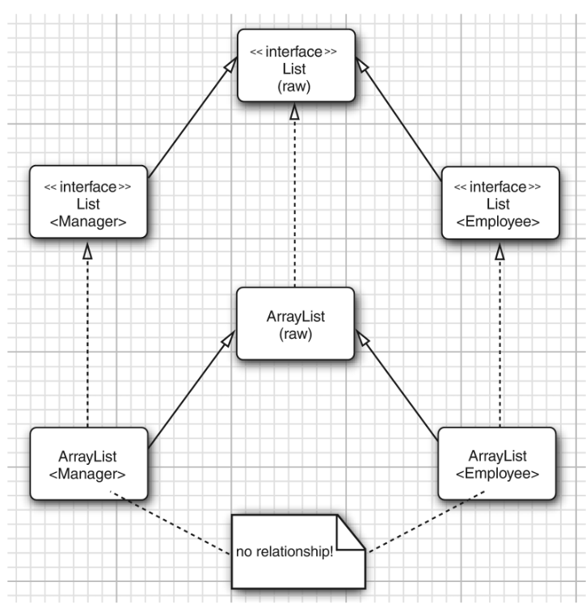

# Programação Genérica

Considere o seguinte código:

```java
// Printing array elements using overloaded methods.
public class OverloadedMethods {
    public static void main(String[] args) {
        // create arrays of Integer, Double and Character
        Integer[] integerArray = {1, 2, 3, 4, 5, 6};
        Double[] doubleArray = {1.1,2.2,3.3,4.4,5.5,6.6,7.7};
        Character[] characterArray = {'H','E','L','L','O'};

        System.out.printf("Array integerArray contains: ");
        printArray(integerArray); // pass an Integer array
        System.out.printf("Array doubleArray contains: ");
        printArray(doubleArray); // pass a Double array
        System.out.printf("Array characterArray contains: ");
        printArray(characterArray); // pass a Character array
    }

    public static void printArray(Integer[] inputArray) {
        for (Integer element : inputArray) 
            System.out.printf("%s ", element);
        System.out.println();
    }

    public static void printArray(Double[] inputArray) {
        for (Double element : inputArray)
            System.out.printf("%s ", element);
        System.out.println();
    }

    public static void printArray(Character[] inputArray) {
        for (Character element : inputArray)
            System.out.printf("%s ", element);
        System.out.println();
    }
}
```

* Problema: note que os métodos sobrecarregados printArray da classe OverloadedMethods são praticamente idênticos, mudando apenas no tipo de dado do array. Isso vai contra o princı́pio do reuso.
* Questão: É possı́vel escrever apenas um método printArray neste caso?

* Solução usada antes do Java 5.0: Herança + Object
```Java
public static void printArray(Object[] inputArray) {
    for (Object element : inputArray) 
        System.out.printf("%s ", element);
    System.out.println();
}
```

* Solução usada a partir do Java 5.0: Tipos Genéricos
```Java
public static <T> void printArray(T[] inputArray) {
        for (T element : inputArray) 
            System.out.printf("%s ", element.toString());
        System.out.println();
}
```

* Apesar dos métodos acima obterem o mesmo resultado, o uso de tipos
genéricos provê benefı́cios que veremos durante esta aula.

* Programação Genérica significa escrever código que pode ser reusado por objetos de diferentes tipos.
* Adicionada ao JDK a partir da versão 5.0
* Antes dos genéricos:

```Java
ArrayList files = new ArrayList();
// Você não sabe que tipo de objeto está 
// armazenado dentro da lista
String filename = (String) files.get(0);

ArrayList<String> files = new ArrayList<>();
// Você não precisa mais da operação de cast
String filename = files.get(0);
```
* Antes dos genéricos não havia checagem de tipos

* Erros eram encontrados apenas em tempo de execução

* Solução dos genéricos: parâmetros de tipo

* O compilador agora pode checar os tipos

```Java
ArrayList < String > files = new ArrayList < >() ;
// Você não precisa mais da operação de cast
String filename = files.get(0);
```

* Genéricos deixam o código mais seguro e fácil de ler.
* Como você usará programação genérica?
    * Nı́vel básico: usando classes genéricas. 
    * Nı́vel intermediário: quando você encontrar seu primeiro erro enigmático usando classes genéricas.
    * Nı́vel avançado: implementando suas próprias classes genéricas.


## Métodos Genéricos
• Em Java, podemos definir também métodos genéricos.
* O parâmetro de tipo é definido logo antes do tipo de retorno do método:
```Java
class ArrayAlg 
{
    public static <T> T getMiddle(T[] a) 
    {
    	return a[a.length / 2];
    }
}
```
* Métodos genéricos podem ser definidos tanto dentro de classes genéricas quanto de classes comuns.
* Chamadas do método genérico:
```Java
String middle =
Arrayalg.<String>getMiddle("John","Q.","Public");
```
```Java
String middle =
Arrayalg.getMiddle("John","Q.","Public");
```

## Métodos Genéricos – Exemplo

```Java
public class GenericMethodTest {
	// método genérico
	public static <T> void printArray(T[] array) {
		for(T element : array)
			System.out.printf("%s ", element);
		System.out.println();
	}

	public static void main(String[] args) {
		Integer[] integerArray = {1,2,3,4,5};
		Double[] doubleArray = {1.1,2.2,3.3};
		Character[] charArray = {'o','l','á'};

		System.out.println("\nintegerArray contains:");
		printArray(integerArray);
		System.out.println("\ndoubleArray contains:");
		printArray(doubleArray);
		System.out.println("\ncharArray contains:");
		printArray(charArray);
	}
}
```

## Variáveis Limitadas

* Escreva um método genérico chamado min que recebe um vetor de objetos e retorna o menor objeto.

```Java
import java.util.Arrays;

public class MinMax {
    public static <T> T min(T[] a) {
        if(a == null || a.length == 0) return null;
        T smallest = a[0];
        for(int i = 0; i < a.length; i++)
            if(smallest.compareTo(a[i]) > 0)
                smallest = a[i];
        return smallest;
    }

    public static void main(String[] args) {
        Integer[] array = {23,4,66,89,77,1,99};
        System.out.println(Arrays.asList(array));
        System.out.println("min = " + min(array));
    }
}
/*
MinMax.java:8: error: cannot find symbol
            if(smallest.compareTo(a[i]) > 0)
                       ^
  symbol:   method compareTo(T)
  location: variable smallest of type T
  where T is a type-variable:
    T extends Object declared in method <T>min(T[])
1 error
*/
```


• Algumas vezes, uma classe ou método precisa impor restrições aos
parâmetros de tipo. Abaixo está um exemplo tı́pico.
• Problem: A variável smallest tem tipo T , o que significa que ela pode ser um objeto de uma classe arbitrária.
Como garantir que a classe T tenha o método compareTo?

* Solução: Restringir o parâmetro de tipo para que ele seja um subtipo do tipo que você deseja:

```Java
public static <T extends Comparable<T> > T min(T[] a) {
    if(a == null || a.length == 0) return null;
    T smallest = a[0];
    for(int i = 0; i < a.length; i++)
        if(smallest.compareTo(a[i]) > 0)
            smallest = a[i];
    return smallest;
}
```

* Use a palavra-chave extends tanto para classes quanto para interfaces.
* É possı́vel usar mútiplos limitantes:
```Java
T extends Comparable<T> & Serializable
```
* No máximo um dos limitantes pode ser uma classe e, se ele for, deve
aparecer primeiro na lista.

## Métodos Genéricos – Sobrecarga
* Os métodos genéricos podem ser sobrecarregados por outros métodos
genéricos ou por métodos não genéricos.
* Os métodos não genéricos têm precedência maior em relação ao genérico.

```java
class SobrecargaTeste {
	public static <T extends Comparable> T min(T[] a) {
		System.out.println("generic method");
		if(a == null || a.length == 0) 
			return null;
		T smallest = a[0];
		for(int i = 1; i < a.length; i++)
			if(smallest.compareTo(a[i]) > 0) 
				smallest = a[i];
		return smallest;
	}

	public static int min(int[] a) {
		System.out.println("overload method");
		if(a == null || a.length == 0) 
			throw new RuntimeException("vetor vazio");
		int smallest = a[0];
		for(int i = 1; i < a.length; i++)
			if(smallest > a[i]) 
				smallest = a[i];
		return smallest;
	}

	public static void main(String[] args) {
		Short[] arr = {1, 2, 4, -1 };
		System.out.println("min = " + min(arr));
		int[] vec = {2, 3, 4};
		System.out.println("min = " + min(vec));
	}
}	
/*
generic method
min = -1
overload method
min = 2
*/

```	

## Classe Genérica (Tipo parametrizado)
* Uma classe com uma ou mais variáveis de tipo
* Parâmetros de tipo são introduzidos depois do nome da classe, entre
colchetes angulares ⟨ e ⟩.
* Parâmetros de tipo são visı́veis no corpo da classe.
* É comum usar letras maiúsculas para as parâmetros de tipo.

```Java
public class Pair <T, U> {
    private T first;
    private U second;

    public Pair() { first = null; second = null; }
    public Pair(T first, U second) { this.first = first; this.second = second; }

    public T getFirst() { return first; }
    public U getSecond() { return second; }

    public void setFirst(T newValue) { first = newValue; }
    public void setSecond(U newValue) { second = newValue; }
}
```

* Classes genéricas agem como fábricas de classes comuns. Os tipos
genéricos são substituı́dos por tipos já criados.

```Java
Pair<Integer, String> pair = new Pair<>();
Integer first = pair.getFirst();
String second = pair.getSecond();
```

## Projeto Pair

### Pair.java 
```Java
public class Pair<T> {
    private T first;
    private T second;

    public Pair() { first = null; second = null; }
    public Pair(T first, T second) { 
        this.first = first; 
        this.second = second; 
    }

    public T getFirst() { return first; }
    public T getSecond() { return second; }

    public void setFirst(T newValue) { first = newValue; }
    public void setSecond(T newValue) { second = newValue; }
}
```

### ArrayAlg.java 
```
class ArrayAlg {
    /**
     * Gets the minimum and maximum of an array of strings
     * @param a an array of strings
     * @return a pair with the min and max value, or null if a is null or empty
     */
    public static Pair<String> minmax(String[] a) {
        if(a == null || a.length == 0) return null;
        String min = a[0];
        String max = a[0];
        for (int i = 1; i < a.length; i++) {
            if(min.compareTo(a[i]) > 0) min = a[i];
            if(max.compareTo(a[i]) < 0) max = a[i];
        }
        return new Pair<String>(min, max);
    }
}
```

### App.java
```java
public class App {
    public static void main(String[] args) throws Exception {
        String[] words = {"Mary","had","A","little","lamb"};
        Pair<String> mm = ArrayAlg.minmax(words);
        System.out.println("min = " + mm.getFirst());
        System.out.println("max = " + mm.getSecond());
    }
}
```


## Type Erasure – Métodos Genéricos
* Quando o compilador traduz o código para bytecode, os métodos genéricos têm seus argumentos substituı́dos por tipos de verdade.
* Por padrão, se o parâmetro de tipo for não-limitado, o tipo Object é
utilizado.
* Diferentemente do que ocorre com templates em C++, em que uma
cópia para cada tipo utilizado é criada.

* Antes de ser compilado
```java
public static <T> void printArray(T[] inputArray) {
    for (T element : inputArray) 
        System.out.printf("%s ", element.toString());
    System.out.println();
}
```

* Depois de ser compilado
```Java
public static void printArray(Object[] inputArray) {
        for (Object element : inputArray) 
            System.out.printf("%s ", element);
        System.out.println();
}
```

* Antes de ser compilado

```java
public static <T extends Comparable<T> > T min(T[] a) {
        if(a == null || a.length == 0) return null;
        T smallest = a[0];
        for(int i = 0; i < a.length; i++)
            if(smallest.compareTo(a[i]) > 0)
                smallest = a[i];
        return smallest;
}

public static void main(String[] args) {
    Integer[] arr = {6,5,3,1,2,7,9,8};

    Integer minimum = min(arr);

    System.out.println("Mínimo: " + minimum);
}
```

* Depois de ser compilado

```java
public static Comparable min(Comparable[] a) {
    	if(a == null || a.length == 0) return null;
    	Comparable smallest = a[0];
    	for(int i = 1; i < a.length; i++) 
    	    // We know for sure that compareTo is available
    	    if (smallest.compareTo(a[i]) > 0) smallest = a[i];
    	return smallest;
    }
}
public static void main(String[] args) {
		Integer[] arr = {6,5,3,1,2,7,9,8};

		Integer minimum = (Integer) min(arr);

		System.out.println("Mínimo: " + minimum);
}
```

## Restrições e limitações do uso de genéricos

* Parâmetros de tipo não podem ser instanciados com tipos primitivos.
* Alternativamente, você pode usar as classes empacotadoras.
* Você não pode criar arrays de tipos parametrizados.
* Alternativamente, crie ArrayLists de tipos parametrizados.
* Você não pode lançar ou capturar instâncias de uma classe genérica.
* Isso acontece porque é proibido a uma classe genérica estender a classe Throwable.
* Por exemplo, a seguinte definição não compilará:
```java
public class Problem<T> extends Exception { ... }
```

* Um parâmetro de tipo não pode ser usado em expressões new dentro
da própria classe parametrizada.

```java
public class PClass<T> {
    public PClass() {
		T object = new T();
		T[] a = new T[10];
		Pair<String, String>[] b = new Pair<String, String>[10];
	}

	public static void main(String[] args) {
		PClass<Integer> p = new PClass<Integer>();
	}
}
/*
PClass.java:3: error: unexpected type
		T object = new T();
		               ^
  required: class
  found:    type parameter T
  where T is a type-variable:
    T extends Object declared in class PClass
PClass.java:4: error: generic array creation
		T[] a = new T[10];
		        ^
./Pair.java:7: error: class, interface, enum, or record expected
Pair<Integer, String> pair = new Pair<>();
^
./Pair.java:8: error: class, interface, enum, or record expected
Integer first = pair.getFirst();
^
./Pair.java:9: error: class, interface, enum, or record expected
String second = pair.getSecond();
^
PClass.java:5: error: generic array creation
		Pair<String, String>[] b = new Pair<String, String>[10];
		                           ^
6 errors

*/
```

* Você não pode referenciar variáveis de tipo em atributos e métodos
estáticos. Por exemplo, o seguinte código não compilará:

```java
public class Singleton<T>
{

	private static T singleInstance;

	public static T getSingleInstance(){
		if( singleInstance == null)
		{
			singleInstance = new T();
		}

		return singleInstance;
	}

	public static void main(String[] args) {
		Singleton<Integer> s = getSingleInstance();
		
	}
}
/*
Singleton.java:4: error: non-static type variable T cannot be referenced from a static context
	private static T singleInstance;
	               ^
Singleton.java:6: error: non-static type variable T cannot be referenced from a static context
	public static T getSingleInstance(){
	              ^
Singleton.java:9: error: non-static type variable T cannot be referenced from a static context
			singleInstance = new T();
			                     ^
3 errors
*/

```


## Classes Genéricas e Herança
* Considere a classe Empregado e sua subclasse Gerente. A classe
Pair<Gerente> é uma subclasse de Pair<Empregado>?
* Resposta: Não.

* Uma classe genérica pode ser derivada a partir de uma classe ou interface genérica.
* Por exemplo, a classe ArrayList<T> implementa a interface List<T>.
Isso significa que um ArrayList<Gerente> pode ser convertido para
um List<Gerente>.
* Contudo, um ArrayList<Gerente> não é um ArrayList<Empregado> ou List<Empregado>.




