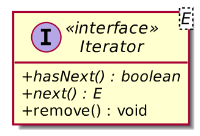
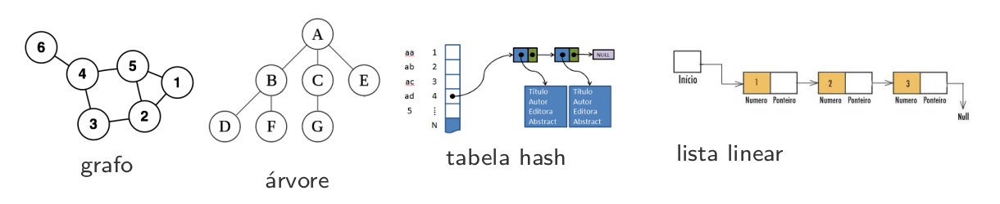
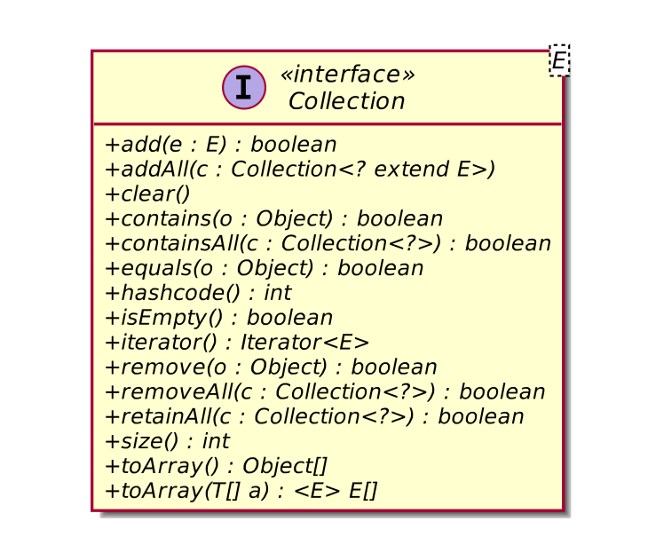
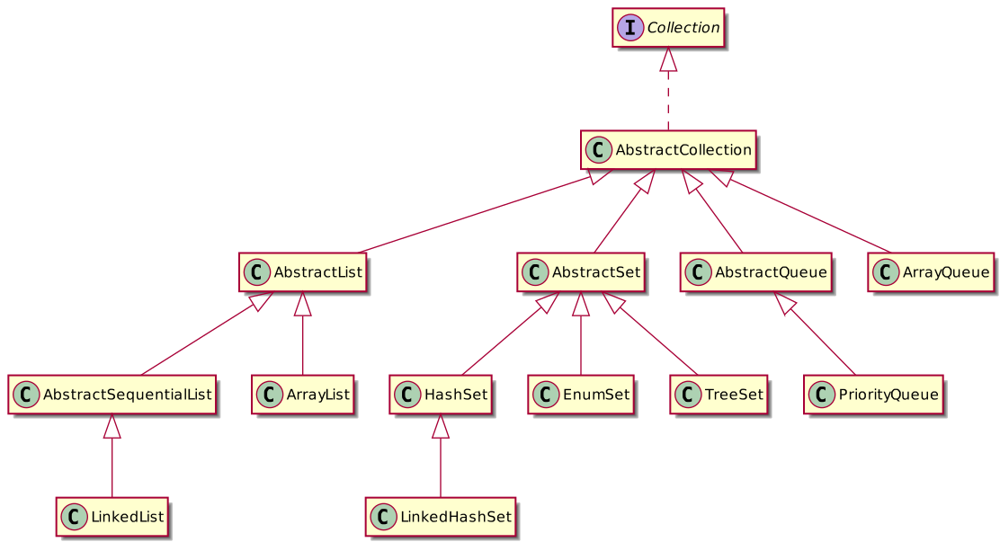
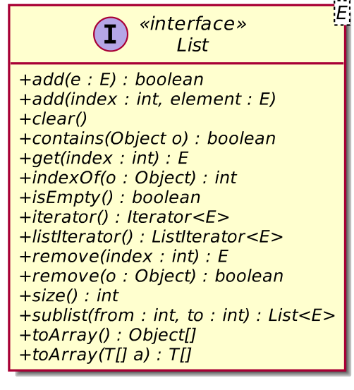
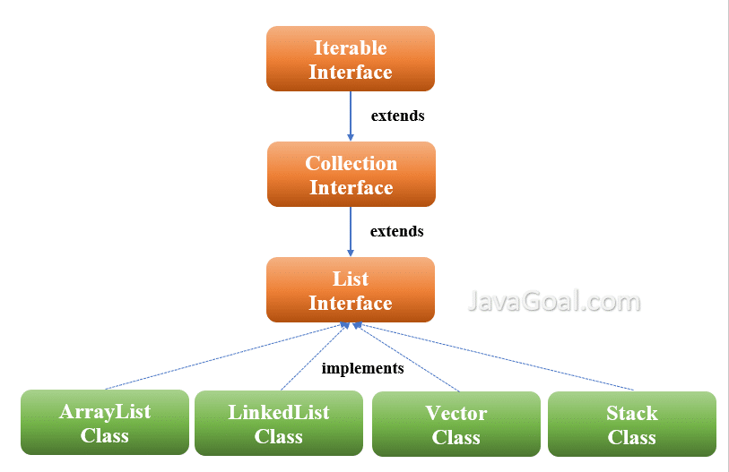
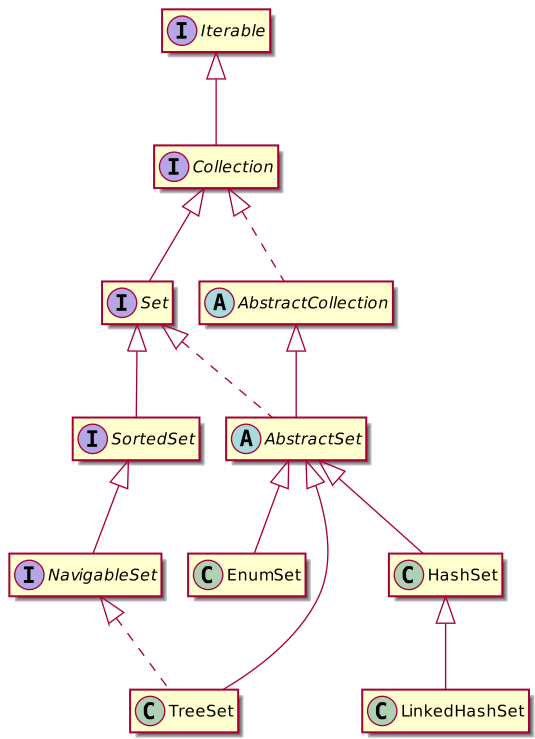
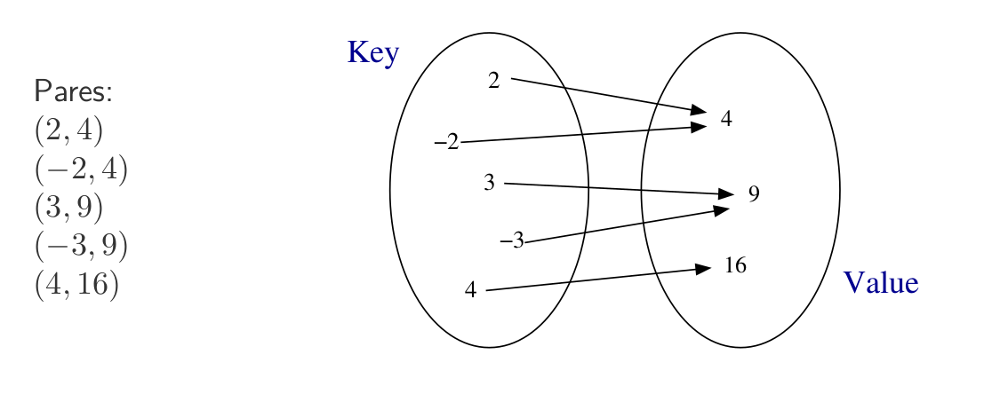
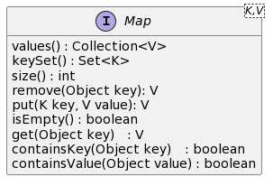
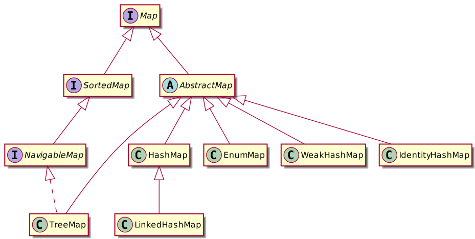

## Collections Framework

* O framework Collections é uma arquitetura unificada para representar e manipular coleções (collections) independentemente dos detalhes de implementação.

* Algumas classes que implementam estruturas de dados podem ter funções semelhantes mas implementações internamente diferentes (por exemplo: lista encadeada × vetor).
* Por esse motivo, Java separa a representação da coleção em interfaces e implementações. 

* O programador pode, então, para uma dada estrutura de dado ou coleção, escolher a implementação mais adequada à sua necessidade.

## Interface Iterator



* O Iterator é um padrão de projeto comportamental que permite a passagem sequencial através de uma estrutura de dados complexa sem expor seus detalhes internos.



* Graças ao Iterator, os clientes podem examinar elementos de diferentes coleções de maneira semelhante usando uma única interface iterador.


## Interface Collection<E>

* Define as operações gerais realizadas em uma coleção de objetos.
* Essa coleção pode ter diferentes comportamentos. 







### Exemplo1.java


```Java
import java.util.ArrayList;
import java.util.Collection;
import java.util.Iterator;

public class Exemplo1 {
    public static void main(String[] args) {
        Collection<Integer> lista = new ArrayList<Integer>();

        lista.add(5);
        lista.add(8);
        lista.add(9);
        lista.add(4);
        lista.add(5);

        Iterator it = lista.iterator();

        while( it.hasNext() ){
            System.out.println( it.next() );
        }

        System.out.println( lista.contains(7) );
    }
}
/*
5
8
9
4
5
false
*/
```

### Exemplo2.java

```java
import java.util.ArrayList;
import java.util.Collection;
import java.util.HashSet;
import java.util.Iterator;

public class Exemplo2 {
    public static void main(String[] args) {
        Collection<Integer> lista = new HashSet<Integer>();

        lista.add(5);
        lista.add(8);
        lista.add(9);
        lista.add(4);
        lista.add(5);

        Iterator it = lista.iterator();

        while( it.hasNext() ){
            System.out.println( it.next() );
        }

        System.out.println( lista.contains(7) );
    }
}

/*
4
5
8
9
false

*/
```


## Interface List<E>

* Pode conter elementos duplicados
* Herdam todos os métodos de Collection e provêm ainda:
* Acesso posicional (get, set, add, addAll, remove)
* Busca por um elemento na lista e retorna sua posição (indexOf, lastIndexOf)
* Sub-listas
* Duas listas são igual se tiverem os mesmos elementos e na mesma ordem





* ArrayList
  * Possui o melhor desempenho
  * Inserção e exclusão (linear)
  * Acesso rápido ao elemento

* LinkedList
  * Buscas mais lentas (linear)
  * Inserções e exclusões rápidas
* Vector e Stack são legadas

## Interface Set

* É uma coleção que não contém elementos duplicados
* É uma abstração dos conjuntos da matemática
* Herdam todos os métodos de Collection e impõe a restrição de duplicidade
(equals e hashCode)
* Dois conjuntos são iguais se ambos possuem os mesmos elementos



* HashSet
  * Armazena os elementos em uma tabela de dispersão
  * Possui o melhor desempenho
  * Não garante a ordem de iteração
* TreeSet
  * Armazena os elementos em um árvore rubro-negra
  * Ordena os elementos de acordo com seus valores (compareTo ou Comparator)
  * Mais lenta que o HashSet
* LinkedHashSet
  * Combina uma tabela de dispersão com um lista encadeada
  * Mantém a ordem de inserção
  * Um pouco mais custoso que o HashSet


```java
import java.util.HashSet;
import java.util.Iterator;
import java.util.Set;

public class Exemplo3 {
    public static void main(String[] args) {
        Set<Integer> set = new HashSet<Integer>();

        set.add(4);
        set.add(5);
        set.add(8);
        set.add(9);
        set.add(15);
        set.add(4784);
        set.add(5756);
        set.add(4587861);
        

        System.out.println( set.size() );

        Iterator it = set.iterator();

        while( it.hasNext() ){
            System.out.println( it.next() );
        }
  
    }
}
/*
8
4784
4587861
4
5
8
9
5756
15
*/
```

```java
import java.util.TreeSet;
import java.util.Iterator;
import java.util.Set;

public class Exemplo4 {
    public static void main(String[] args) {
        Set<Integer> set = new TreeSet<Integer>();

        set.add(4);
        set.add(5);
        set.add(8);
        set.add(9);
        set.add(15);
        set.add(4784);
        set.add(5756);
        set.add(4587861);
        

        System.out.println( set.size() );

        Iterator it = set.iterator();

        while( it.hasNext() ){
            System.out.println( it.next() );
        }

        
        
        
        
        
    }
}
/*
8
4
5
8
9
15
4784
5756
4587861
*/
```

```java
import java.util.LinkedHashSet;
import java.util.Iterator;
import java.util.Set;


public class Exemplo5 {
    public static void main(String[] args) {
        Set<Integer> set = new LinkedHashSet<Integer>();

        set.add(4);
        set.add(5);
        set.add(8);
        set.add(9);
        set.add(15);
        set.add(4587861);
        
        set.add(5756);
        set.add(4784);
        set.add(4777);
        
        

        System.out.println( set.size() );

        Iterator it = set.iterator();

        while( it.hasNext() ){
            System.out.println( it.next() );
        }

        
        
        
        
        
    }
}
/*
9
4
5
8
9
15
4587861
5756
4784
4777
*/
```


## Interface Map

* Map é uma estrutura de dados que armazena pares (chave, valor)
* chave e valor são objetos
* Não permite chaves repetidas, mas admite valores repetidos
* Os elementos são indexados pelo objeto chave (não possuem repetição)
* Acesso, inserção e remoção de elementos são rápidos








* HashMap
  * Usa uma tabela de dipersão internamente
  * Permite chaves null
  * Não garante a ordem dos dados
    *Melhor performance
* TreeMap
  * Usa uma árvore binária de busca internamente
  *  Garante que o mapa será ordenado na ordem crescentes das chaves
  * É possível especificar outra ordem
* LinkedHashMap
  * Mantém um lista duplamente encadeada entre os itens
  * Ordem de iteração é a ordem de inserção

### HashMap
```java
import java.util.HashMap;
import java.util.Map;
import java.util.Iterator;

public class Exemplo6 {
    public static void main(String[] args) {
        Map<String, Integer> votos = new HashMap<String, Integer>();
        votos.put("java", 6);
        votos.put("python", 6);
        votos.put("c++", 5);
        votos.put("javascript", 8);
        votos.put("ada", 1);
        votos.put("c", 3);
        votos.put("bash", 1);
        votos.put("eiffel", 0);

        
        Iterator<Map.Entry<String, Integer>> it = votos.entrySet().iterator();
        System.out.println("iterating using Iterator");
        
        //using Iterator
        while( it.hasNext() ){
            Map.Entry<String, Integer> entry = it.next(); 
            System.out.printf( "votos[%s] = %d\n", entry.getKey(), entry.getValue() );
        }
        System.out.println("iterating using Iterator + type inference");
        
        //using Iterator + type inference
        var it2 = votos.entrySet().iterator();
        while( it2.hasNext() ){
            var entry = it2.next(); 
            System.out.printf( "votos[%s] = %d\n", entry.getKey(), entry.getValue() );
        }
        System.out.println("iterating over entrySet");
        //iterating over entrySet
        for(var entry : votos.entrySet() ){
            System.out.printf( "votos[%s] = %d\n", entry.getKey(), entry.getValue() );
        }
        System.out.println("iterating over keySet");
        //iterating over keySet
        for(String key : votos.keySet() ){
            System.out.printf( "votos[%s] = %d\n", key, votos.get(key) );
        }

        System.out.println("iterating using forEach");
        //iterating using forEach
        votos.forEach( (k,v)-> System.out.printf( "votos[%s] = %d\n", k, v) );

        
    }
}
/*
iterating using Iterator
votos[python] = 6
votos[c++] = 5
votos[java] = 6
votos[c] = 3
votos[bash] = 1
votos[eiffel] = 0
votos[javascript] = 8
votos[ada] = 1
iterating using Iterator + type inference
votos[python] = 6
votos[c++] = 5
votos[java] = 6
votos[c] = 3
votos[bash] = 1
votos[eiffel] = 0
votos[javascript] = 8
votos[ada] = 1
iterating over entrySet
votos[python] = 6
votos[c++] = 5
votos[java] = 6
votos[c] = 3
votos[bash] = 1
votos[eiffel] = 0
votos[javascript] = 8
votos[ada] = 1
iterating over keySet
votos[python] = 6
votos[c++] = 5
votos[java] = 6
votos[c] = 3
votos[bash] = 1
votos[eiffel] = 0
votos[javascript] = 8
votos[ada] = 1
iterating using forEach
votos[python] = 6
votos[c++] = 5
votos[java] = 6
votos[c] = 3
votos[bash] = 1
votos[eiffel] = 0
votos[javascript] = 8
votos[ada] = 1
*/
```

###TreeMap
```java
import java.util.TreeMap;
import java.util.Map;
import java.util.Iterator;

public class Exemplo7 {
    public static void main(String[] args) {
        Map<String, Integer> votos = new TreeMap<String, Integer>();

        votos.put("java", 6);
        votos.put("python", 6);
        votos.put("c++", 5);
        votos.put("javascript", 8);
        votos.put("ada", 1);
        votos.put("c", 3);
        votos.put("bash", 1);
        votos.put("eiffel", 0);
        
        Iterator<Map.Entry<String, Integer>> it = votos.entrySet().iterator();
        System.out.println("iterating using Iterator");
        
        //using Iterator
        while( it.hasNext() ){
            Map.Entry<String, Integer> entry = it.next(); 
            System.out.printf( "votos[%s] = %d\n", entry.getKey(), entry.getValue() );
        }
        System.out.println("iterating using Iterator + type inference");
        
        //using Iterator + type inference
        var it2 = votos.entrySet().iterator();
        while( it2.hasNext() ){
            var entry = it2.next(); 
            System.out.printf( "votos[%s] = %d\n", entry.getKey(), entry.getValue() );
        }
        System.out.println("iterating over entrySet");
        //iterating over entrySet
        for(var entry : votos.entrySet() ){
            System.out.printf( "votos[%s] = %d\n", entry.getKey(), entry.getValue() );
        }
        System.out.println("iterating over keySet");
        //iterating over keySet
        for(String key : votos.keySet() ){
            System.out.printf( "votos[%s] = %d\n", key, votos.get(key) );
        }

        System.out.println("iterating using forEach");
        //iterating using forEach
        votos.forEach( (k,v)-> System.out.printf( "votos[%s] = %d\n", k, v) );

        
    }
}
/*
iterating using Iterator
votos[ada] = 1
votos[bash] = 1
votos[c] = 3
votos[c++] = 5
votos[eiffel] = 0
votos[java] = 6
votos[javascript] = 8
votos[python] = 6
iterating using Iterator + type inference
votos[ada] = 1
votos[bash] = 1
votos[c] = 3
votos[c++] = 5
votos[eiffel] = 0
votos[java] = 6
votos[javascript] = 8
votos[python] = 6
iterating over entrySet
votos[ada] = 1
votos[bash] = 1
votos[c] = 3
votos[c++] = 5
votos[eiffel] = 0
votos[java] = 6
votos[javascript] = 8
votos[python] = 6
iterating over keySet
votos[ada] = 1
votos[bash] = 1
votos[c] = 3
votos[c++] = 5
votos[eiffel] = 0
votos[java] = 6
votos[javascript] = 8
votos[python] = 6
iterating using forEach
votos[ada] = 1
votos[bash] = 1
votos[c] = 3
votos[c++] = 5
votos[eiffel] = 0
votos[java] = 6
votos[javascript] = 8
votos[python] = 6

*/
```

### LinkedHashMap

```java
import java.util.LinkedHashMap;
import java.util.Map;
import java.util.Iterator;

public class Exemplo8 {
    public static void main(String[] args) {
        Map<String, Integer> votos = new LinkedHashMap<String, Integer>();

        votos.put("java", 6);
        votos.put("python", 6);
        votos.put("c++", 5);
        votos.put("javascript", 8);
        votos.put("ada", 1);
        votos.put("c", 3);
        votos.put("bash", 1);
        votos.put("eiffel", 0);
        
        Iterator<Map.Entry<String, Integer>> it = votos.entrySet().iterator();
        System.out.println("iterating using Iterator");
        
        //using Iterator
        while( it.hasNext() ){
            Map.Entry<String, Integer> entry = it.next(); 
            System.out.printf( "votos[%s] = %d\n", entry.getKey(), entry.getValue() );
        }
        System.out.println("iterating using Iterator + type inference");
        
        //using Iterator + type inference
        var it2 = votos.entrySet().iterator();
        while( it2.hasNext() ){
            var entry = it2.next(); 
            System.out.printf( "votos[%s] = %d\n", entry.getKey(), entry.getValue() );
        }
        System.out.println("iterating over entrySet");
        //iterating over entrySet
        for(var entry : votos.entrySet() ){
            System.out.printf( "votos[%s] = %d\n", entry.getKey(), entry.getValue() );
        }
        System.out.println("iterating over keySet");
        //iterating over keySet
        for(String key : votos.keySet() ){
            System.out.printf( "votos[%s] = %d\n", key, votos.get(key) );
        }

        System.out.println("iterating using forEach");
        //iterating using forEach
        votos.forEach( (k,v)-> System.out.printf( "votos[%s] = %d\n", k, v) );

        
    }
}
/*
iterating using Iterator
votos[java] = 6
votos[python] = 6
votos[c++] = 5
votos[javascript] = 8
votos[ada] = 1
votos[c] = 3
votos[bash] = 1
votos[eiffel] = 0
iterating using Iterator + type inference
votos[java] = 6
votos[python] = 6
votos[c++] = 5
votos[javascript] = 8
votos[ada] = 1
votos[c] = 3
votos[bash] = 1
votos[eiffel] = 0
iterating over entrySet
votos[java] = 6
votos[python] = 6
votos[c++] = 5
votos[javascript] = 8
votos[ada] = 1
votos[c] = 3
votos[bash] = 1
votos[eiffel] = 0
iterating over keySet
votos[java] = 6
votos[python] = 6
votos[c++] = 5
votos[javascript] = 8
votos[ada] = 1
votos[c] = 3
votos[bash] = 1
votos[eiffel] = 0
iterating using forEach
votos[java] = 6
votos[python] = 6
votos[c++] = 5
votos[javascript] = 8
votos[ada] = 1
votos[c] = 3
votos[bash] = 1
votos[eiffel] = 0
*/
```

## Interface Queue<E>

Uma coleção projetada para conter elementos antes do processamento. Além das operações básicas de coleta, as filas fornecem operações adicionais de inserção, extração e inspeção. Cada um desses métodos existe em duas formas: um lança uma exceção se a operação falhar, o outro retorna um valor especial (nulo ou falso, dependendo da operação). 

Implementações Conhecidas:

* ArrayDeque
    * Implementação de array redimensionável da interface Deque. Os ArrayDeque não têm restrições de capacidade; eles crescem conforme necessário para suportar o uso.
    * Elementos nulos são proibidos. 
    * Essa classe provavelmente será mais rápida que Stack quando usada como pilha e mais rápida que LinkedList quando usada como fila.

* PriorityQueue
    * Os elementos da fila de prioridade são ordenados de acordo com sua ordenação natural, ou por um Comparator fornecido no momento da construção da fila, dependendo de qual construtor é usado. 
    * Uma fila de prioridade não permite elementos nulos. 
    * Uma fila de prioridade que depende de ordenação natural também não permite a inserção de objetos não comparáveis (isso pode resultar em ClassCastException).

### ArrayDeque

```java
import java.util.ArrayDeque;
import java.util.Iterator;
import java.util.Queue;

public class Exemplo9 {
    public static void main(String[] args) {
        Queue<Integer> q = new ArrayDeque<Integer>();

        q.add(8);
        q.add(9);
        q.add(10);
        q.add(7);

        
        Iterator it = q.iterator();

        while( it.hasNext() ){
            System.out.println( it.next() );
        }

        while( !q.isEmpty() ){
            int u = q.poll(); // recupera e remove o primeiro
            System.out.println(u);
        }

    }
}
```

### PriorityQueue

```java
import java.util.Iterator;
import java.util.PriorityQueue;
import java.util.Queue;

public class Exemplo10 {
    public static void main(String[] args) {
        Queue<Integer> q = new PriorityQueue<Integer>();

        q.add(8);
        q.add(9);
        q.add(10);
        q.add(7);
        
        System.out.println("Iterating over queue");
        Iterator it = q.iterator();
        while( it.hasNext() ){
            System.out.println( it.next() );
        }

        System.out.println("Retrieve elements from priority queue");
        while( !q.isEmpty() ){
            int u = q.poll(); // recupera e remove o primeiro
            System.out.println(u);
        }

    }
}
```