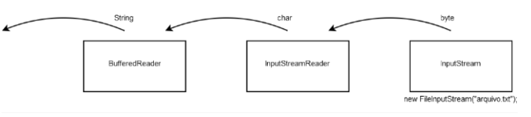
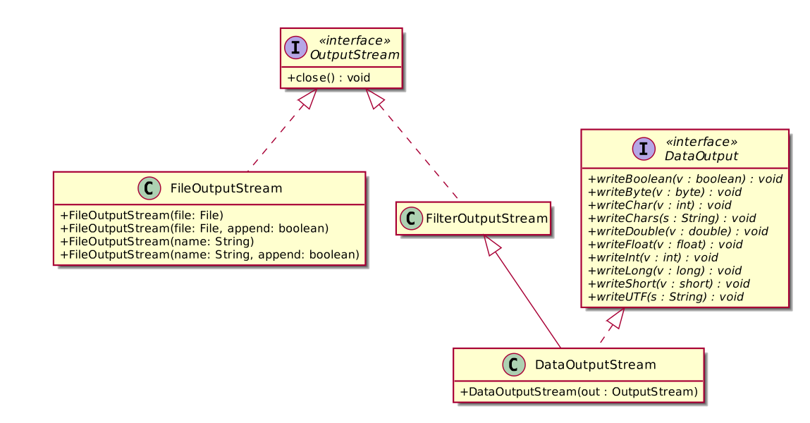
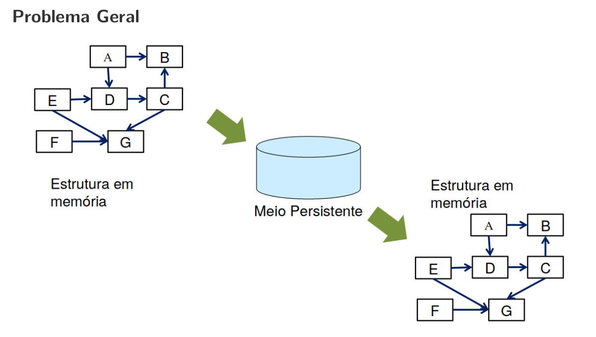
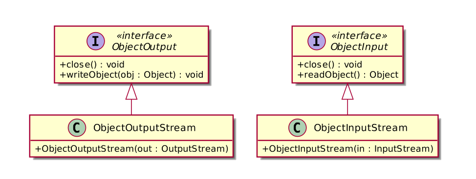

## Entrada e Saída

Na linguagem Java, o controle de entrada e saída de dados (conhecido como io) também é orientada a objetos e utiliza vários conceitos de OO como: interfaces, classes abstratas e polimorfismo.

Na linguagem Java, um canal de comunicação chamado de *stream* (fluxo) é estabelecido entre o dispositivo (teclado, arquivo) e a memória RAM. 

Esses canais de comunicação podem ser de entrada ou saída.


As operações sobre os **stream** de entrada e saída são as mesmas independente de ser um arquivo, uma conexão remota via sockets, console ou campo blob de um banco de dados.


## InputStream e OutputStream 

As classes abstratas InputStream e OutputStream definem o comportamento padrão dos fluxos de entrada e saída de bytes.

A classe abstrata InputStream possui várias subclasses conhecidas como ``AudioInputStream, ByteArrayInputStream, FileInputStream, FilterInputStream, InputStream, ObjectInputStream, PipedInputStream, SequenceInputStream, StringBufferInputStream``

A classe abstrada OutputStream possui várias subclasses conhecidas conhecidas como ``ByteArrayOutputStream, FileOutputStream, FilterOutputStream, ObjectOutputStream, OutputStream, PipedOutputStream`` 


**InputStream**

```Java
import java.io.FileInputStream;
import java.io.InputStream;

class Exemplo1 {
    public static void main(String[] args) {

        try {
            InputStream is = new FileInputStream("hello.txt");
            int data;
            data = is.read();
            int cont = 0;
            while (data != -1) {
                System.out.println("Char : " + (char) data);

                if ((char) data == 'l') {
                    is.skip(1);
                }

                if ((char) data == '!') {
                    cont++;
                    System.out.println(cont);
                    if (cont == 1) {
                        is.mark(0);
                    } else if (cont == 2) {
                        if (is.markSupported()) {
                            System.out.println("reset() chamado");
                            is.reset();
                        } else {
                            System.out.println("reset() nao suportado");
                        }
                    }
                }

                data = is.read();
            }
        } catch (Exception e) {
            e.printStackTrace();
        }
    }
}
```

**OutputStream**

```Java
import java.io.FileOutputStream;
import java.io.InputStream;
import java.io.OutputStream;

class Exemplo2 {
    public static void main(String[] args) {

        try {
            OutputStream out = new FileOutputStream("hello.out");
            String s = "Hello World";
            for(int i = 0; i < s.length(); i++){
                out.write( s.charAt(i) );
            }
            out.close();
        } catch (Exception e) {
            e.printStackTrace();
        }
    }
}
```


## Classe Abstrata Reader

A classe abstrata Reader é utilizada para a leitura de fluxo de caracteres.

Subclasses conhecidas da classe Reader:
``BufferedReader, CharArrayReader, FilterReader, InputStreamReader, PipedReader, StringReader``


## InputStreamReader

Em alguns casos, precisamos de uma ponte para converter um fluxo de bytes em um fluxo de caracteres. O fluxo de bytes pode utilizar diferentes formatos de codificação dos caracteres como:


| Charset      | Description                                                                                  |
|--------------|----------------------------------------------------------------------------------------------|
| US-ASCII     | Seven-bit ASCII, a.k.a. ISO646-US, a.k.a. the Basic Latin block of the Unicode character set |
| ISO-8859-1   | ISO Latin Alphabet No. 1, a.k.a. ISO-LATIN-1                                                 |
| UTF-8        | Eight-bit UCS Transformation Format                                                          |
| UTF-16BE     | Sixteen-bit UCS Transformation Format, big-endian byte order                                 |
| UTF-16LE     | Sixteen-bit UCS Transformation Format, little-endian byte order                              |
| UTF-16       | Sixteen-bit UCS Transformation Format, byte order identified by an optional byte-order mark  |

Neste caso, utilizamos a classe InputStreamReader realiza essa ponte entre um stream de bytes e um stream de caracteres codificados.

```Java
import java.io.FileInputStream;
import java.io.InputStream;
import java.io.InputStreamReader;

public class Exemplo3 {
    public static void main(String[] args) {
        try{
            InputStream is = new FileInputStream("hello.txt");
            InputStreamReader isr = new InputStreamReader(is, StandardCharsets.UTF_8);
            int data;
            data = isr.read();
            while (data != -1) {
                System.out.println("Char : " + (char) data);
                data = isr.read();
            }
        }catch(Exception e){
            e.printStackTrace();
        }
    }
}
```


## BufferedReader


Note que a leitura de uma String seria complicada usando InputStream. A classe BufferedReader resolve esse problema.



```Java
import java.io.BufferedReader;
import java.io.InputStream;
import java.io.InputStreamReader;
import java.io.FileInputStream;

public class Exemplo4 {
    public static void main(String[] args) {
        try{
            InputStream is = new FileInputStream("hello.txt");
            InputStreamReader isr = new InputStreamReader(is, "UTF-8");
            BufferedReader br = new BufferedReader(isr);

            System.out.println( br.readLine() );
        }catch(Exception e){
            e.printStackTrace();
        }
    }
}
```

## Classe Writer

A classe Writer é uma classe abstrata para a escrita de fluxo de caracteres.

A classe Writer possui as seguintes subclasses diretas conhecidas: ``BufferedWriter, CharArrayWriter, FilterWriter, OutputStreamWriter, PipedWriter, PrintWriter, StringWriter``

## Classe BufferedWriter

Essa classe é usada para escrever textos em uma fluxo de caracteres de saída.


```Java
import java.io.OutputStreamWriter;
import java.io.FileOutputStream;
import java.io.BufferedWriter;

public class Exemplo5 {
    public static void main(String[] args) {
        try {
            OutputStream out = new FileOutputStream("hello.out");
            OutputStreamWriter osr = new OutputStreamWriter(out, "UTF-8");
            BufferedWriter bw = new BufferedWriter(osr);

            bw.write("Hello World!!!");
            bw.close();
        } catch (Exception e) {
            e.printStackTrace();
        }
    }
}
```

## Classe FileWriter

Essa classe utilizada para criar arquivos de textos para gravação de caracteres.

```
import java.io.FileWriter;
import java.nio.charset.StandardCharsets;

public class Exemplo6 {
    public static void main(String[] args) {
        try {
            FileWriter fstream = new FileWriter("hello.out", StandardCharsets.UTF_8, false);
            
            fstream.write("Hello OutputStream characteres!!!");
            fstream.close();

        } catch (Exception e) {
            e.printStackTrace();
        }
    }
}
```

## Classe PrintWriter

Permite a impressão formatada de objetos no fluxo de saída.

```Java
import java.io.PrintWriter;
import java.nio.charset.StandardCharsets;

class Student{
    String nome;
    int matricula;
    public Student(String nome, int matricula) {
        this.nome = nome;
        this.matricula = matricula;
    }
    @Override
    public String toString() {
        return "Student [nome=" + nome + ", matricula=" + matricula + "]";
    }

}

public class Exemplo7 {
    public static void main(String[] args) {
        try {
            PrintWriter out = new PrintWriter("hello.out", StandardCharsets.UTF_8);

            Student s = new Student("joao", 0);

            out.println("Hello OutputStream characteres!!!");
            out.println(s);
            out.close();

        } catch (Exception e) {
            e.printStackTrace();
        }
    }
}
```

## Classe DataInputStream e DataOutputStream

Permite a escrita e a leitura de tipos de dados primitivos Java de uma maneira portável (em binário).

```Java
import java.io.DataInputStream;
import java.io.DataOutputStream;
import java.io.FileInputStream;
import java.io.FileOutputStream;
import java.io.InputStream;
import java.io.OutputStream;

public class Exemplo8 {
    public static void main(String[] args) {
        try {
            OutputStream os = new FileOutputStream("hello.dat");
            DataOutputStream out = new DataOutputStream(os);
            out.writeInt(45);
            out.writeDouble(2.35);
            out.close();

            InputStream is = new FileInputStream("hello.dat");
            DataInputStream in = new DataInputStream(is);

            System.out.println( in.readInt() );
            System.out.println( in.readDouble() );

            in.close();
            

        } catch (Exception e) {
            e.printStackTrace();
        }
    }
}
```

hello.dat
```
\00\00\00-@\CC\CC\CC\CC\CC\CD
```



## Serialização de Objetos
* Serialização: consiste em representar um objeto como uma sequência de
bytes.
  * Um objeto serializado é um objeto representado como uma sequência
de bytes que inclui os dados do objeto assim como as informações
sobre o tipo do objeto e os tipos dos dados armazenados no objeto.
  * Um objeto é serializado pode ser transmitido por uma stream e armazenado em disco.
* Desserialização: consiste em reconstruir um objeto a partir de uma
sequência de bytes.
  * O objeto é lido a partir do arquivo por meio de uma stream.
  * Então, ele é desserializado e reconstruı́do na memória do computador.



## ObjectOutputStream e ObjectInputStream


* ObjectOutputStream: permite a serialização de uma estrutura de
objetos num dispositivo de saı́da. Implementa a interface
ObjectOutput


* ObjectInputStream: permite a desserialização de objetos a partir de
dados lidos de um dispositivo de entrada. Implementa a interface
ObjectInput



## Interface Serializable
* A interface java.io.Serializable deve ser implementada pelas classes
a serem serializadas.
* Esta interface é apenas de marcação, pois não tem nenhum atributo e nenhum método a ser implementado, serve apenas para que a JVM saiba que aquela determinada classe está hábil para ser serializada.
* Por padrão, todas as variáveis de tipo nativo e do tipo String são serializáveis. Arrays também são serializáveis. Todas as coleções do Java são serializáveis.
* Para demais variáveis do tipo referência, você deve checar a documentação da classe e de suas superclasses para determinar se ela é serializável.
* Em uma classe Serializable, todas os atributos de instância devem ser
Serializable.
* Toda variável de instância que for não-serializável deve ser declarada
transient para indicar que elas deveriam ser ignoradas durante o
processo de serialização.

```Java
// Classe Car serializável para armazenar carros como objetos
import java.io.Serializable;

public class Car implements Serializable {
    private String registration; 
    private transient String make; // marcado como "transient"
    private double price;

    public Car(String registration, String make, double price) {
        this.registration = registration;
        this.make = make;
        this.price = price;
    }

    public String getRegistration() {
        return registration;
    }

    public String getMake() {
        return make;
    }

    public double getPrice() {
        return price;
    }

    @Override
    public String toString() {
        return String.format("Registration: %s, Make: %s, Price: %.2f", 
            getRegistration(), getMake(), getPrice());
    }
}
```

Main.java
```Java
import java.util.ArrayList;
import java.util.List;
import java.util.Locale;
import java.util.Scanner;
import java.io.IOException;
import java.io.ObjectInputStream;
import java.io.ObjectOutputStream;
import java.io.StreamCorruptedException;
import java.io.EOFException;
import java.io.FileInputStream;
import java.io.FileNotFoundException;
import java.io.FileOutputStream;

public class Main {
    public static void main(String[] args) {
        Locale.setDefault(Locale.US);
        Scanner sc = new Scanner(System.in);
        char choice;

        // create an empty List to hold Cars
        List<Car> carList = new ArrayList<>();

        // read the list from file when the program starts
        readList(carList);

        // menu options
        do {
            System.out.println("\nText File Tester");
            System.out.println("1. Add a car");
            System.out.println("2. Remove a car");
            System.out.println("3. List all cars");
            System.out.println("4. Quit");
            System.out.print("Entre your choice: ");
            choice = sc.next().charAt(0);
            
            switch(choice) {
                case '1': addCar(carList); break;
                case '2': removeCar(carList); break;
                case '3': listAll(carList); break;
                case '4': writeList(carList); break; // write to the file
                default : System.out.print("\nPlease choose a number from 1-4 only\n");
            }
        } while(choice != '4');
    }

    // method to add a new car to the List
    static void addCar(List<Car> carListIn) {
        String tempReg;
        String tempMake;
        double tempPrice;

        Scanner sc = new Scanner(System.in);
        System.out.print("Please enter the registration number: ");
        tempReg = sc.next();
        System.out.print("Please enter the make: ");
        tempMake = sc.next();
        System.out.print("Please enter the price: ");
        tempPrice = sc.nextDouble();
        carListIn.add(new Car(tempReg, tempMake, tempPrice));
    }

    // method for removing a car from the list 
    static void removeCar(List<Car> carListIn) {
        int pos;
        System.out.print("Enter the position of the car to be removed: ");
        Scanner sc = new Scanner(System.in);
        pos = sc.nextInt();
        carListIn.remove(pos-1);
    }

    // method for listing details of all cars in the list
    static void listAll(List<Car> carListIn) {
        for(Car item : carListIn) {
            System.out.println(item);
        }
    }

    // method for writing the file
    static void writeList(List<Car> carListIn) {
        // use try-with-resources to ensure file is closed safely
        try (
                /* create a FileOutputStream object, carFile, that handles
                the low-level details of writing the list to a file 
                which we have called "Cars.ser" */
                FileOutputStream carFile = new FileOutputStream("Cars.ser");
                // create an ObjectOutputStream object to wrap around carFile
                ObjectOutputStream carStream = new ObjectOutputStream(carFile);
            )
        {
            // write each element of the list to the file
            for(Car item : carListIn) {
                carStream.writeObject(item);
            }
        }
        catch(IOException e) {
            System.out.println("There was a problem writing the file");
        }
    }

    // method for reading the file
    static void readList(List<Car> carListIn) {
        Car tempCar;
        boolean endOfFile = false;

        // use try-with-resources to ensure file is closed safely
        try (
                // create a FileInputStream object that handles the low-level 
                // details of reading the list from the "Cars.ser" file 
                FileInputStream carFile = new FileInputStream("Cars.ser");
                // create an ObjectInputStream object to wrap around carFile
                ObjectInputStream carStream = new ObjectInputStream(carFile);
            )
        {
            while(endOfFile == false) { 
                try {
                    // read a whole object
                    tempCar = (Car) carStream.readObject();
                    carListIn.add(tempCar);
                }
                catch(EOFException e) {
                    // use the fact that readObject throws an EOFException
                    // to check whether the end of the filehas been reached
                    endOfFile = true;
                }                
            }
        }
        catch(FileNotFoundException e) {
            System.out.println("\nNo previous file was read");
        }
        catch(ClassNotFoundException e) { // thrown by readObject
            System.out.println("\nTrying to read an object of an unknown class");
        }
        catch(StreamCorruptedException e) { // thrown by the constructor ObjectInputStream
            System.out.println("\nUnreadable file format");
        }
        catch(IOException e) {
            System.out.println("\nerror: There was a problem reading the file");
        }
    }
}
```

```bash
wladimir@wladimir-Nitro:~/Disciplinas/2022.2/Programação Orientação a Objetos/re
positorio/Semana17$ java Main 

No previous file was read

Text File Tester
1. Add a car
2. Remove a car
3. List all cars
4. Quit
Entre your choice: 1
Please enter the registration number: 1
Please enter the make: Corsa
Please enter the price: 1000

Text File Tester
1. Add a car
2. Remove a car
3. List all cars
4. Quit
Entre your choice: 3
Registration: 1, Make: Corsa, Price: 1000.00

Text File Tester
1. Add a car
2. Remove a car
3. List all cars
4. Quit
Entre your choice: 4
wladimir@wladimir-Nitro:~/Disciplinas/2022.2/Programação Orientação a Objetos/re
positorio/Semana17$ java Main 

Text File Tester
1. Add a car
2. Remove a car
3. List all cars
4. Quit
Entre your choice: 3
Registration: 1, Make: null, Price: 1000.00

Text File Tester
1. Add a car
2. Remove a car
3. List all cars
4. Quit
Entre your choice: 1
Please enter the registration number: 2
Please enter the make: fiat
Please enter the price: 50000

Text File Tester
1. Add a car
2. Remove a car
3. List all cars
4. Quit
Entre your choice: 3
Registration: 1, Make: null, Price: 1000.00
Registration: 2, Make: fiat, Price: 50000.00

Text File Tester
1. Add a car
2. Remove a car
3. List all cars
4. Quit
Entre your choice: 4
```