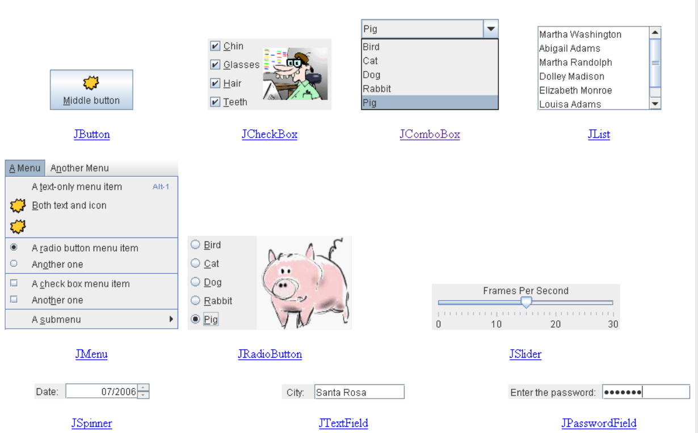
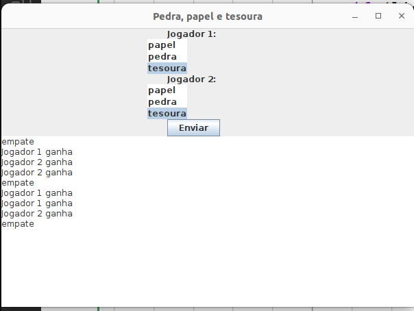
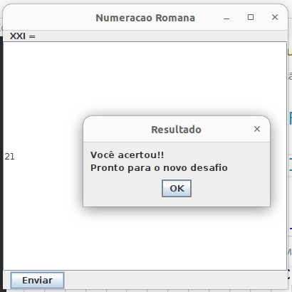

## Interface Gráfica com o Usuário


Os conceitos da programação orientada a objetos como: Herança, Polimorfismo e sobrecarga são essenciais para o desenvolvimento de programa com interface gráfica com o usuário (GUI).

Histórico:

**AWT (Abstract Window Toolkit)**

* API padrão para criação de componentes GUI no início da plataforma
Java (entre 1995 até 1998);
* Os objetos AWT são construídos sobre objetos de código nativo do
Sistema Operacional em uso;
* Os componentes GUI originais do pacote java.awt estão diretamente
associados com as capacidades de GUI da plataforma local.
* Os componentes são exibidos com uma aparência diferente em cada plataforma. Por exemplo, de Windows, Apple Macintosh, Solaris, etc.

**Swing**

* API escrita puramente em Java (padrão desde 1998);
* JLabel, JButton, JTextField, etc, são componentes GUI do pacote
javax.swing.
* Mais flexível que o java.awt porque é implementada toda em Java, enquanto que java.awt é implementada em código nativo.


<p align = "center">
<b>Hierarquia de Classes</b> 
</p>

**Classe abstrata java.awt.Component**

Um componente é um objeto que possui uma representação gráfica que pode ser exibida na tela e que pode interagir com o usuário. Exemplos de componentes são os botões, caixas de seleção e barras de rolagem de uma interface gráfica de usuário típica.

**Classe  java.awt.Container**

Um objeto container genérico do Abstract Window Toolkit(AWT) é um componente que pode conter outros componentes AWT.

Os containers podem ser divididos em vários níveis:
* Nível mais alto: frames, diálogos;
* Nível intermediário: panel, scroll panel
* Nível mais baixo: Button, Label, TextField

Todo programa que usa uma GUI Swing tem pelo menos um container de alto nível (top-level).

Um container de alto nível provê o suporte que os componenetes necessitam para realizar o desenho da tela e o tratamento de eventos.

A linguagem Java fornece alguns containers de alto nível :
* JFrame (Janela principal)
* JDialog (Janela secundária)

**javax.swing.JFrame**

Uma versão estendida de java.awt.Frame que adiciona suporte para a arquitetura de componentes JFC/Swing.

Possui diversos métodos herdados  java.awt.Component, java.awt.Container, java.awt.Frame e class java.awt.Window


```Java
import javax.swing.JFrame;
import javax.swing.JLabel;

public class GUI1 {
    public static void main(String[] args) {
        JFrame frame = new JFrame("Primeiro programa");
        JLabel label = new JLabel("Hello World");
        frame.setSize(800,500);
        frame.getContentPane().add(label);
        frame.setDefaultCloseOperation(JFrame.EXIT_ON_CLOSE);
        frame.setVisible(true);
    }
}
```


<p align="center">

</p>


<p align = "center">
<b>Primeira Janela</b> 
</p>


**Classe javax.swing.JComponent**

A class javax.swing.JComponent herda de java.awt.Container.

A classe base para todos os componentes Swing , exceto contêineres de alto nível. Para usar um componente que herda de JComponent, você deve adicionar o componente em um container de nível superior.

Subclasses diretas conhecidas: 
``AbstractButton, BasicInternalFrameTitlePane, Box, Box.Filler, JColorChooser, JComboBox, JFileChooser, JInternalFrame, JInternalFrame.JDesktopIcon, JLabel, JLayer, JLayeredPane, JList, JMenuBar, JOptionPane, JPanel, JPopupMenu, JProgressBar, JRootPane, JScrollBar, JScrollPane, JSeparator, JSlider, JSpinner, JSplitPane, JTabbedPane, JTable, JTableHeader, JTextComponent, JToolBar, JToolTip, JTree, JViewport``


**Controles Básicos**



**Controles com informações formatadas**


**Controles com informações não-editáveis**


**Classe javax.swing.JOptionPane**


JOptionPane facilita a exibição de uma caixa de diálogo padrão que solicita aos usuários um valor ou os informa sobre algo.

```Java
import javax.swing.JOptionPane;

public class GUI2 {
    public static void main(String[] args) {
        String s1 = JOptionPane.showInputDialog("Entre com um número:");
        String s2 = JOptionPane.showInputDialog("Entre com um número:");

        int n1 = Integer.parseInt(s1);
        int n2 = Integer.parseInt(s2);

        JOptionPane.showMessageDialog(null, "A soma dos dois números é " + (n1 + n2), "Resultado", JOptionPane.PLAIN_MESSAGE);
        
        
    }
}
```


<p align="center">

</p>
<p align = "center">
<b>ShowInputDialog</b> 
</p>


<p align="center">

</p>
<p align = "center">
<b>ShowMessageDialog</b> 
</p>


**Estendendo JFrame**

```Java
import javax.swing.JButton;
import javax.swing.JFrame;
import javax.swing.JLabel;
import javax.swing.JTextField;
import javax.swing.BoxLayout;

public class GUI3 extends JFrame {
    private JLabel label1;
    private JTextField textfield1;
    private JLabel label2;
    private JTextField textfield2;
    private JButton button1;     
    private JLabel label3;
    private JTextField textfield3; 

    public GUI3() {
        super("Somando números");
        
        label1 = new JLabel("Entre com um número");;
        textfield1 = new JTextField(10);
        label2 = new JLabel("Entre com um número");
        textfield2 = new JTextField(10);
        button1 = new JButton("OK");
        label3 = new JLabel("Resultado: ");
        textfield3 = new JTextField(10);
        setLayout(new BoxLayout(getContentPane(), BoxLayout.Y_AXIS));
        add(label1);
        add(textfield1);
        add(label2);
        add(textfield2);
        add(button1);
        add(label3);
        add(textfield3);
    }

}

```

**Instaciando minha Janela**
```Java
import javax.swing.JFrame;

public class TesteGUI3 {
    public static void main(String[] args) {

        GUI3 frame = new GUI3();
        frame.setDefaultCloseOperation(JFrame.EXIT_ON_CLOSE);
        frame.setSize(275, 180); // configura tamanho do frame
        frame.setVisible(true); // exibe frame
    }
}

``` 

<p align="center">

</p>
<p align = "center">
<b>Estendendo JFrame</b> 
</p>

**Tratamento de Eventos**

* Um evento é uma ação (ou ocorrência) que é disparada por um acontecimento que pode ter origem humana ou computacional.

* EXEMPLOS DE EVENTOS
  * Apertar uma tecla do teclado;
  * Clicar com o botão do mouse;
  * Tocar a tela de um dispositivo sensível ao toque;
  * Usar o comando de voz de um TV compatível;


**Tipos de eventos**
* Eventos do Usuário (user-initiated)
  * Iniciados por um usuário do sistema;
  * Dependem da iniciativa humana para poderem disparar uma ação.
* Eventos Automáticos (automatic)
    * Iniciados pelo sistema computacional;
    * Dependem da programação do sistema computacional para poderem disparar uma ação

**Eventos do usuário**
  * Clicar em um botão na tela;
  * Tocar a tela;
  * Arrastar algo na tela;
  * Uma tecla for pressionada
  * Um ator for clicado

* Em um botão podemos anexar um objeto Listener(Ouvinte) que quando o objeto muda de estado o objeto Listener é avisado e realiza alguma ação.

* Esse objeto implementa a interface ActionListener e possui um método
void actionPerformed(ActionEvent e)


**Adicionando um ActionListener**

```Java
import javax.swing.JButton;
import javax.swing.JFrame;
import javax.swing.JLabel;
import javax.swing.JTextField;
import javax.swing.BoxLayout;
import javax.swing.JOptionPane;
import java.awt.event.ActionListener;
import java.awt.event.ActionEvent;

public class GUI3 extends JFrame {
    private JLabel label1;
    private JTextField textfield1;
    private JLabel label2;
    private JTextField textfield2;
    private JButton button1;
    private JLabel label3;
    private JTextField textfield3;

    public GUI3() {
        super("Somando números");

        label1 = new JLabel("Entre com um número");
        ;
        textfield1 = new JTextField(10);
        label2 = new JLabel("Entre com um número");
        textfield2 = new JTextField(10);
        button1 = new JButton("OK");
        label3 = new JLabel("Resultado: ");
        textfield3 = new JTextField(10);
        setLayout(new BoxLayout(getContentPane(), BoxLayout.Y_AXIS));
        add(label1);
        add(textfield1);
        add(label2);
        add(textfield2);

        add(button1);

        add(label3);
        add(textfield3);
        ButtonHandler handler = new ButtonHandler();
        button1.addActionListener(handler);
    }

    private class ButtonHandler implements ActionListener{
        public void actionPerformed(ActionEvent e) {
            int n1 = Integer.parseInt(textfield1.getText());
            int n2 = Integer.parseInt(textfield2.getText());
            Integer res = n1 + n2;
            System.out.println("chamando\n");
            textfield3.setText(res.toString());
        }
    }

}
```

**Usando um classe anônima ActionListener**

```Java
import javax.swing.JButton;
import javax.swing.JFrame;
import javax.swing.JLabel;
import javax.swing.JTextField;
import javax.swing.BoxLayout;
import javax.swing.JOptionPane;
import java.awt.event.ActionListener;
import java.awt.event.ActionEvent;

public class GUI4 extends JFrame {
    private JLabel label1;
    private JTextField textfield1;
    private JLabel label2;
    private JTextField textfield2;
    private JButton button1;
    private JLabel label3;
    private JTextField textfield3;

    public GUI4() {
        super("Somando números");

        label1 = new JLabel("Entre com um número");
        textfield1 = new JTextField(10);
        label2 = new JLabel("Entre com um número");
        textfield2 = new JTextField(10);
        button1 = new JButton("OK");
        label3 = new JLabel("Resultado: ");
        textfield3 = new JTextField(10);
        setLayout(new BoxLayout(getContentPane(), BoxLayout.Y_AXIS));
        add(label1);
        add(textfield1);
        add(label2);
        add(textfield2);

        add(button1);

        add(label3);
        add(textfield3);
        

        button1.addActionListener( new ActionListener() {
            public void actionPerformed(ActionEvent e) {
                int n1 = Integer.parseInt(textfield1.getText());
                int n2 = Integer.parseInt(textfield2.getText());
                Integer res = n1 + n2;
                System.out.println("chamando\n");
                textfield3.setText(res.toString());
            }
        } );
    }

    

}
```

**Trabalhando com JList**

<p align="center">

</p>
<p align = "center">
<b>Trabalhando com um JList</b> 
</p>


```Java
import javax.swing.JFrame;
import javax.swing.JLabel;
import javax.swing.JList;
import javax.swing.JTextArea;
import javax.swing.JTextField;
import javax.swing.ListModel;
import javax.swing.event.ListSelectionEvent;
import javax.swing.event.ListSelectionListener;
import javax.swing.ListSelectionModel;
import java.util.List;
import java.text.Bidi;
import java.util.ArrayList;
import javax.swing.BoxLayout;
import javax.swing.ButtonGroup;
import javax.swing.DefaultListModel;
import javax.swing.JButton;
import java.awt.event.ActionListener;
import java.awt.event.ActionEvent;

public class GUI5 extends JFrame {
    JList lista;
    DefaultListModel listModel;
    JLabel label1;
    JTextField textField1;
    JTextArea textArea1;
    JButton button1;
    JButton button2;

    public GUI5() {
        super("Lista de Frutas");

        listModel = new DefaultListModel<>();

        listModel.addElement("maça");
        listModel.addElement("banana");

        lista = new JList<>(listModel);
        lista.setSelectionMode(ListSelectionModel.SINGLE_SELECTION);

        textArea1 = new JTextArea(10, 50);
        label1 = new JLabel("Fruta");
        textField1 = new JTextField(20);
        button1 = new JButton("Adicionar Fruta");
        button2 = new JButton("Remover Fruta");

        setLayout(new BoxLayout(getContentPane(), BoxLayout.Y_AXIS));
        add(lista);
        add(label1);
        add(textField1);
        add(button1);
        add(button2);
        add(textArea1);

        button1.addActionListener(
                new ActionListener() {
                    public void actionPerformed(ActionEvent e) {

                        listModel.addElement(textField1.getText());
                        textField1.setText("");
                    }
                }
        );

        button2.addActionListener(
                new ActionListener() {
                    public void actionPerformed(ActionEvent e) {
                        textArea1.append("removendo o elemento na posicao: " + lista.getSelectedIndex() + "\n");
                        listModel.remove( lista.getSelectedIndex() );
                        lista.setSelectedIndex(0);
                    }
                }
        );  
        
        lista.addListSelectionListener(
                new ListSelectionListener() {
                    @Override
                    public void valueChanged(ListSelectionEvent e) {
                        if (!e.getValueIsAdjusting()) {
                            textArea1.append("Indice selecionado: " + lista.getSelectedIndex() + "\n");
                            textArea1.append("Valor selecionado: " + lista.getSelectedValue() + "\n");
                        }
                    }
                });

    }

}

```

TesteGUI5

```Java
import javax.swing.JFrame;

public class TesteGUI5 {
    public static void main(String[] args) {
        GUI5 frame = new GUI5();
        frame.setDefaultCloseOperation(JFrame.EXIT_ON_CLOSE);
        frame.setSize(400, 400); // configura tamanho do frame
        frame.setVisible(true); // exibe frame
    }
}
```

## Pedra, Papel e Tesoura

<p align="center">

</p>
<p align = "center">
<b>Pedra, papel e Tesoura</b> 
</p>

```Java
import javax.swing.JFrame;
import javax.swing.JLabel;
import javax.swing.JList;
import javax.swing.JRadioButton;
import javax.swing.JTextArea;
import javax.swing.JTextField;
import javax.swing.ListModel;
import javax.swing.event.ListSelectionEvent;
import javax.swing.event.ListSelectionListener;
import javax.swing.ListSelectionModel;
import java.util.List;
import java.text.Bidi;
import java.util.ArrayList;
import javax.swing.BoxLayout;
import javax.swing.ButtonGroup;
import javax.swing.DefaultListModel;
import javax.swing.JButton;
import java.awt.event.ActionListener;
import java.awt.event.ActionEvent;

public class GUI6 extends JFrame {
    private JLabel label1, label2;
    private DefaultListModel listModel;
    private JList lista1, lista2;
    private JButton button1;
    private JTextArea textArea1;

    public GUI6() {
        super("Pedra, papel e tesoura");
        label1 = new JLabel("Jogador 1:");

        listModel = new DefaultListModel<>();
        listModel.addElement("papel");
        listModel.addElement("pedra");
        listModel.addElement("tesoura");

        lista1 = new JList<>(listModel);
        lista1.setSelectionMode(ListSelectionModel.SINGLE_SELECTION);

        label2 = new JLabel("Jogador 2:");

        lista2 = new JList<>(listModel);
        lista2.setSelectionMode(ListSelectionModel.SINGLE_SELECTION);

        button1 = new JButton("Enviar");
        textArea1 = new JTextArea(10, 30);
        setLayout(new BoxLayout(getContentPane(), BoxLayout.Y_AXIS));
        add(label1);
        add(lista1);
        add(label2);
        add(lista2);
        add(button1);
        add(textArea1);

        button1.addActionListener(
                new ActionListener() {
                    public void actionPerformed(ActionEvent e) {

                        if (lista1.getSelectedIndex() == lista2.getSelectedIndex()) {
                            textArea1.append("empate\n");
                        } else if (lista1.getSelectedIndex() == 0) {
                            if (lista2.getSelectedIndex() == 1)
                                textArea1.append("Jogador 1 ganha\n");
                            if (lista2.getSelectedIndex() == 2)
                                textArea1.append("Jogador 2 ganha\n");
                        } else if (lista1.getSelectedIndex() == 1) {
                            if (lista2.getSelectedIndex() == 0)
                                textArea1.append("Jogador 2 ganha\n");
                            if (lista2.getSelectedIndex() == 2)
                                textArea1.append("Jogador 1 ganha\n");
                        }else {
                            if (lista2.getSelectedIndex() == 0)
                                textArea1.append("Jogador 1 ganha\n");
                            if (lista2.getSelectedIndex() == 1)
                                textArea1.append("Jogador 2 ganha\n");
                        }
                    }
                });
    }

}
```
## Jogo da Numeração Romana

<p align="center">

</p>
<p align = "center">
<b>Jogo da Numeração Romana</b> 
</p>

```Java
import javax.swing.JFrame;
import javax.swing.JLabel;
import javax.swing.JList;
import javax.swing.JRadioButton;
import javax.swing.JTextArea;
import javax.swing.JTextField;
import javax.swing.ListModel;
import javax.swing.event.ListSelectionEvent;
import javax.swing.event.ListSelectionListener;
import javax.swing.ListSelectionModel;
import java.util.List;
import java.util.Random;
import java.text.Bidi;
import java.util.ArrayList;
import javax.swing.BoxLayout;
import javax.swing.ButtonGroup;
import javax.swing.DefaultListModel;
import javax.swing.JButton;
import java.awt.event.ActionListener;
import java.awt.event.ActionEvent;
import javax.swing.JOptionPane;

public class GUI7 extends JFrame {
    JLabel label1;
    JTextField textField1;
    JButton button1;
    int numero_secreto;
    String repr;
    Random rand;

    private String romanNumber(int x) {
        String[] romanSymbols = { "I", "IV", "V", "IX", "X", "XL", "L", "XC", "C" };
        int[] romanValues = { 1, 4, 5, 9, 10, 40, 50, 90, 100 };
        String res = "";

        int pos = romanSymbols.length - 1;

        while (x > 0) {

            if (x >= romanValues[pos]) {
                res += romanSymbols[pos];
                x -= romanValues[pos];
            } else {
                pos--;
            }

        }

        return res;

    }

    public GUI7() {
        super("Numeracao Romana");

        rand = new Random();
        numero_secreto = rand.nextInt(99) + 1;
        repr = romanNumber(numero_secreto);

        label1 = new JLabel(repr + " = ");
        textField1 = new JTextField(6);
        button1 = new JButton("Enviar");
        setLayout(new BoxLayout(getContentPane(), BoxLayout.Y_AXIS));
        add(label1);
        add(textField1);
        add(button1);

        button1.addActionListener(
                new ActionListener() {
                    public void actionPerformed(ActionEvent e) {
                        int n1 = Integer.parseInt(textField1.getText());
                        if (n1 == numero_secreto) {
                            JOptionPane.showMessageDialog(null, "Você acertou!!\nPronto para o novo desafio",
                                    "Resultado", JOptionPane.PLAIN_MESSAGE);
                            numero_secreto = rand.nextInt(99) + 1;
                            repr = romanNumber(numero_secreto);
                            label1.setText(repr + " = ");
                            textField1.setText("");
                        } else {
                            JOptionPane.showMessageDialog(null, "Infelizmente, você errou :( Tente novamente",
                                    "Resultado", JOptionPane.PLAIN_MESSAGE);
                            numero_secreto = rand.nextInt(99) + 1;
                            repr = romanNumber(numero_secreto);
                            label1.setText(repr + " = ");
                            textField1.setText("");
                        }
                    }
                });
    }

}

```