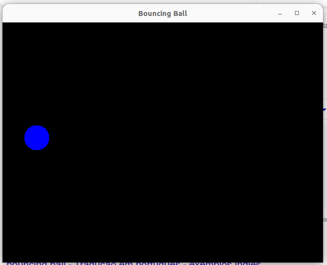

## Interface Gráfica com o Usuário

## Jogo da Velha

<p align="center">

</p>
<p align = "center">
<b>Jogo da Velha</b> 
</p>

**Classe JogoDaVelha**

```Java
import java.awt.*;
import java.awt.event.*;
import javax.swing.*;

public class JogoDaVelha extends JFrame {

    JButton[][] buttons = new JButton[3][3];
    String[] jogador = { "X", "O" };
    int joga_da_vez = 0;
    boolean terminou = false;

    public JogoDaVelha() {
        super("Jogo da Velha");
        JPanel controls = new JPanel();
        controls.setLayout(new GridLayout(3, 3));

        for (int i = 0; i < 3; i++) {
            for (int j = 0; j < 3; j++) {
                buttons[i][j] = new JButton("");
                controls.add(buttons[i][j]);
                buttons[i][j].addActionListener(
                        new ActionListener() {
                            @Override
                            public void actionPerformed(ActionEvent e) {

                                if (terminou)
                                    return;

                                JButton button = (JButton) e.getSource();

                                if (button.getText() == "") {
                                    button.setText(jogador[joga_da_vez]);
                                    joga_da_vez = (joga_da_vez + 1) % 2;
                                } else {
                                    JOptionPane.showMessageDialog(null, "jogada inválida");
                                }

                                for (int i = 0; i < 3; i++) {
                                    int[] contJogador = new int[2];
                                    contJogador[0] = 0;
                                    contJogador[1] = 0;
                                    for (int j = 0; j < 3; j++) {
                                        if (buttons[i][j].getText().equals(jogador[0])) {
                                            contJogador[0]++;
                                        } else if (buttons[i][j].getText().equals(jogador[1])) {
                                            contJogador[1]++;
                                        }
                                    }

                                    if (contJogador[0] == 3) {
                                        JOptionPane.showMessageDialog(null, "Primeiro Jogador Venceu");
                                        terminou = true;
                                    } else if (contJogador[1] == 3) {
                                        JOptionPane.showMessageDialog(null, "Segundo Jogador Venceu");
                                        terminou = true;
                                    }
                                }

                                for (int j = 0; j < 3; j++) {
                                    int[] contJogador = new int[2];
                                    contJogador[0] = 0;
                                    contJogador[1] = 0;
                                    for (int i = 0; i < 3; i++) {
                                        if (buttons[i][j].getText().equals(jogador[0])) {
                                            contJogador[0]++;
                                        } else if (buttons[i][j].getText().equals(jogador[1])) {
                                            contJogador[1]++;
                                        }
                                    }

                                    if (contJogador[0] == 3) {
                                        JOptionPane.showMessageDialog(null, "Primeiro Jogador Venceu");
                                        terminou = true;
                                    } else if (contJogador[1] == 3) {
                                        JOptionPane.showMessageDialog(null, "Segundo Jogador Venceu");
                                        terminou = true;
                                    }
                                }

                            }
                        });
            }
        }
        add(controls);
    }
}

```

**Classe TesteJogoDaVelha**

```Java
import javax.swing.JFrame;

public class TesteJogoDaVelha {
    public static void main(String[] args) {
        JogoDaVelha frame = new JogoDaVelha();
        frame.setDefaultCloseOperation(JFrame.EXIT_ON_CLOSE);
        frame.setSize(400, 400); // configura tamanho do frame
        frame.setVisible(true); // exibe frame
    }
}
```

## Campo Minado

<p align="center">

</p>
<p align = "center">
<b>CampoMinado</b> 
</p>

**Classe Campo Minado**

```Java
import java.awt.*;
import java.awt.event.*;
import javax.swing.*;
import javax.swing.event.MouseInputListener;

import java.util.*;

public class CampoMinado extends JFrame implements  MouseInputListener{

    JPanel painel1;
    JButton[][] tabuleiro;
    Integer [][] contBombas;
    Random rand;
    int rows = 5;
    int cols = 5;
    int posX = -1;
    int posY = -1;
        

    public CampoMinado(){
        super("Campo Minado");
        setLayout(new BoxLayout(getContentPane(), BoxLayout.Y_AXIS));
        setDefaultCloseOperation(JFrame.EXIT_ON_CLOSE);
        setSize(400, 400); // configura tamanho do frame
        setVisible(true); // exibe frame

        
        tabuleiro = new JButton[rows][cols];
        contBombas = new Integer[rows][cols];

        painel1 = new JPanel();
        painel1.setLayout( new GridLayout( rows, cols) );

        for(int i = 0; i < rows; i++){
            for(int j = 0; j < cols; j++){
                contBombas[i][j] = 0;
                tabuleiro[i][j] = new JButton("");
                
                tabuleiro[i][j].addMouseListener(this);
                painel1.add(tabuleiro[i][j]);

            }
        }
        rand = new Random();
        
        for(int k = 0; k < 3; k++){
            int r = rand.nextInt(rows);
            int c = rand.nextInt(cols);
            contBombas[r][c] = -1;
            //System.out.printf("bomba %d %d\n", r, c);
            
        }

        int [] dx = { -1,-1,-1, 0, 0, 1, 1, 1};
        int [] dy = { -1, 0, 1,-1, 1,-1, 0, 1};

        for(int i = 0; i < rows; i++){
            for(int j = 0; j < cols; j++){
                if(contBombas[i][j] == -1) continue;
                int moves = dx.length;
                
                for(int k = 0; k < moves; k++){
                    
                    if( i + dx[k] >= 0 && i+dx[k] < rows){
                        if( j + dy[k] >= 0 && j + dy[k] < cols){
                            
                            if( contBombas[i + dx[k]][j + dy[k]] == -1){
                                contBombas[i][j]++;
                            }
                            
                        }
                    }
                }
                
            }
        }


       
        add(painel1);
        

    }

   
   
    public void mousePressed(MouseEvent e) {
        

        if(e.getButton() == MouseEvent.BUTTON1){
            for(int i = 0; i < rows; i++){
                for(int j = 0; j < cols; j++){
                    
                    if( e.getSource() instanceof JButton){
                        JButton button = (JButton)e.getSource();
                        if( button == tabuleiro[i][j]  ){
                            
                            if(contBombas[i][j] != -1){
                                tabuleiro[i][j].setText( contBombas[i][j].toString());
                            }else{
                                JOptionPane.showMessageDialog(null, "você explodiu");
                            }
                        }
                    }
                }
            }
        }else if( e.getButton() == MouseEvent.BUTTON3){
            
            for(int i = 0; i < rows; i++){
                for(int j = 0; j < cols; j++){
                    
                    if( e.getSource() instanceof JButton){
                        JButton button = (JButton)e.getSource();
                        if( button == tabuleiro[i][j]  ){
                            
                            if(contBombas[i][j] == -1){
                                tabuleiro[i][j].setText( "D" );
                                JOptionPane.showMessageDialog(null, "bomba desarmada");
                            }else{
                                JOptionPane.showMessageDialog(null, "errou");
                            }
                        }
                    }
                }
            }
        }
    }
    public void mouseReleased(MouseEvent e) {}
    public void mouseEntered(MouseEvent e) {}
    public void mouseExited(MouseEvent e) {}
    public void mouseMoved(MouseEvent e) {}
    public void mouseDragged(MouseEvent e) {}
    public void mouseClicked(MouseEvent e) {
        
        
        
      }

}

```

**Classe TesteCampoMinado**

```Java
import javax.swing.JFrame;

public class TesteCampoMinado {
    public static void main(String[] args) {
        CampoMinado frame = new CampoMinado();
       
    }
}
```


## Bola Quicando


<p align="center">

</p>
<p align = "center">
<b>BolaQuicando</b> 
</p>

```Java
import java.awt.*; // Using AWT's Graphics and Color
import javax.swing.*; // Using Swing's components and containers

/**
 * A Bouncing Ball: Running animation via a custom thread
 */
public class CGBouncingBall extends JFrame {
    // Define named-constants
    private static final int CANVAS_WIDTH = 640;
    private static final int CANVAS_HEIGHT = 480;
    private static final int UPDATE_INTERVAL = 20; // milliseconds

    private DrawCanvas canvas; // the drawing canvas (an inner class extends JPanel)

    // Attributes of moving object
    private int x = 100; // top-left (x, y)
    private int y = 100;
    private int size = 50; // width and height
    private int xSpeed = 3; // moving speed in x and y directions
    private int ySpeed = 5; // displacement per step in x and y

    // Constructor to setup the GUI components and event handlers
    public CGBouncingBall() {
        canvas = new DrawCanvas();
        canvas.setPreferredSize(new Dimension(CANVAS_WIDTH, CANVAS_HEIGHT));
        this.setContentPane(canvas);
        this.setDefaultCloseOperation(EXIT_ON_CLOSE);
        this.pack();
        this.setTitle("Bouncing Ball");
        this.setVisible(true);

        // Create a new thread to run update at regular interval
        Thread updateThread = new Thread() {
            @Override
            public void run() {
                while (true) {
                    update(); // update the (x, y) position
                    repaint(); // Refresh the JFrame. Called back paintComponent()
                    try {
                        // Delay and give other thread a chance to run
                        Thread.sleep(UPDATE_INTERVAL); // milliseconds
                    } catch (InterruptedException ignore) {
                    }
                }
            }
        };
        updateThread.start(); // called back run()
    }

    // Update the (x, y) position of the moving object
    public void update() {
        x += xSpeed;
        y += ySpeed;
        if (x > CANVAS_WIDTH - size || x < 0) {
            xSpeed = -xSpeed;
        }
        if (y > CANVAS_HEIGHT - size || y < 0) {
            ySpeed = -ySpeed;
        }
    }

    // Define Inner class DrawCanvas, which is a JPanel used for custom drawing
    class DrawCanvas extends JPanel {
        @Override
        public void paintComponent(Graphics g) {
            super.paintComponent(g); // paint parent's background
            setBackground(Color.BLACK);
            g.setColor(Color.BLUE);
            g.fillOval(x, y, size, size); // draw a circle
        }
    }

    // The entry main method
    public static void main(String[] args) {
        // Run GUI codes in Event-Dispatching thread for thread safety
        SwingUtilities.invokeLater(new Runnable() {
            @Override
            public void run() {
                new CGBouncingBall(); // Let the constructor do the job
            }
        });
    }
}
```

## Movimentando uma bolinha com o teclado

```Java
import java.awt.*; // Using AWT's Graphics and Color
import java.awt.event.*; // Using AWT's event classes and listener interface
import javax.swing.*; // Using Swing's components and containers

/**
 * A Bouncing Ball: Running animation via a custom thread
 */
public class CGBouncingBall2 extends JFrame {
    // Define named-constants
    private static final int CANVAS_WIDTH = 640;
    private static final int CANVAS_HEIGHT = 480;
    private static final int UPDATE_INTERVAL = 20; // milliseconds

    private DrawCanvas canvas; // the drawing canvas (an inner class extends JPanel)

    // Attributes of moving object
    private int x = 100; // top-left (x, y)
    private int y = 100;
    private int size = 50; // width and height
    private int xSpeed = 3; // moving speed in x and y directions
    private int ySpeed = 5; // displacement per step in x and y

    // Constructor to setup the GUI components and event handlers
    public CGBouncingBall2() {
        canvas = new DrawCanvas();
        canvas.setPreferredSize(new Dimension(CANVAS_WIDTH, CANVAS_HEIGHT));
        this.setContentPane(canvas);
        this.setDefaultCloseOperation(EXIT_ON_CLOSE);
        this.pack();
        this.setTitle("Bouncing Ball");
        this.setVisible(true);

        // Create a new thread to run update at regular interval
        Thread updateThread = new Thread() {
            @Override
            public void run() {
                while (true) {
                    repaint(); // Refresh the JFrame. Called back paintComponent()
                    try {
                        // Delay and give other thread a chance to run
                        Thread.sleep(UPDATE_INTERVAL); // milliseconds
                    } catch (InterruptedException ignore) {
                    }
                }
            }
        };
        updateThread.start(); // called back run()


        // "super" JFrame fires KeyEvent
        addKeyListener(new KeyAdapter() {
            @Override
            public void keyPressed(KeyEvent evt) {
                switch (evt.getKeyCode()) {
                    case KeyEvent.VK_LEFT:
                        
                        if(x - size >= 0){
                            x -= size;
                        }

                        repaint();
                        break;
                    case KeyEvent.VK_RIGHT:
                        if(x + size < CANVAS_WIDTH){
                            x += size;
                        }
                        repaint();
                        break;

                    case KeyEvent.VK_UP:
                    if(y - size >= 0){
                        y -= size;
                    }
                    repaint();
                    break;
                    
                    case KeyEvent.VK_DOWN:
                    if(y + size < CANVAS_HEIGHT){
                        y += size;
                    }
                    repaint();
                    break;
                }
            }
        });
    }

    


    // Define Inner class DrawCanvas, which is a JPanel used for custom drawing
    class DrawCanvas extends JPanel {
        @Override
        public void paintComponent(Graphics g) {
            super.paintComponent(g); // paint parent's background
            setBackground(Color.BLACK);
            g.setColor(Color.BLUE);
            g.fillOval(x, y, size, size); // draw a circle
        }
    }

    // The entry main method
    public static void main(String[] args) {
        // Run GUI codes in Event-Dispatching thread for thread safety
        SwingUtilities.invokeLater(new Runnable() {
            @Override
            public void run() {
                new CGBouncingBall2(); // Let the constructor do the job
            }
        });
    }
}
```

## Movimentando a bolinha com o mouse

```Java
import java.awt.*; // Using AWT's Graphics and Color
import java.awt.event.*; // Using AWT's event classes and listener interface
import javax.swing.*; // Using Swing's components and containers

/**
 * A Bouncing Ball: Running animation via a custom thread
 */
public class CGBouncingBall3 extends JFrame implements MouseMotionListener {
    // Define named-constants
    private static final int CANVAS_WIDTH = 640;
    private static final int CANVAS_HEIGHT = 480;
    private static final int UPDATE_INTERVAL = 20; // milliseconds

    private DrawCanvas canvas; // the drawing canvas (an inner class extends JPanel)

    // Attributes of moving object
    private int x = 100; // top-left (x, y)
    private int y = 100;
    private int size = 50; // width and height
    private int xSpeed = 3; // moving speed in x and y directions
    private int ySpeed = 5; // displacement per step in x and y

    // Constructor to setup the GUI components and event handlers
    public CGBouncingBall3() {
        canvas = new DrawCanvas();
        canvas.setPreferredSize(new Dimension(CANVAS_WIDTH, CANVAS_HEIGHT));
        this.setContentPane(canvas);
        this.setDefaultCloseOperation(EXIT_ON_CLOSE);
        this.pack();
        this.setTitle("Bouncing Ball");
        this.setVisible(true);

        // Create a new thread to run update at regular interval
        Thread updateThread = new Thread() {
            @Override
            public void run() {
                while (true) {
                    repaint(); // Refresh the JFrame. Called back paintComponent()
                    try {
                        // Delay and give other thread a chance to run
                        Thread.sleep(UPDATE_INTERVAL); // milliseconds
                    } catch (InterruptedException ignore) {
                    }
                }
            }
        };
        updateThread.start(); // called back run()

        addMouseMotionListener(this);
        
    }

    @Override
    public void mouseMoved(MouseEvent e) {
        x = e.getX()-10;
        y = e.getY()-10;
        repaint();

    }

    @Override
    public void mouseDragged(MouseEvent e) {
    }

    // Define Inner class DrawCanvas, which is a JPanel used for custom drawing
    class DrawCanvas extends JPanel {
        @Override
        public void paintComponent(Graphics g) {
            super.paintComponent(g); // paint parent's background
            setBackground(Color.BLACK);
            g.setColor(Color.BLUE);
            g.fillOval(x, y, size, size); // draw a circle
        }
    }

    // The entry main method
    public static void main(String[] args) {
        // Run GUI codes in Event-Dispatching thread for thread safety
        SwingUtilities.invokeLater(new Runnable() {
            @Override
            public void run() {
                new CGBouncingBall3(); // Let the constructor do the job
            }
        });
    }
}
```