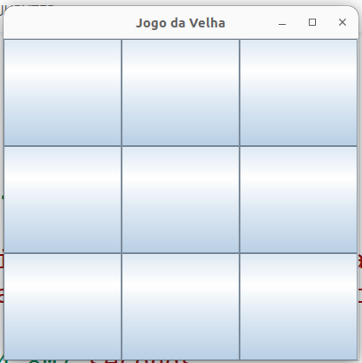
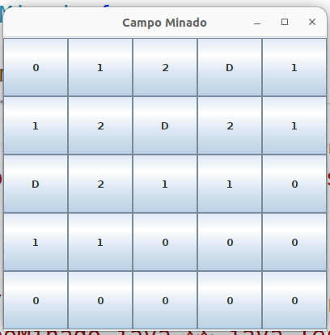

## Interface Gráfica com o Usuário

## Jogo da Velha

<p align="center">

</p>
<p align = "center">
<b>Jogo da Velha</b> 
</p>

**Classe JogoDaVelha**

```Java
import java.awt.*;
import java.awt.event.*;
import javax.swing.*;

public class JogoDaVelha extends JFrame {

    JButton[][] buttons = new JButton[3][3];
    String[] jogador = { "X", "O" };
    int joga_da_vez = 0;
    boolean terminou = false;

    public JogoDaVelha() {
        super("Jogo da Velha");
        JPanel controls = new JPanel();
        controls.setLayout(new GridLayout(3, 3));

        for (int i = 0; i < 3; i++) {
            for (int j = 0; j < 3; j++) {
                buttons[i][j] = new JButton("");
                controls.add(buttons[i][j]);
                buttons[i][j].addActionListener(
                        new ActionListener() {
                            @Override
                            public void actionPerformed(ActionEvent e) {

                                if (terminou)
                                    return;

                                JButton button = (JButton) e.getSource();

                                if (button.getText() == "") {
                                    button.setText(jogador[joga_da_vez]);
                                    joga_da_vez = (joga_da_vez + 1) % 2;
                                } else {
                                    JOptionPane.showMessageDialog(null, "jogada inválida");
                                }

                                for (int i = 0; i < 3; i++) {
                                    int[] contJogador = new int[2];
                                    contJogador[0] = 0;
                                    contJogador[1] = 0;
                                    for (int j = 0; j < 3; j++) {
                                        if (buttons[i][j].getText().equals(jogador[0])) {
                                            contJogador[0]++;
                                        } else if (buttons[i][j].getText().equals(jogador[1])) {
                                            contJogador[1]++;
                                        }
                                    }

                                    if (contJogador[0] == 3) {
                                        JOptionPane.showMessageDialog(null, "Primeiro Jogador Venceu");
                                        terminou = true;
                                    } else if (contJogador[1] == 3) {
                                        JOptionPane.showMessageDialog(null, "Segundo Jogador Venceu");
                                        terminou = true;
                                    }
                                }

                                for (int j = 0; j < 3; j++) {
                                    int[] contJogador = new int[2];
                                    contJogador[0] = 0;
                                    contJogador[1] = 0;
                                    for (int i = 0; i < 3; i++) {
                                        if (buttons[i][j].getText().equals(jogador[0])) {
                                            contJogador[0]++;
                                        } else if (buttons[i][j].getText().equals(jogador[1])) {
                                            contJogador[1]++;
                                        }
                                    }

                                    if (contJogador[0] == 3) {
                                        JOptionPane.showMessageDialog(null, "Primeiro Jogador Venceu");
                                        terminou = true;
                                    } else if (contJogador[1] == 3) {
                                        JOptionPane.showMessageDialog(null, "Segundo Jogador Venceu");
                                        terminou = true;
                                    }
                                }

                            }
                        });
            }
        }
        add(controls);
    }
}

```

**Classe TesteJogoDaVelha**

```Java
import javax.swing.JFrame;

public class TesteJogoDaVelha {
    public static void main(String[] args) {
        JogoDaVelha frame = new JogoDaVelha();
        frame.setDefaultCloseOperation(JFrame.EXIT_ON_CLOSE);
        frame.setSize(400, 400); // configura tamanho do frame
        frame.setVisible(true); // exibe frame
    }
}
```

## Campo Minado

<p align="center">

</p>
<p align = "center">
<b>CampoMinado</b> 
</p>

**Classe Campo Minado**

```Java
import java.awt.*;
import java.awt.event.*;
import javax.swing.*;
import javax.swing.event.MouseInputListener;

import java.util.*;

public class CampoMinado extends JFrame implements  MouseInputListener{

    JPanel painel1;
    JButton[][] tabuleiro;
    Integer [][] contBombas;
    Random rand;
    int rows = 5;
    int cols = 5;
    int posX = -1;
    int posY = -1;
        

    public CampoMinado(){
        super("Campo Minado");
        setLayout(new BoxLayout(getContentPane(), BoxLayout.Y_AXIS));
        setDefaultCloseOperation(JFrame.EXIT_ON_CLOSE);
        setSize(400, 400); // configura tamanho do frame
        setVisible(true); // exibe frame

        
        tabuleiro = new JButton[rows][cols];
        contBombas = new Integer[rows][cols];

        painel1 = new JPanel();
        painel1.setLayout( new GridLayout( rows, cols) );

        for(int i = 0; i < rows; i++){
            for(int j = 0; j < cols; j++){
                contBombas[i][j] = 0;
                tabuleiro[i][j] = new JButton("");
                
                tabuleiro[i][j].addMouseListener(this);
                painel1.add(tabuleiro[i][j]);

            }
        }
        rand = new Random();
        
        for(int k = 0; k < 3; k++){
            int r = rand.nextInt(rows);
            int c = rand.nextInt(cols);
            contBombas[r][c] = -1;
            //System.out.printf("bomba %d %d\n", r, c);
            
        }

        int [] dx = { -1,-1,-1, 0, 0, 1, 1, 1};
        int [] dy = { -1, 0, 1,-1, 1,-1, 0, 1};

        for(int i = 0; i < rows; i++){
            for(int j = 0; j < cols; j++){
                if(contBombas[i][j] == -1) continue;
                int moves = dx.length;
                
                for(int k = 0; k < moves; k++){
                    
                    if( i + dx[k] >= 0 && i+dx[k] < rows){
                        if( j + dy[k] >= 0 && j + dy[k] < cols){
                            
                            if( contBombas[i + dx[k]][j + dy[k]] == -1){
                                contBombas[i][j]++;
                            }
                            
                        }
                    }
                }
                
            }
        }


       
        add(painel1);
        

    }

   
   
    public void mousePressed(MouseEvent e) {
        

        if(e.getButton() == MouseEvent.BUTTON1){
            for(int i = 0; i < rows; i++){
                for(int j = 0; j < cols; j++){
                    
                    if( e.getSource() instanceof JButton){
                        JButton button = (JButton)e.getSource();
                        if( button == tabuleiro[i][j]  ){
                            
                            if(contBombas[i][j] != -1){
                                tabuleiro[i][j].setText( contBombas[i][j].toString());
                            }else{
                                JOptionPane.showMessageDialog(null, "você explodiu");
                            }
                        }
                    }
                }
            }
        }else if( e.getButton() == MouseEvent.BUTTON3){
            
            for(int i = 0; i < rows; i++){
                for(int j = 0; j < cols; j++){
                    
                    if( e.getSource() instanceof JButton){
                        JButton button = (JButton)e.getSource();
                        if( button == tabuleiro[i][j]  ){
                            
                            if(contBombas[i][j] == -1){
                                tabuleiro[i][j].setText( "D" );
                                JOptionPane.showMessageDialog(null, "bomba desarmada");
                            }else{
                                JOptionPane.showMessageDialog(null, "errou");
                            }
                        }
                    }
                }
            }
        }
    }
    public void mouseReleased(MouseEvent e) {}
    public void mouseEntered(MouseEvent e) {}
    public void mouseExited(MouseEvent e) {}
    public void mouseMoved(MouseEvent e) {}
    public void mouseDragged(MouseEvent e) {}
    public void mouseClicked(MouseEvent e) {
        
        
        
      }

}

```

**Classe TesteCampoMinado**

```Java
import javax.swing.JFrame;

public class TesteCampoMinado {
    public static void main(String[] args) {
        CampoMinado frame = new CampoMinado();
       
    }
}
```