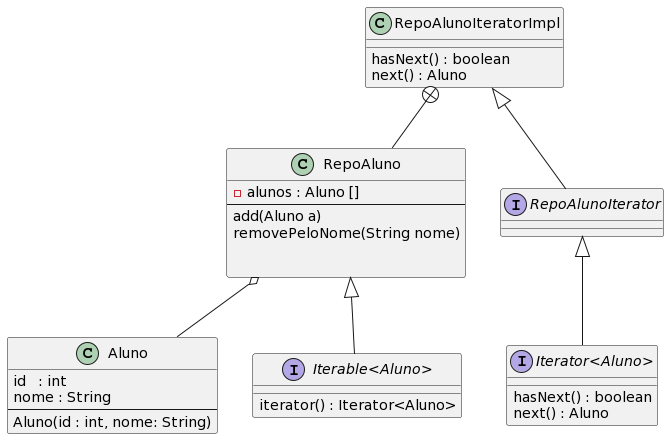

## Padrão Iterator

O padrão de projeto Iterator é um padrão relativamente simples e bastante utilizado. Em um projeto, podemos disponibilizar várias coleções de objetos. Cada coleção de objetos pode prover uma ou mais maneiras de iterar os objetos da coleção sem expor sua implementação. No nosso exemplo, criaremos uma coleção para guardar uma coleção de alunos. A coleção começa com um tamanho inicial. Quando a coleção está cheia, a coleção é realocada para uma outra região da memória com o dobro do tamanho anterior. Além disso, a coleção permite remoção pelo nome do Aluno. A inserção será realizada na primeira posição com ``null``.

```Java
public class RepoAluno {

    Aluno[] alunos;
    
    public RepoAluno(int total) {
        
        alunos = new Aluno[total];
    }

    void add(Aluno a) {
        boolean adicionado = false;

        for (int i = 0; i < alunos.length; i++) {
            if (alunos[i] == null) {
                alunos[i] = a;
                System.out.println(alunos[i]);
                adicionado = true;
                break;
            }
        }

        if(!adicionado){
            Aluno [] aux = Arrays.copyOf(alunos, 2*alunos.length);
            alunos = aux;
            add(a);
        }

    }

    void removePeloNome(String nome){
        for(int i = 0; i < alunos.length; i++){
            if( alunos[i] != null && alunos[i].getNome().equals(nome)){
                alunos[i] = null;
            }
        }
    }

    
    @Override
    public String toString() {
        return "RepoAluno [aluno=" + Arrays.toString(alunos) + "]";
    }
```

## Interface Iterator

A interface Iterator estabelece um contrato de implementação que será desempenhado por todas as classes que implementam essa interface. Note que a interface Iterator é uma interface genérica.

```Java
interface Iterator<E> {
    boolean	hasNext()
    E	next()
}
```


## Interface RepoAlunoIterator

A interface RepoAlunoIterator será uma subinterface da Iterator<Aluno>

```Java
interface RepoAlunoIterator extends Iterator<Aluno> {
}
```

Essa subinterface será implementada por uma classe interna privada ``RepoAlunoIteratorImpl`` que será mostrada a seguir.

## Interface Iterable<E>

É um contrato de implementação que será executado pela class RepoAluno

```Java
interface Iterable<E>{
    Iterator<T> iterator();
}
```

## Classe RepoAluno

```Java
public class RepoAluno implements Iterable<Aluno>{

    Aluno[] alunos;
    

    public RepoAluno(int total) {
        
        alunos = new Aluno[total];
    }

    void add(Aluno a) {
        boolean adicionado = false;

        for (int i = 0; i < alunos.length; i++) {
            if (alunos[i] == null) {
                alunos[i] = a;
                System.out.println(alunos[i]);
                adicionado = true;
                break;
            }
        }

        if(!adicionado){
            Aluno [] aux = Arrays.copyOf(alunos, 2*alunos.length);
            alunos = aux;
            add(a);
        }

    }

    void removePeloNome(String nome){
        for(int i = 0; i < alunos.length; i++){
            if( alunos[i] != null && alunos[i].getNome().equals(nome)){
                alunos[i] = null;
            }
        }
    }

    public RepoAlunoIterator iterator(){
        return new RepoAlunoIteratorImpl();
    }
    


    @Override
    public String toString() {
        return "RepoAluno [aluno=" + Arrays.toString(alunos) + "]";
    }

    private class RepoAlunoIteratorImpl implements RepoAlunoIterator{
        private int position;
        
        RepoAlunoIteratorImpl(){
            position = 0;
        }

        @Override
        public boolean hasNext(){
            while( position < alunos.length){
                if( alunos[position] != null){
                    return true;
                }else{
                    position++;
                }
            }
            return false;
        }

        @Override
        public Aluno next(){
            Aluno a = alunos[position];
            position++;
            return a;
        }

    }

}
```

## Classe TesteRepoAluno

```Java
public class TesteRepoAluno {
    public static void main(String[] args) {
        RepoAluno rep = new RepoAluno(2);

        System.out.println(rep);

        rep.add(new Aluno(1, "joao"));
        System.out.println(rep);
        rep.add(new Aluno(2, "jose"));
        System.out.println(rep);
        rep.add(new Aluno(3, "maria"));
        System.out.println(rep);
        rep.add(new Aluno(4, "marcos"));
        System.out.println(rep);
        rep.removePeloNome("maria");
        System.out.println(rep);
        
        RepoAlunoIterator it = rep.iterator();
        while( it.hasNext() ){
            System.out.println(it.next() );
        }

        for(Aluno a : rep){
            System.out.println(a);
        }
        
    }
}

```

## Diagrama



## PlantUml

```bash
@startuml
RepoAluno o-- Aluno
RepoAluno <|-- "Iterable<Aluno>"
RepoAlunoIteratorImpl <|-- RepoAlunoIterator
RepoAlunoIterator <|-- "Iterator<Aluno>"
RepoAlunoIteratorImpl +-- RepoAluno

class Aluno {
id   : int 
nome : String
--
Aluno(id : int, nome: String)
}
class RepoAluno{
- alunos : Aluno []
--
add(Aluno a)
removePeloNome(String nome)


}

class RepoAlunoIteratorImpl{
hasNext() : boolean
next() : Aluno
}

interface RepoAlunoIterator {

}

interface "Iterator<Aluno>" {
hasNext() : boolean
next() : Aluno
}

interface "Iterable<Aluno>" {
iterator() : Iterator<Aluno>
}
@enduml
```