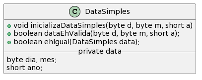

# Modificadores de acesso e Construtores

### Abstração e encapsulamento

Na programação procedural, estamos acostumados a desenvolver programas que seguem os seguintes passos:

* Leitura dos dados
* Processamento
* Saída

Todas as ações são delegadas à funções (main e outras).

No paradigma orientado a objetos, precisamos pensar em como será os nossos **objetos**. A programação orientada a objetos está assentada em quatros pilares principais:
* Abstração
* Encapsulamento
* Herança
* Polimorfismo

Os objetos segue o molde definido pelas **classes**. Como vimos, as **classes** são constituídas por atributos e métodos. A construção de uma classe é realizada através do processo de **abstração**.

```
Abstração é a habilidade de concentrar nos aspectos essenciais de um
contexto qualquer, ignorando caracterı́sticas menos importantes.
Processo pelo qual se isolam atributos de um objeto, considerando os
que certos grupos de objetos tenham em comum.
```

Contudo, a abstração não é suficiente para construímos bons programas orientado a objetos. Considere o exemplo da class Data.




```Java
/**
 * A classe DataSimples contém campos e metodos que
 * permitem a manipulacao de datas
 */
class DataSimples { // declaracao da classe

    byte dia, mes; // atributos ou campos
    short ano;

    /**
     * O metodo inicializaDataSimples recebe argumentos
     * para inicializar os campos da classe DataSimples.
     * @param d o argumento correspondente ao campo dia
     * @param m o argumento correspondente ao campo mes
     * @param a o argumento correspondente ao campo ano
     */
    void inicializaDataSimples(byte d, byte m, short a) {
        if(dataEhValida(d,m,a)) {
            dia = d;
            mes = m;
            ano = a;
        }
        else {
            dia = mes = 0;
            ano = 0;
        }
    }

    /**
     * O metodo dataEhValida recebe tres valores como argumentos
     * e verifica de maneira simples se os dados 
     * correspondem a uma data valida.
     * Vale a pena notar que este algoritmo eh simples e 
     * incorreto.
     * @param d o argumento correspondente ao campo dia
     * @param m o argumento correspondente ao campo mes
     * @param a o argumento correspondente ao campo ano
     * @return true se a data for valida, false caso contrario
     */
    boolean dataEhValida(byte d, byte m, short a) {
        if(d >= 1 && d <= 31 && m >= 1 && m <= 12)
            return true;
        else 
            return false;
    }

    /**
     * O metodo ehIgual recebe uma instancia da propria classe
     * DataSimples como argumento e verifica se a data 
     * representada pela classe e pela intancia que foi 
     * passada eh a mesma.
     * @param data uma instancia da propria classe DataSimples
     * @return true se a data encapsulada for igual a passada, false caso contrario
     */
    boolean ehIgual(DataSimples data) {
        if( (dia == data.dia) && (mes == data.mes) && 
            (ano == data.ano) )
            return true;
        else
            return false;
    }

    /**
     * O metodo mostraData imprime a data na tela
     */
    void mostraData() {
        System.out.println(dia + "/" + mes + "/" + ano);
    }
}
```

Observe a seguinte utilização da classe DataSimples:

```Java
import java.util.Scanner;

public class AppDataSimples {
    public static void main(String[] args) throws Exception {
        Scanner sc = new Scanner(System.in);
        DataSimples hoje = new DataSimples();
        DataSimples independenciaDoBrasil = new DataSimples();
        byte dia, mes;
        short ano;

        System.out.print("Digite a data de hoje separada por espaços: ");
        dia = sc.nextByte();
        mes = sc.nextByte();
        ano = sc.nextShort();

        hoje.inicializaDataSimples(dia, mes, ano);
        System.out.print("Data de hoje: ");
        hoje.mostraData();

        // Os literais 22, 4 e 1500 são considerados int pelo 
        // compilador e, no caso de passagem de argumentos 
        // para métodos, o Java exige que eles sejam 
        // convertidos explicitamente para byte/short 
        independenciaDoBrasil.inicializaDataSimples((byte)22, (byte)4, (short)1500);
        System.out.print("Dia da independência do Brasil: ");
        independenciaDoBrasil.mostraData();

        if(hoje.ehIgual(independenciaDoBrasil)) {
            System.out.println("Hoje é o dia da independência do Brasil.");
        }

        hoje.dia = 0;
        hoje.mes = 1;
        hoje.ano = 2001;
        hoje.mostraData(); // essa data é valida?
        independenciaDoBrasil.mes = 13;
        independenciaDoBrasil.mostraData();

        sc.close();
    }
}
```

Observe que a classe DataSimples permite que os atributos possam ser acessados e modificados diretamente sem a utilização de métodos especializados. No código acima, essa modificação permite a criação de uma data não válida. Chegamos ao segundo pilar da OO que é o **encapsulamento**.

```
Encapsulamento: a capacidade de ocultar dados dentro de modelos,
permitindo que somente operações especializadas ou dedicadas
manipulem os dados ocultos.
```

## Modificadores de Acesso

Modificadores de acesso são padrões de visibilidade de acessos às classes,
atributos e métodos. Eles ajudam a garantir um bom encapsulamento dos nossos objetos.

Os modificadores de acesso são definidos pelas palavras-chaves (public, private e protected) declarados antes dos nomes dos atributos e métodos.

* **public**: o atributo ou método declarado com este modificador poderá ser
acessado ou executado a partir de qualquer outra entidade que possa
visualizar a classe a que eles pertencem.
• **private**: atributos e métodos declarados com este modificador só podem
ser acessados ou executados por métodos da mesma classe, sendo
completamente ocultos para o programador usuário que for usar
instâncias desta classe ou criar classes herdeiras.
• **protected**: funciona como o modificador private, exceto que classes
herdeiras também terão acesso ao atributo ou método marcado com este
modificador.


**Regras gerais de ocultação e de acesso de atributos e métodos**

1. Todos os atributos de uma classe devem ser declarados com o modificador
private ou com o modificador protected.
2. Métodos de uma classe que devam ser acessı́veis devem ser declarados
explicitamente com o modificador public.
3. Se for necessário ou desejável, métodos de uma classe podem ser
declarados como private – esses métodos não poderão ser executados por
classes escritas por programadores usuários, mas poderão ser executados
por outros métodos dentro de uma mesma classe.
4. Como os atributos terão o modificador private, métodos que permitam a
manipulação controlada dos valores dos atributos devem ser escritos nas
classes, e estes métodos devem ter o modificador public.

### Getters e Setters

* Para permitir o acesso aos atributos (já que eles são private) de uma
maneira controlada, a prática mais comum é criar dois métodos, um que
retorna o valor (getter) e outro que muda o valor (setter).

* A convenção para esses métodos é de colocar a palavra get ou set como
as primeiras letras do nome do método.


Agora, vamos aplicar essas regras na nossa classe Data:

```Java
/**
 * A classe Data contém campos e metodos que permitem 
 * a manipulacao de datas. Esta versão da classe tem 
 * os campos protegidos para evitar a sua manipulação 
 * incorreta -- valores dos campos só podem ser 
 * acessados através de métodos.
 */
public class Data { // declaração da classe

    /**
     * Declaração dos atributos da classe
     */
    private byte dia, mes; 
    private short ano;

    /**
     * O método inicializaData recebe argumentos para inicializar 
     * os atributos da classe Data. Este método chama o método 
     * dataEhValida para verificar se os argumentos correspondem
     * a uma data válida: se forem, inicializa os atributos, caso 
     * contrário inicializa todos os três atributos com o valor zero.
     * @param d o argumento correspondente ao atributo dia
     * @param m o argumento correspondente ao atributo mes
     * @param a o argumento correspondente ao atributo ano
     */
    public void inicializaData(byte d, byte m, short a) {
        if(dataEhValida(d,m,a)) {
            dia = d;
            mes = m;
            ano = a;
        }
        else {
            dia = mes = 0;
            ano = 0;
        }
    }

    /**
     * O método dataEhValida recebe três valores como argumentos
     * e verifica de maneira simples se os dados correspondem a 
     * uma data válida. Se a data for válida, retorna a constante 
     * booleana true, caso contrário, retorna false.
     * Vale a pena notar que este algoritmo é simples e incorreto, 
     * uma tarefa para casa consiste em pesquisar e escrever o 
     * algoritmo correto.
     * @param d o argumento correspondente ao atributo dia
     * @param m o argumento correspondente ao atributo mes
     * @param a o argumento correspondente ao atributo ano
     * @return true se a data for válida, false caso contrário
     */
    public boolean dataEhValida(byte d, byte m, short a) {
        if(d >= 1 && d <= 31 && m >= 1 && m <= 12)
            return true;
        else 
            return false;
    }

    /**
     * O método ehIgual recebe uma instância da própria classe
     * Data como argumento e verifica se a data representada 
     * pela classe e pela instância que foi passada é a mesma.
     * A comparação é feita comparando os campos da data um a um.
     * @param data uma instância da própria classe Data
     * @return true se a data encapsulada for igual à passada, false caso contrário
     */
    public boolean ehIgual(Data data) {
        if( (dia == data.dia) && (mes == data.mes) && (ano == data.ano) )
            return true;
        else
            return false;
    }

    /**
     * O método mostraData não recebe argumentos nem retorna valores.
     * Este método somente imprime os valores dos atributos no
     * formato dd/mm/aaaa. Uma quebra de linha é impressa ao final.
     */
    public void mostraData() {
        System.out.println(dia + "/" + mes + "/" + ano);
    }

    /**
     * O método getDia devolve o dia da data encapsulada.
     * @return o dia encapsulado pela classe
     */
    public byte getDia() {
        return dia;
    }

    public void setDia(byte dia) {
        this.dia = dia;
    }

    /**
     * O método getMes devolve o mês da data encapsulada.
     * @return o mês encapsulado pela classe
     */
    public byte getMes() {
        return mes;
    }

    public void setMes(byte mes) {
        this.mes = mes;
    }


    /**
     * O método getAno devolve o ano da data encapsulada.
     * @return o ano encapsulado pela classe
     */
    public short getAno() {
        return ano;
    }

    public void setAno(short ano) {
        this.ano = ano;
    }
}
```

Observe o seguinte utilização da classe DataSimples:

```Java
import java.util.Scanner;

public class DemoData {
    public static void main(String[] args) throws Exception {
        Data descobrimentoDoBrasil = new Data();
        
        // Os literais 22, 4 e 1500 são considerados int pelo compilador
        // e, no caso de passagem de argumentos para métodos, o Java
        // exige que eles sejam convertidos explicitamente para byte/short 
        descobrimentoDoBrasil.inicializaData((byte)22, (byte)4, (short)1500);
        System.out.print("Dia do descobrimento do Brasil: ");
        descobrimentoDoBrasil.mostraData();

        Data data = new Data();
        data.setDia((byte) 0);
        data.setMes((byte) 13);
        data.setAno((short)2025);

        data.mostraData();
    }
}

```

Observe que os métodos `setDia`, `setMes` e `setAno` estão permitindo a criação de uma data inválida. 

**Má prática**: criar uma classe e, logo em seguida, criar getters e
setters para todos os seus atributos. Um getter ou setter só deve
ser criado se houver a real necessidade.

### Construtores

**Construtores** são blocos de códigos especiais, que são chamados auto-
maticamente quando instâncias são criadas através da palavra-chave
new.

**Construtores** são particularmente úteis para iniciar atributos de instâncias
de classes para garantir que, quando métodos dessas instâncias forem
chamados, eles contenham valores especı́ficos e não os default.

Regras para os construtores:

* Construtores devem ter exatamente o mesmo nome que a classe a que
pertencem.
* Construtores não podem retornar nenhum valor, nem mesmo void,
portanto devem ser declarados sem tipo de retorno.
* Não é possı́vel invocar construtores diretamente – construtores só são
executados quando a instância é criada com new.
* Construtores podem receber modificadores como public ou private.

```Java
public Data(byte d, byte m, short a) {
        if(dataEhValida(d,m,a)) {
            dia = d;
            mes = m;
            ano = a;
        }
        else {
            dia = mes = 0;
            ano = 0;
        }
    }
```


### Sobrecarga de Métodos

* Java permite a criação de métodos com nomes iguais, contanto que as
suas assinaturas sejam diferentes.
* A assinatura de um método é definida pelo seu nome e pela quantidade,
tipos e ordem dos parâmetros do método, independentemente dos nomes
de variáveis usadas na declaração do método.
* O tipo de retorno do método não é considerado parte da assinatura.
* Por exemplo, a assinatura do método
`public boolean transfere(Conta destino, double valor) {...}`
é
`transfere(Conta, double)`

* A possibilidade de criar mais de um método com o mesmo nome e
assinaturas diferentes é conhecida como sobrecarga de métodos.

* A decisão sobre qual método será chamado quando existem dois ou mais
métodos com o mesmo nome será feita pelo compilador, com base na
assinatura dos métodos.

No trecho de código abaixo, temos a sobrecarga do construtor da classe Data.
```Java
public Data(byte d, byte m, short a) {
        if(dataEhValida(d,m,a)) {
            dia = d;
            mes = m;
            ano = a;
        }
        else {
            dia = mes = 0;
            ano = 0;
        }
    }

    public Data(Data data){
        if( dataEhValida( data.getDia(), data.getMes(), data.getAno()) ){
            dia = getDia();
            mes = getMes();
            ano = getAno();
        }else{
            System.out.println("fail: data invalida");
            dia = 0;
            mes = 0;
            ano = 0;
        }
    }
```
### RobotFire

```Java
package sample;
import robocode.HitByBulletEvent;
import robocode.HitRobotEvent;
import robocode.Robot;
import robocode.ScannedRobotEvent;
import static robocode.util.Utils.normalRelativeAngleDegrees;

import java.awt.*;


/**
 * Fire - a sample robot by Mathew Nelson, and maintained.
 * <p>
 * Sits still. Spins gun around. Moves when hit.
 *
 * @author Mathew A. Nelson (original)
 * @author Flemming N. Larsen (contributor)
 */

 /**
  * Herda as características do Robot
 */
public class Fire extends Robot {
	private int dist = 50; // distance to move when we're hit

	
	public void run() {
		// Set colors
		setBodyColor(Color.orange);
		setGunColor(Color.orange);
		setRadarColor(Color.red);
		setScanColor(Color.red);
		setBulletColor(Color.red);

		// Gira o canhão lentamente para a direita
		while (true) {
			turnGunRight(5);
		}
	}
	/**
	 * Método executado quando o radar do seu robô encontra um adversário.
	 * Metodos da classe ScannedRobotEvent:
     * getName() : String - Retorna o nome do robô adversário scaneado.
     * getBearing() : double - Retorna o ângulo do robô adversário em relação ao seu robô
     * getDistance() : double - Retorna a distacia do robô adversário em relação ao seu robô.
     * getEnergy() : double - Retorna o nível de energia do robô adversário
     * getHeading() : double - Retorna o ângulo em graus do adversário em relação a tela.
     * getVelocity() : double - Retorna a velocidade do robô scaneado.
     * 
     * 
     * 
	 */
	public void onScannedRobot(ScannedRobotEvent e) {
		// If the other robot is close by, and we have plenty of life,
		// fire hard!
		if (e.getDistance() < 50 && getEnergy() > 50) {
			fire(3);
		} // otherwise, fire 1.
		else {
			fire(1);
		}
		// Call scan again, before we turn the gun
		scan();
	}
		/**
	 * onHitByBullet: Este método é chamado quando seu robô colide com outro robô
	 * 
	 * Métodos da classe HitRobotEvent
	 *getName() : String - Retorna o nome do robô adversário colidido.
     *getBearing() : double - Retorna o ângulo do robô adversário em relação ao seu robô
     *getDistance() : double - Retorna a distacia do robô adversário em relação ao seu robô.
     *getEnergy() : double - Retorna o nível de energia do robô adversário
     *getHeading() : double - Retorna o ângulo em graus do adversário em relação a tela.
     *getVelocity() : double - Retorna a velocidade do robô scaneado.
     *isMyFault() : boolean - Retorna true se foi seu robô quem originou o evento, e false 
     * se foi o adversário que bateu em seu robô.
	 */


	public void onHitByBullet(HitByBulletEvent e) {
	    //Gira perpendicularmente à bala e avança um pouco.	
        turnRight(normalRelativeAngleDegrees(90 - (getHeading() - e.getHeading())));
		ahead(dist);
		dist *= -1;
		scan();
	}
	/**
    * Quando o robô bate em outro: Ajusta a mira pra ele e dispara
    * intensamente
    */
	public void onHitRobot(HitRobotEvent e) {
		//É criada a variável turnGumAmt que recebe o valor do calculo
        //de quanto a mira do canhão deve ser ajustada.
        //Para encontrar o valor adequado de ajuste, é chamada a função
        //para normalizar um ângulo.
        //Nesse exemplo é feito um cálculo entre o ângulo entre os robôs somado
        //com o ângulo do adversário em relação a tela menos a inclinação do canhão
        double turnGunAmt = normalRelativeAngleDegrees(e.getBearing() + getHeading() - getGunHeading());
		turnGunRight(turnGunAmt);
		
        fire(3);
	}
}

```

### FirstRobot

```Java
package ufc;
import robocode.HitByBulletEvent;
import robocode.HitRobotEvent;
import robocode.Robot;
import robocode.ScannedRobotEvent;
import robocode.HitWallEvent;
import static robocode.util.Utils.normalRelativeAngleDegrees;
import java.awt.*;

//import java.awt.Color;

// API help : https://robocode.sourceforge.io/docs/robocode/robocode/Robot.html

/**
 * FirstRobot - a robot by (your name here)
 */
public class FirstRobot extends Robot
{
	
	//Método chamado quando o round for iniciado
	
	public void run() {
		
		// Seta as cores
		setBodyColor(Color.orange);
		setGunColor(Color.orange);
		setRadarColor(Color.red);
		setScanColor(Color.red);
		setBulletColor(Color.red);
		
		// Robot main loop
		while(true) {
			//anda 100 pixels
			ahead(50);
			//Gira o canhão para a direita na quantidade informada em graus
			turnGunRight(360);
			//Move o robô para trás, pela distância calculada em pixels
			ahead(50);
			//Gira o canhão para a direita na quantidade informada em graus
			turnGunRight(360);
		}
	}

	/**
	 * Executado quando o radar do seu robô encontra um adversário.
	 * Metodos da classe ScannedRobotEvent:
		getName() : String - Retorna o nome do robô adversário scaneado.
		getBearing() : double - Retorna o ângulo do robô adversário em relação ao seu robô
		getDistance() : double - Retorna a distacia do robô adversário em relação ao seu robô.
		getEnergy() : double - Retorna o nível de energia do robô adversário
		getHeading() : double - Retorna o ângulo em graus do adversário em relação a tela.
		getVelocity() : double - Retorna a velocidade do robô scaneado.
	 */
	public void onScannedRobot(ScannedRobotEvent e) {
		
		
		if( e.getDistance() < 50)
			fire(3);
		else if(e.getDistance() < 100){
			fire(2);
		}else
			fire(1);
		scan();
	}

	/**
	 * onHitByBullet: Este método é chamado quando seu robô colide com outro robô
	 * 
	 * Métodos da classe HitRobotEvent
	 *getName() : String - Retorna o nome do robô adversário colidido.
     *getBearing() : double - Retorna o ângulo do robô adversário em relação ao seu robô
     *getDistance() : double - Retorna a distacia do robô adversário em relação ao seu robô.
     *getEnergy() : double - Retorna o nível de energia do robô adversário
     *getHeading() : double - Retorna o ângulo em graus do adversário em relação a tela.
     *getVelocity() : double - Retorna a velocidade do robô scaneado.
     *isMyFault() : boolean - Retorna true se foi seu robô quem originou o evento, e false se
         foi o adversário que bateu em seu robô.
	 */
	public void onHitByBullet(HitByBulletEvent e) {
		
		fire(1);
		turnRight(45);
		ahead(100);
		scan();
	}
	
	/**
	 * onHitWall: Este método é chamado quando seu robô colide com uma parede.
	 */
	public void onHitWall(HitWallEvent e) {
		// Replace the next line with any behavior you would like
		turnRight(45);
		ahead(100);
	}	
}
```