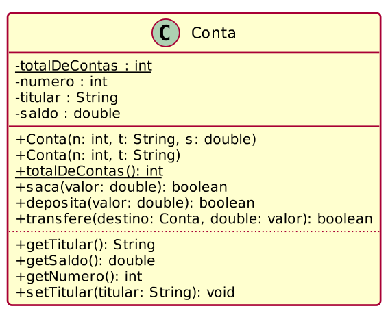
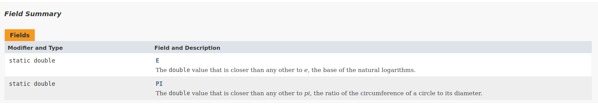
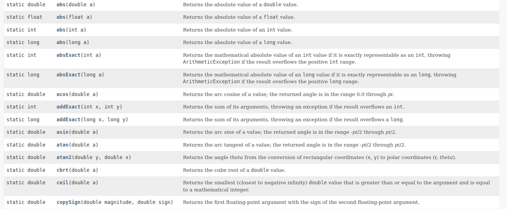
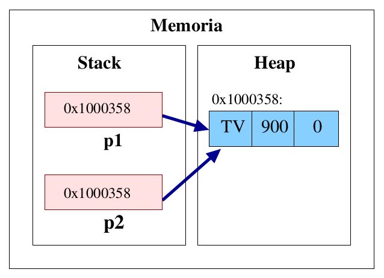
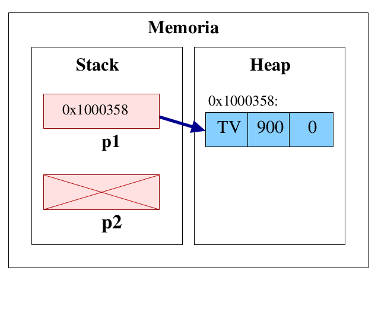
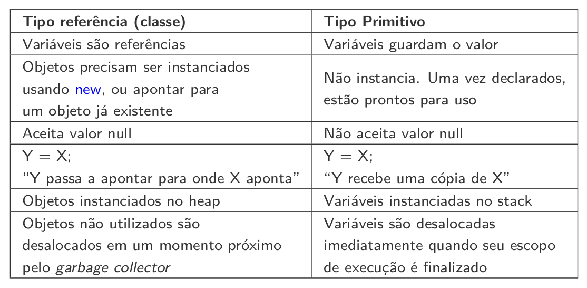
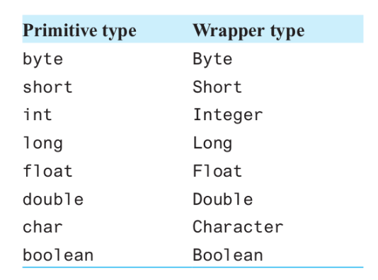

# Atributos e métodos estáticos

Cada instância de uma dessas classes terá uma cópia de todos os atributos declarados na classe.
* Esses atributos são chamados **atributos de instância**.
* Modificar o valor de um atributo de instância de um objeto não interfere no valor do mesmo atributo em outro objeto da mesma classe.

Os atributos numero, titular e saldo são **atributos de instância**.

```Java
/**
 * A classe Conta modela uma conta bancária simplificada.
 */
public class Conta {
    private int numero;
    private String titular;
    private double saldo;

    /**
     * Construtor que recebe três argumentos. Quando o objeto do 
     * tipo Conta for instanciado com um inteiro, uma String e um 
     * double passados por parâmetro, esse construtor será executado.
     * @param numero número da conta
     * @param titular nome do titular da conta
     * @param saldo saldo da conta
     */
    Conta(int numero, String titular, double saldo) {
        this.numero = numero;
        this.titular = titular;
        this.saldo = saldo;
    }

    /**
     * Construtor que recebe dois argumentos. Quando o objeto 
     * do tipo Conta for instanciado com um inteiro e uma String 
     * passados por parâmetro, esse construtor será executado.
     * @param numero número da conta
     * @param titular nome do titular da conta
     */
    Conta(int numero, String titular) {
        // invoca o construtor com três parâmetros
        this(numero, titular, 0.0); 
    }

    public int getNumero() { // getter
        return numero;
    }

    public double getSaldo() { // getter
        return saldo;
    }

    public String getTitular() { // getter
        return titular;
    }

    /**
     * Método para sacar uma quantia da conta.
     * @param valor o valor a ser sacado da conta
     * @return true se o saque for bem-sucedido, false caso contrário
     */
    public boolean saca(double valor) {
        if(valor >= 0 && valor <= this.saldo) {
            this.saldo -= valor;
            return true;
        }
        else return false;
    }

    /**
     * Método usado para depositar uma quantia na conta.
     * Antes de depositar, verifica se o valor é não-negativo.
     * @param valor quantia a ser depositada na conta
     * @return true se o depósito for bem-sucedido, false caso contrário
     */
    public boolean deposita(double valor) {
        if(valor >= 0) {
            this.saldo += valor;
            return true;
        }
        else return false;
    }

    /**
     * Método que transfere uma quantia desta conta para outra
     * Antes de transferir, verifica se a conta possui a 
     * quantidade a ser transferida disponível.
     * @param destino conta para a qual a quantia deve ser transferida
     * @param valor quantia a ser transferida
     * @return true se a transferência for bem sucedida, false caso contrário
     */
    public boolean transfere(Conta3 destino, double valor) {
        boolean retirou = this.saca(valor);
        if(retirou == false) {
            return false; // não deu para sacar
        }
        else {
            destino.deposita(valor);
            return true;
        }
    }
    
    /**
     * Método toString sobrescrito.
     * @return uma string com a descrição do objeto
     */
    public String toString() {
        String output = this.getClass().getName() + "[" + 
            "número:" + numero + "," +
            "Titular:" + titular + "," + 
            "Saldo:" + saldo + "]";
        return output;
    }
}
```

### Problema

Suponha que o banco quer controlar a quantidade de contas existentes no sistema. Como podemos implementar esse requisito?


Essa informação não pode pertencer a uma única instância da classe Conta.

```
Uma solução elegante seria se pudéssemos ter uma variável
contadora compartilhada por todos os objetos da classe Conta.
Quando um objeto modificasse o valor do contador, o seu novo valor estaria visı́vel e acessı́vel para todos os outros objetos da classe.
```

### Atributos Estáticos

* **Atributos estáticos** são atributos compartilhados por todas as instâncias de uma classe.
*  Em Java, atributos estáticos são declarados com o modificador static, que deve ser declarado antes do tipo de dado do atributo.
private static int totalDeContas;
* Somente um valor é armazenado em um atributo estático, e caso este
valor seja modificado por uma das instâncias da classe, a modificação será
refletida em todas as outras instâncias da classe.

* Atributos estáticos são também conhecidos como atributos de classes, já
que estes atributos poderão ser acessados diretamente usando o nome da
classe, sem que seja necessária a criação de uma instância da classe e
uma referência para esta instância.

```Java
/**
 * A classe Conta modela uma conta bancária simplificada.
 */
public class Conta {
    private int numero;
    private String titular;
    private double saldo;
    private static int contador = 0;

    /**
     * Construtor que recebe três argumentos. Quando o objeto do 
     * tipo Conta for instanciado com um inteiro, uma String e um 
     * double passados por parâmetro, esse construtor será executado.
     * @param numero número da conta
     * @param titular nome do titular da conta
     * @param saldo saldo da conta
     */
    Conta(int numero, String titular, double saldo) {
        this.numero = numero;
        this.titular = titular;
        this.saldo = saldo;
        contador++;
    }

    int getContadorConta(){
        return contador;
    }

    /**
     * Construtor que recebe dois argumentos. Quando o objeto 
     * do tipo Conta for instanciado com um inteiro e uma String 
     * passados por parâmetro, esse construtor será executado.
     * @param numero número da conta
     * @param titular nome do titular da conta
     */
    Conta(int numero, String titular) {
        // invoca o construtor com três parâmetros
        this(numero, titular, 0.0); 
    }

    public int getNumero() { // getter
        return numero;
    }

    public double getSaldo() { // getter
        return saldo;
    }

    public String getTitular() { // getter
        return titular;
    }

    /**
     * Método para sacar uma quantia da conta.
     * @param valor o valor a ser sacado da conta
     * @return true se o saque for bem-sucedido, false caso contrário
     */
    public boolean saca(double valor) {
        if(valor >= 0 && valor <= this.saldo) {
            this.saldo -= valor;
            return true;
        }
        else return false;
    }

    /**
     * Método usado para depositar uma quantia na conta.
     * Antes de depositar, verifica se o valor é não-negativo.
     * @param valor quantia a ser depositada na conta
     * @return true se o depósito for bem-sucedido, false caso contrário
     */
    public boolean deposita(double valor) {
        if(valor >= 0) {
            this.saldo += valor;
            return true;
        }
        else return false;
    }

    /**
     * Método que transfere uma quantia desta conta para outra
     * Antes de transferir, verifica se a conta possui a 
     * quantidade a ser transferida disponível.
     * @param destino conta para a qual a quantia deve ser transferida
     * @param valor quantia a ser transferida
     * @return true se a transferência for bem sucedida, false caso contrário
     */
    public boolean transfere(Conta3 destino, double valor) {
        boolean retirou = this.saca(valor);
        if(retirou == false) {
            return false; // não deu para sacar
        }
        else {
            destino.deposita(valor);
            return true;
        }
    }
    
    /**
     * Método toString sobrescrito.
     * @return uma string com a descrição do objeto
     */
    public String toString() {
        String output = this.getClass().getName() + "[" + 
            "número:" + numero + "," +
            "Titular:" + titular + "," + 
            "Saldo:" + saldo + "]";
        return output;
    }
}
```

Os membros estáticos de uma classe são indicados sublinhando os seus nomes no diagrama de classes UML.
*  atributos estáticos
* métodos estáticos
• Programadores Java traduzem o sublinhando para a palavra-chave static.




## Classe java.lang.Math

Java fornece a classe Math do pacote java.lang que possui duas constantes estáticas: Math.PI e Math.E.
* Math.PI (3.141592653589793) é a razão da circunferência do cı́rculo pelo seu diâmetro.
* Math.E (2.718281828459045) é o valor base para o logarı́tmo natural.
* Estas constantes são declaradas na classe Math com os modificadores public, static e final.



## Constantes estáticas públicas

```Java
/**
 * A classe MathConst contém vários valores que são constantes.
 * Esta classe não tem métodos, e todos os campos são 
 * declarados como static, assim não é necessário criar
 * instâncias desta classe para acessar os valores.
 */
public class MathConst {
    // A raiz quadrada de 2
    public static final double raizDe2 = 1.4142135623730950488;

    // A raiz quadrada de 3
    public static final double raizDe3 = 1.7320508075688772935;

    // A raiz quadrada de 5
    public static final double raizDe5 = 2.2360679774997896964;
    
    // A raiz quadrada de 6: podemos usar as constantes já definidas
    public static final double raizDe6 = raizDe2*raizDe3; 
}
```

## Uso da classe com constantes estáticas

```Java
import java.util.Locale;

class DemoMathConst {
    public static void main(String[] args) {
        Locale.setDefault(Locale.US);
        System.out.println("PI = " + Math.PI);
        System.out.println("Raiz(2) = " + MathConst.raizDe2);
        System.out.println("Raiz(3) = " + MathConst.raizDe3);
        System.out.println("Raiz(5) = " + MathConst.raizDe5);
        System.out.println("Raiz(6) = " + MathConst.raizDe6);
        System.out.printf("Raiz(10) = %.3f%n", MathConst.raizDe2 * MathConst.raizDe5);
    }
}
```

## Métodos Estáticos

*  Vimos até agora que a maioria dos métodos executam em resposta a chamadas de métodos em objetos especı́ficos.
* Contudo, algumas vezes um método realiza uma tarefa que não depende de um objeto. 
* Chamamos de métodos estáticos ou métodos de classe os métodos que não precisam de instâncias de classes para serem executados.

## Classe Math

A classe Math do pacote java.lang é um exemplo de classe em que todos os seus métodos são estáticos (static).
* Essa classe fornece uma coleção de métodos que possibilitam a realização
de cálculos matemáticos comuns.
* Para uma descrição completa da Classe, consulte a API do Java:
https://docs.oracle.com/en/java/javase/17/docs/api/java.base/java/lang/Math.html



## Métodos estáticos
*  Métodos estáticos em uma classe devem ser declarados com o
modificador static, que deve preceder o tipo de retorno do método e
que pode ser combinado com os modificadores de acesso ao método.
* Exemplo: 
```Java
public static void main(String[] args)
```
* Métodos estáticos podem ser usados em classes que contenham o método
main para servirem como sub-rotinas deste.
* A aplicação mais frequente de métodos estáticos é a criação de bibliotecas de métodos — classes que contêm somente métodos estáticos, geralmente agrupados por função, como a classe Math.


## Método main
*  Quando você executa a JVM com o comando java, a JVM tenta invocar o método main da classe que você especificou.
*  Declarar main como static permite à JVM invocar main sem criar uma instância da classe.
*  **Importante**: Se um método for chamado diretamente a partir do método
main, este método deverá ser obrigatoriamente declarado como estático.
* **Importante**: Se o método main for acessar atributos declarados na sua classe mas fora do método main, estes atributos também deverão ser declarados como static.
• **Importante**: Toda classe em Java pode conter um método public static void main – somente a main da classe usada para executar a aplicação é chamada.

```Java
import java.util.Scanner;

class EntradaDados {
    public static void main(String[] args) {
        Scanner input = new Scanner(System.in);

        System.out.print(
            "Digite 3 inteiros separados por espaço: ");
        int num1 = input.nextInt();
        int num2 = input.nextInt();
        int num3 = input.nextInt();

        int resultado = maximo(num1, num2, num3);
        System.out.println("Máximo é: " + resultado);
    }

    public static int maximo(int x, int y, int z) {
        int maior = x;
        maior = (y > maior) ? y : maior;
        maior = (z > maior) ? z : maior;
        return maior;
    }
}
```


## Tipos nativos
* Como já vimos, o Java possui oito tipos nativos: char, boolean, byte, short, int, long, float, double.
* Uma variável de tipo nativo guarda exatamente um valor do seu tipo nativo em um dado momento.


## Classes são tipos referência
*  Variáveis cujo tipo são classes, guardam a localização dos objetos na memória.
* Elas devem ser entendidas como ponteiros ou referências.

```Java
Product p1, p2;
p1 = new Product(”TV”,900.00,0);
p2 = p1;
//p2 passa a apontar para onde p1 aponta
```




## Valor null

* Variáveis de tipos referência aceitam o valor null, indicando que a variável referencia ninguém.
```Java
Product p1, p2;
p1 = new Product(”TV”,900.00,0);
p2 = null;
```




## Valor default
* Quando alocamos qualquer tipo estruturado (classe ou array), são atribuı́dos valores padrão aos seus elementos
  * números: 0
  * boolean: false
  * char: \u0000
  * objeto: null

## Referência x Nativos



## Classes empacotadoras (Wrapper classes)
* Todos os oito tipos nativos do Java possuem uma classe correspondente denominada classe empacotadora que pertencem ao pacote java.lang


* Classes empacotadoras possuem atributos e métodos estáticos que podem ser úteis em várias aplicações.


* Todas as estruturas de dados do Collection Framework do Java e as classes do pacote java util trabalham apenas com objetos e, portanto, as classes empacotadoras serão necessárias caso você queira armazenar tipos de dados nativos.



## Criando classes empacotadoras

Classes empacotadoras possuem o método estático valueOf que recebe como argumento um valor de tipo nativo e retorna um objeto da sua respectiva classe empacotadora.

```Java
import java.util.Scanner;

public class CreateWrapper {
    public static void main(String[] args) {
        Scanner input = new Scanner(System.in);
        Integer myInt = Integer.valueOf ( input.nextInt () ) ;
        System.out.println(soma);
    }
}
```


## Wrappers são imutáveis
* Objetos de classe empacotadora guardam o valor de tipo nativo em um atributo declarado como private final.
* Uma vez atribuı́do um valor a esse atributo, não será possı́vel modificá-lo.

## Boxing (ou empacotamento)
* Autoboxing: é o processo de conversão automática de um tipo de dado nativo em um objeto da sua classe empacotadora correspondente.
* Desde o Java 5, não precisamos mais usar o método estático valueOf
das classes empacotadoras para converter os tipos primitivos em objetos.
* Desde o Java 9, os construtores das classes empacotadoras estão
descontinuados, o que significa que não devemos usar construtores para
criar objetos dessas classes.
* O mecanismo de autoboxing faz isso automaticamente ou, se você
preferir, pode usar o método estático valueOf.

```Java
public class CreateWrapperBoxing {
    public static void main(String[] args) {
        Integer myInt = 5; // criando um novo Integer

        Double myDouble = 5.99; // criando um novo Double

        Character myChar = 'A'; // criando um novo Character

        System.out.println(myInt); // chama toString()
        System.out.println(myDouble); // chama toString()
        System.out.println(myChar); // chama toString()

        Integer intRef = myInt; // intRef = 5

        if(intRef.equals(myInt)) 
            System.out.println("possuem o mesmo valor");
        else 
            System.out.println("possuem valores distintos");
    }
}
```

## Unboxing (ou desempacotamento)
* Unboxing: é o processo de conversão automática de um objeto de classe
empacotadora em seu respectivo tipo nativo.
* O compilador do Java aplica unboxing quando um objeto de uma classe empacotadora é:
  * Passado como parâmetro para um método que espera um valor do tipo nativo correspondente.
  * Atribuı́do a uma variável do tipo nativo correspondente.


```Java
public class WrapperUnboxing {
    public static void main(String[] args) {
        Double myDouble = -4567.0; // boxing

        double x = myDouble; // unboxing 

        System.out.println("Absolute value of " + myDouble 
            + " = " + Math.abs(x));
    }
}
```

## Classe Integer – Métodos não-estáticos


```Java


public class WrapperExemplo2 {
    public static void main(String[] args) {
        
       
        Integer a = 8;
        Integer b = 2*4; 
        
        // Ilustrando o método compareTo
        if( a.compareTo(b) == 0 ) 
            System.out.println(a + " e " + b + " são iguais");
        else 
            System.out.println(a + " e " + b + " são diferentes");
        
        if(a == b) { // false
            System.out.println("a e b apontam para o mesmo objeto");
        }
        else {
            System.out.println("a e b apontam para objetos distintos"); // ---> vai ser impressa
        }

        
        // Ilustrando o método equals
        Integer z = 77;
        if(a.equals(z)) 
            System.err.println("os objetos apontados por a e z possuem o mesmo estado");
        else   
            System.out.println("os objetos apontados por a e z não possuem o mesmo estado");
        
        
        // Ilustrando o método hashCode
        System.out.println("hash code de a: " + a.hashCode());
        System.out.println("hash code de b: " + b.hashCode());
        System.out.println("hash code de z: " + z.hashCode());
        
        // Ilustrando conversões para outros tipos
        byte aByte = a.byteValue();
        short aShort = a.shortValue();
        int aInt = a.intValue();
        long aLong = a.longValue();
        float aFloat = a.floatValue();
        double aDouble = a.doubleValue();
        System.out.printf("%d %d %d %d %f %f%n", aByte, aShort, aInt, aLong, aFloat, aDouble);
        
    }
}
```


## Classe Integer 

### Atributos Estáticos

* int MIN VALUE: constante que dá o menor valor que um int pode ter
*  int MAX VALUE: constante que dá o maior valor que um int pode ter
*  int BYTES: o número de bytes usados para representar um int
*  int SIZE: o número de bits usados para representar um int


```Java
/**
 * A classe IntegerExemplo exemplifica os
 * atributos estáticos da classe wrapper Integer
 */
class IntegerExemplo {
    public static void main(String[] args) {
        System.out.println("MIN_VALUE: " + Integer.MIN_VALUE);
        System.out.println("MAX_VALUE: " + Integer.MAX_VALUE);
        System.out.println("BYTES: " + Integer.BYTES);
        System.out.println("SIZE: " + Integer.SIZE);
    }
}
```

## Classe Integer

Alguns Métodos Públicos e Estáticos
*  int max(int a, int b): retorna o valor do maior parâmetro
*  int min(int a, int b): retorna o valor do menor parâmetro
*  int parseInt(String s): converte a String s para int
*  int parseInt(String s, int radix): converte o valor da String s na
base radix para decimal e retorna o valor
*  String toString(int i): converte o int i para String

```Java
/**
 * A classe IntegerExemplo2 testa alguns dos
 * métodos estáticos da classe wrapper Integer
 */
class IntegerExemplo2 {
    public static void main(String[] args) {
        int a = 34, b = 5;
        System.out.println("Máximo: " + Integer.max(a, b));
        System.out.println("Mínimo: " + Integer.min(a, b));
        System.out.printf("int para String: %s%n", Integer.toString(a));
        System.out.printf("int para String: %s%n", Integer.toString(b));

        String str = "4352";
        System.out.printf("String para int: %d%n", Integer.parseInt(str));

        System.out.println("decimal 345 convertido para decimal: " + Integer.parseInt("345", 10));
        System.out.println("hexadecimal AB convertido para decimal: " + Integer.parseInt("AB", 16));
        System.out.println("octal 20 convertido para decimal: " + Integer.parseInt("20", 8));
        System.out.println("binário 1010110 convertido para decimal: " + Integer.parseInt("1010110", 2));
    }
}
```

## Demais classes empacotadoras
* Todas as demais classes empacotadoras possuem os atributos estáticos
MIN VALUE, MAX VALUE, BYTES e SIZE, e também o método estático toString.
* Com exceção da classe Character, todas as demais também têm os métodos estáticos max e min.
*  Do mesmo modo que a classe Integer tem o método estático parseInt, as demais classes empacotadoras (com exceção da classe Character) têm o seu método “parse” equivalente, obtido trocando-se Int pelo nome do tipo nativo correspondente.


```Java
import java.util.Locale;

class WrappersExemplo {
    public static void main(String[] args) {
        Locale.setDefault(Locale.US);
        
        byte v1 = Byte.parseByte("127");
        short v2 = Short.parseShort("2543");
        int v3 = Integer.parseInt("63542");
        long v4 = Long.parseLong("123456789");
        float v5 = Float.parseFloat("45.69823");
        double v6 = Double.parseDouble("23.46574849132987");
        boolean v7 = Boolean.parseBoolean("true");

        System.out.printf("%d %d %d %d %.5f %.14f %b%n",v1, v2, v3, v4, v5, v6, v7);
    }
}
```

## Student

```Java
import java.util.Locale;

public class Student {
    private String nome;
    //Grade Point Average 
    private double gpa;

    Student(String n, double g){
        nome = n;
        gpa = g;
    }

    public String getNome(){
        return nome;
    }

    public double getGpa(){
        return gpa;
    }

    public String toString(){
        return String.format(Locale.US, "Nome: %s GPA: %f", nome, gpa);
    }
}
```


## TestStudent

```Java

import java.util.Arrays;


public class TestStudent {
    public static void main(String[] args) {
        Student [] student = new Student[4];

        student[0] = new Student("arnaldo", 8.5);
        student[1] = new Student("ana", 9.2);
        student[2] = new Student("bia", 9.5);
        student[3] = new Student("rogerio", 9.8);

        Arrays.sort(student, (s1,s2)-> s1.getNome().compareTo(s2.getNome() ));
        /* 
        Arrays.sort(student, (s1,s2)-> s1.getGpa() < s2.getGpa() ? -1 : 
                                       s1.getGpa() > s2.getGpa() ? 1  : 
                                       s1.getNome().compareTo(s2.getNome() )
                                       );
        */

        for(Student s : student){
            System.out.println(s);
        }
        
    }
}

```