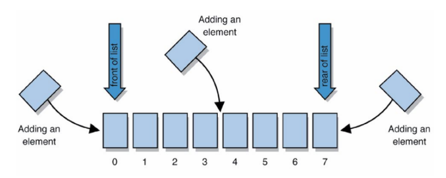
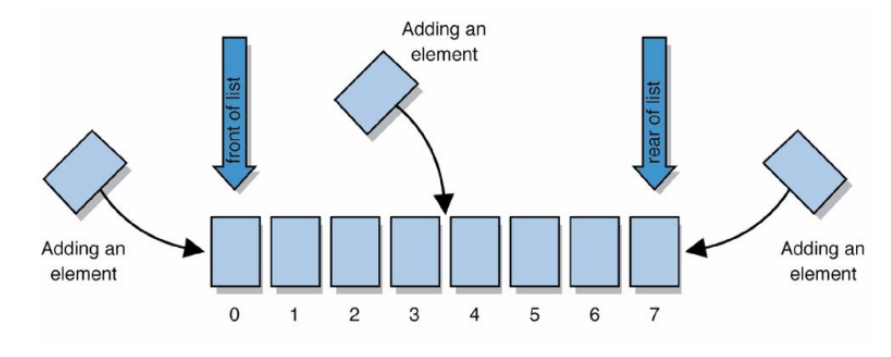

# Array e ArrayList

* É uma estrutura de dados que armazena uma coleção de valores do mesmo tipo sequencialmente na memória.
* Em Java, arrays são objetos. Logo, eles são do tipo referência.
* Os elementos de um array podem ser de tipo nativo ou do tipo
referência.

Sintaxe da declaração de um array: 

```Java
<tipo> [ ] <nome da variável>;
```

Exemplo: 

```Java
int[] arr;
```

arr ainda não foi inicializado

## Arrays — Instanciação
* Um array pode ser instanciado usando o operador new:
```
int[] arr = new int[100];
```
* O valor que determina o tamanho do array deve ser um inteiro:
int n = 100;
int[] arr = new int[n];

* Para acessar um elemento especı́fico no array, usamos o nome da
referência para o array e o ı́ndice da posição do elemento no array.
* Em Java, os elementos de um array de tamanho n são numerados de 0
a n − 1, assim como em C/C++.
* Todo array sabe o seu tamanho e o armazena na variável length, que é um atributo do objeto array. A expressão arr.length devolve o tamanho do array arr.

* Podemos instanciar um array e inicializar seus elementos com uma lista inicializadora, que é uma lista de elementos separados por vı́rgula e fechada com colchetes.

Exemplo: 
```Java
int[] array = {10, 20, 30, 40, 50};
```
• Uma lista inicializadora também pode ser usada desta forma:
```
int[] array = new int[] {10, 20, 30, 40, 50};
```

## laço for each
* O Java possui uma estrutura de repetição (laço) que permite iterar sobre os elementos de um array sem usar uma variável contadora, o for each.
Sintaxe:
```Java
int[] array = {5, 78, 23, 10};
for (int element : array) {
    System.out.println(element);
}
```

* O for each só pode ser usado para obter o valor dos elementos do array, ele não pode modificá-los. Se seu programa precisar iterar e modificar o valor dos elementos, use o for tradicional ou outro laço.


```Java
public class Programa15 {
    public static void main(String[] args) {
        int[] array = {87, 78, 90, 45, 23, 17, 67};
        int total = 0;

        for(int number : array) {
            total += number;
        }

        System.out.printf("Total: %d%n", total);
    }
}
```

Exercícios:

* [Java 1D](https://www.hackerrank.com/challenges/java-1d-array-introduction/problem?isFullScreen=true)
* [Java 2D](https://www.hackerrank.com/challenges/java-2d-array/problem?isFullScreen=true)
* [Java SubArray](https://www.hackerrank.com/challenges/java-negative-subarray/problem?isFullScreen=true)
* 


## Passando arrays para métodos
* Para que um método receba uma referência para um array através de uma chamada de método, a sua lista de parâmetros deve especificar um parâmetro do tipo array.
◦ Exemplo: 
```Java
void imprimeArray(int[ ] vetor)
public static void main(String [] args)
```
* Para passar o array como argumento para o método, especifique apenas o
nome do array, sem os colchetes:
◦ Exemplo:
```Java
int[ ] meuVetor = {1,2,3,4,5,6};
imprimeArray(meuVetor);
```
* Todo objeto array sabe o seu tamanho, portanto não é preciso passar o tamanho do array como argumento. Além disso, o que é passado para o método é uma referência para o objeto array e não o seu valor.

## Listas de argumentos com tamanhos variados
*  Note que o método printf permite uma lista de argumentos de tamanho variável. Em Java, podemos escrever métodos com essa caracterı́stica.
* Em uma lista de parâmetros de um método, um tipo seguido por três pontos (. . . ) indica que o método pode receber uma quantidade variável de argumentos daquele tipo.
◦ Exemplo: 
```Java
double media(double...numeros)
```
* Java trata a lista de argumentos de tamanho variável como se fosse um array, cujos elementos são todos do mesmo tipo.
  *  No exemplo acima, o parâmetro numeros é tratado dentro do método como um array de doubles.


## A classe Arrays do pacote java.util

* Java possui a classe Arrays que fornece diversos métodos estáticos para
manipulações comuns de arrays, como:
    * ordenação de array, busca binária, comparação de arrays, preenchimento de um vetor, etc.
* Importe a classe Arrays no inı́cio do seu programa:
```Java
import java.util.Arrays;
```
* [API do Java](https://docs.oracle.com/en/java/javase/17/docs/api/java.base/java/util/Arrays.html) 

## Métodos estáticos da classe Arrays


## Código

```Java
import java.util.Arrays;

public class ArrayManipulations {
    public static void main(String[] args) {
        // Testando a ordenação em ordem crescente
        double[] doubleArray = {8.4, 9.3, 0.2, 7.9, 3.4};
        System.out.println("Array com toString original: " + doubleArray);
        System.out.println("Array original: " + Arrays.toString(doubleArray));
        Arrays.sort(doubleArray);
        System.out.println("Array ordenado: " + Arrays.toString(doubleArray));
        
        // busca o valor 9.3 no array origArray
        // note que origArray está ordenado, então podemos usá-lo aqui 
        int location = Arrays.binarySearch(doubleArray, 9.3);
        if(location >= 0) {
            System.out.println("Valor 9.3 encontrado na posição " + location);
        }
        else {
            System.out.println("Valor 9.3 não foi encontrado");
        }
        
        // busca o valor 77.65 no array origArray
        // note que origArray está ordenado, então podemos usá-lo aqui 
        location = Arrays.binarySearch(doubleArray, 77.65);
        if(location >= 0) {
            System.out.println("Valor 77.65 encontrado na posição " + location + " do vetor");
        }
        else {
            System.out.println("Valor 77.65 não foi encontrado");
        }
        
        // Testando o preenchimento do array
        int[] filledIntArray = new int[10];
        Arrays.fill(filledIntArray, 7);
        System.out.println("Array preenchido com 7: " + Arrays.toString(filledIntArray));
        Arrays.fill(filledIntArray, 2, 8, 33);
        System.out.println("Array parcialmente preenchido com 33: " + Arrays.toString(filledIntArray));
        
        
        // Testando cópia de array
        int[] origArray = {23, 56, 76, 9, 10};
        int[] copyArray = Arrays.copyOf(origArray, origArray.length);
        System.out.println("Array original: " + Arrays.toString(origArray));
        System.out.println("Array copiado: " + Arrays.toString(copyArray));
        
        // Compara origArray e copyArray
        boolean b = Arrays.equals(origArray, copyArray);
        if(b) System.out.println("Arrays são iguais");
        else System.out.println("Arrays são diferentes");
        
        // Testando o método copyOfRange
        int[] copyArray2 = Arrays.copyOfRange(origArray, 1, origArray.length);
        System.out.println("Array original: " + Arrays.toString(origArray));
        System.out.println("Array copiado de intervalo [1..n-1]: " + Arrays.toString(copyArray2));

        // Compara origArray e copyArray2
        b = Arrays.equals(origArray, copyArray2);
        if(b) System.out.println("Arrays são iguais");
        else System.out.println("Arrays são diferentes");   
        
    }
}
```

## Arrays Bidimensionais
* Esse tipo de array é declarado como tendo duas dimensões e é usado para representar tabelas de valores que consistem em  informações organizadas em linhas e colunas.

* Exemplo de declaração: 
```Java
int[][] matriz = new int[4][5];
```

Matrizes irregulares
* Uma matriz é irregular se ela não têm o mesmo número de colunas para
cada linha
```Java
int[][] mat = new int[5][];
mat[0] = new int[6];
mat[1] = new int[3];
mat[2] = new int[1];
mat[3] = new int[4];
mat[4] = new int[8];
```


## Collections
* A API do Java fornece diversas estruturas de dados pré-definidas,
chamadas collections, usadas para armazenar objetos relacionados na
memória.
* Estas classes fornecem métodos eficientes que organizam, armazenam e
acessam os dados sem exigir conhecimento de como os dados estão
aramazenados.

## ArrayList

### java.util.ArrayList

* Um ArrayList encapsula a estrutura de dados Lista, que é uma estrutura de dados que pode diminuir e aumentar de tamanho automaticamente à medida que os elementos são adicionados ou removidos.




*  Um ArrayList não pode armazenar tipos nativos, ele só pode armazenar
referências a objetos.
*  Para conseguir trabalhar com dados de tipos nativos em um ArrayList,
precisaremos usar suas respectivas classes empacotadoras:
   *  Byte
   *  Short
   *  Integer
   * Long
   * Float
   * Double
   * Character
   * Boolean

## Criando um ArrayList
O tipo do objeto deve ser especificado usando o operador diamante <>:
Sintaxe: 
```Java
Arraylist<tipo> nome da variavel = new Arraylist<tipo>();
```
Exemplos:
```Java
ArrayList<String> str1 = new arrayList<String>();
ArrayList<String> str2 = new arrayList<String>(30);
ArrayList<Integer> age = new ArrayList<Integer>(2);
```
O construtor vazio cria um arraylist com capacidade inicial igual a 10.


## Adicionando elementos a um ArrayList
Elementos podem ser adicionados no inı́cio, no fim ou em qualquer outra
posição.

```Java
ArrayList<Integer> myList = new ArrayList<Integer>();
myList.add(5);
myList.add(7);
```



```Java
void add(int index, NomeDaClasse elemento)
```
* Adiciona elemento na posição index do ArrayList.
    * O index deve ser maior que ou igual a zero e menor que ou igual ao número de elementos no ArrayList.

Exemplo:
```Java
ArrayList<Integer> myList = new ArrayList<Integer>();
myList.add(5);
myList.add(7);
myList.add(8);
myList.add(6, 1);
```

## Métodos

```Java
boolean remove(NomeDaClasse elemento)
```
Remove a primeira ocorrência de elemento do Arraylist.
Retorna true se o elemento foi removido; false caso contrário.

```Java
void remove(int index)
```

Remove o elemento na posição index do ArrayList
```Java
void clear()
```
Remove todos os elementos
```Java
void set(int index, NomeDaClasse elemento)
```
Seta novo valor para o elemento na posição index do Arraylist.
O valor que estava na posição index é sobrescrito.
```Java
NomeDaClasse get(int index)
```
◦ Retorna o elemento na posição index do ArrayList.
```Java
boolean equals(ArrayList<NomeDaClasse> lista)
```

Determina se as duas listas contém os mesmos elementos, na mesma ordem.

```Java
boolean isEmpty()
```
Retorna true se o ArrayList não tem elementos.
```Java
int size()
```
Retorna o número de elementos atualmente no 
ArrayList.
```Java
T[] toArray(T[] arr)
```
◦ Retorna um array contendo todos os elementos do ArrayList na ordem
correta. Se a lista couber no array especificado, ela será retornada nele.
Caso contrário, uma novo array é alocado e retornado.
```Java
boolean contains(NomeDaClasse elemento)
```

Testa se elemento é um componente deste ArrayList.
```Java
String toString()
```
Retorna uma representação em String do ArrayList.

```Java
import java.util.ArrayList;
/**
 * Demosntração de funcionamento da classe genérica ArrayList<E>
 */
public class DemoArrayList {
    public static void main(String[] args) {
        // cria um ArrayList de Integers com capacidade inicial de 10
        ArrayList<Integer> numeros = new ArrayList<Integer>();

        // Ilustrando o uso do método add
        numeros.add(2); // adiciona 2 ao final da lista, ou seja, na posição 0
        numeros.add(0, 1); // insere 1 na posição 0

        // Ilustrando o uso do método get
        System.out.print("Conteúdo no ArrayList:");
        for(int i = 0; i < numeros.size(); i++) {
            System.out.printf(" %d", numeros.get(i));
        }
        System.out.println();
        
        numeros.add(3);
        numeros.add(4);
        numeros.add(5);
        numeros.add(6);
        System.out.println("ArrayList: " + numeros); // invoca toString implicitamente
        
        // Remove um Integer do ArrayList passando o índice dele
        numeros.remove(2);
        System.out.println("ArrayList após a removação do elemento na posição 2: " + numeros);
        
        // Remove um Integer do ArrayList passando o valor dele
        numeros.remove(Integer.valueOf(4));
        System.out.println("ArrayList após a removação do elemento 4: " + numeros);
        
        // Sobrescreve o valor que estava na posição 2 do ArrayList
        numeros.set(2, Integer.valueOf(77));
        System.out.println("ArrayList após modificação do elemento na posição 2: " + numeros);
        
        // Ilustração do método contains
        if(numeros.contains((Integer)88)) { // usando casting e unboxing
            System.out.println("O ArrayList contém o número 88");
        }
        else {
            System.out.println("O ArrayList não contém o número 88");
        }

        // Ilustração do método toArray(T[])
        Integer[] arr = new Integer[numeros.size()];
        arr = numeros.toArray(arr);
        for(int i = 0; i < arr.length; i++) {
            arr[i]++;
        }
        System.out.print("Elementos no vetor arr: ");
        for(Integer e : arr) {
            System.out.print(e + " ");
        }
        System.out.println();
        
    }
}
```