# Relacionamentos

Um **objeto** de uma classe pode ter um **relacionamentos** com os **objetos** de uma outra classe de maneira que essa conexão tem um significado definido.

Um relacionamento entre duas ou mais classes é chamada de **associação**

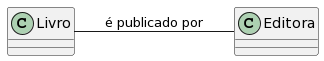

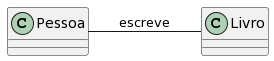

Representamos as associações por meio de linhas retas que ligam as
classes envolvidas.

A forma mais comum de implementar associação é ter um objeto como
atributo de outro.

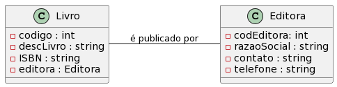

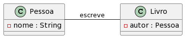

Caracterı́sticas das Associações

* Nome
* Multiplicidade
* Conectividade
* Navegabilidade
* Papéis

## Multiplicidades

A multiplicidade define quantas instâncias de uma classe A podem estar
relacionadas a uma instância da classe B.

Cada associação em um diagrama de classes possui duas multiplicidades,
uma em cada extremo da linha que a representa.

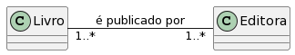

Um livro pode ser publicado por 1 ou mais editoras.

Uma editora pode publicar um ou mais livros.

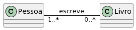

Uma pessoa escreve 0 ou mais livros.

Um livro pode ser escrito por 1 ou mais pessoas.

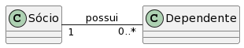

Um sócio pode ter 0 ou mais dependentes.

Um dependente é dependente de um sócio.

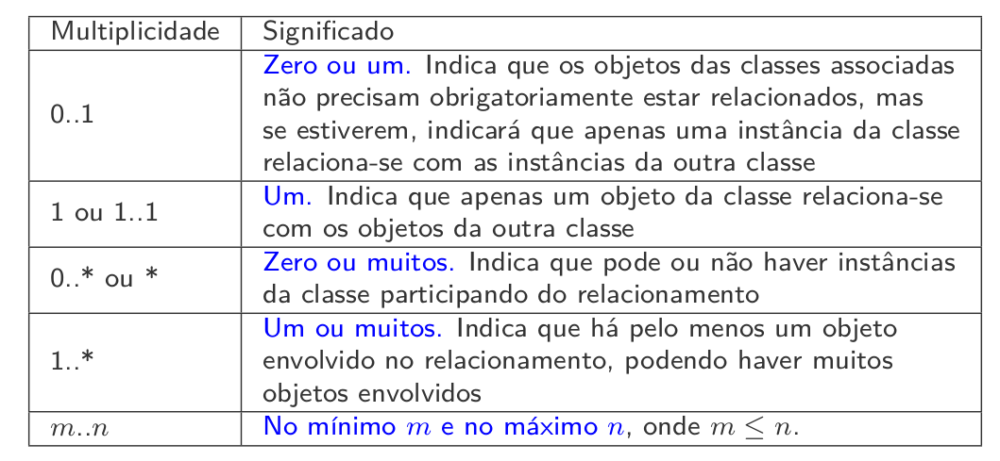

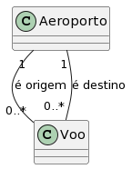

## Conectividade

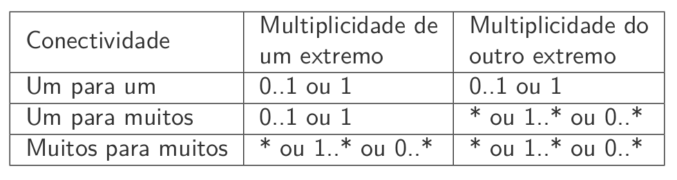

Um para Um

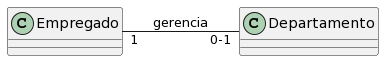

Um empregado pode gerenciar no máximo um departamento, e um departamento possui um gerente.

Um para Muitos

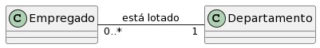

Um empregado está lotado em um único departamento, mas um departamento pode ter diversos empregados.

Muitos para Muitos

## Navegabilidade

*  A navegabilidade indica como a associação deve ser lida.

* As associações entre classes UML podem ter uma direção navegável, de
uma classe para a outra ou em ambas as direções (bidirecional).
* As associações também podem ter direção não especificada, que na
maioria dos casos será a mesma que bidirecional, mas esta opção pode
gerar dúvidas.
* A navegabilidade descreve como as implementações do modelo podem ser
navegadas e é simbolizada por setas no diagrama.

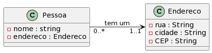

Neste caso, a pessoa sabe seu endereço, mas o endereço não sabe quem vive lá.

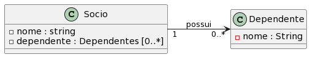

Neste caso, o sócio conhece seus dependentes, mas o dependente não sabe de quem ele depende.

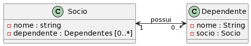

Neste caso, o sócio conhece seus dependentese  o dependente sabe de quem ele depende.

