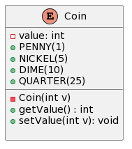
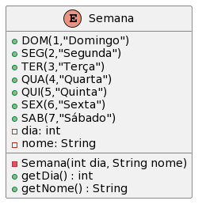
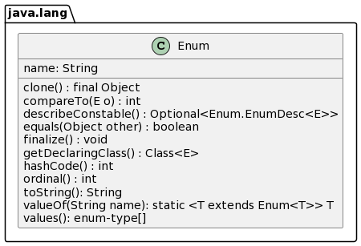
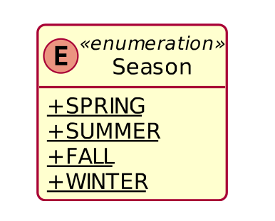

# Enumeração


Algumas vezes precisamos de uma variável que possa receber somente um certo conjunto finito e enumerado de valores. 

Além disso, em tempo de compilação, gostarı́amos também de checar se essa variável possui um desses valores.

Exemplos:
   * ```dayOfWeek{ SUNDAY, MONDAY, TUESDAY, . . .}```
   * ```month{} JAN, FEB, MAR, APR, MAY, . . .}```
   * ```gender { MALE, FEMALE . . .}```
   
Os valores estão escritos em caixa alta porque eles são constantes.

Como implementar essas constantes?

```Java
class DayOfWeek{

   public static final int SUNDAY = 0;
   public static final int MONDAY = 1;
   public static final int TUESDAY = 2;
   public static final int WEDNESDAY = 3;
   public static final int THURSDAY = 4;
   public static final int FRIDAY = 5;
   public static final int SATURDAY = 6;
   
   
   static void printDayOfWeek(int day){
      switch(day){
         case DayOfWeek.SUNDAY:
            System.out.println("SUNDAY");
            break;
         case DayOfWeek.MONDAY:
            System.out.println("MONDAY");
            break;

         case DayOfWeek.TUESDAY:
            System.out.println("TUESDAY");
            break;

         case DayOfWeek.WEDNESDAY:
            System.out.println("WEDNESDAY");
            break;

         case DayOfWeek.THURSDAY:
            System.out.println("THURSDAY");
            break;

         case DayOfWeek.FRIDAY:
            System.out.println("FRIDAY");
            break;
         
         case DayOfWeek.SATURDAY:
            System.out.println("SATURDAY");
            break;
         
      }
   }
}

class Teste{


   public static void main(String[] args) {
      int day = 78;

      DayOfWeek.printDayOfWeek(day);
   }
      
}
```


Antes da versão 1.5, o Java representava enumerações como valores
inteiros :
```Java
public final int SPRING = 0;
public final int SUMMER = 1;
public final int FALL = 2;
public final int WINTER = 3;
```
Infelizmente, esse tipo de abordagem permite que essas constantes sejam
usadas onde quer que um inteiro seja esperado:
```Java
int now = WINTER;
int month = now;
```
Hoje, o jeito correto de construir enumerações em Java é usando um tipo
enumerado:

```Java
enum Color { RED, GREEN, BLUE; }

public class Teste {
    public static void main(String[] args) {
        Color c = Color.RED;
        System.out.println(c);
    }
}
```

A primeira linha de um enum deve ser uma lista de constantes. Depois dela, podem vir variáveis, construtores e métodos.

Segundo as convenções do Java, todas as constantes devem ser escritas em maiúsculo.


## enums são classes
* Todos os enums estendem implicitamente java.lang.Enum.
  
* Todo enum é internamente implementado como uma classe.
  
* Podemos simular parte do comportamento do enum Color do exemplo
anterior como a seguir:
```Java
class Color {
public static final Color RED = new Color();
public static final Color BLUE = new Color();
public static final Color GREEN = new Color();
}
```

* Toda constante enum representa um objeto do tipo enum.

```Java
class Color {
     public static final Color RED = new Color();
     public static final Color BLUE = new Color();
     public static final Color GREEN = new Color();
}

public class Teste2 {
    public static void main(String[] args) {
        Color c = Color.RED;
        Color d = Color.RED;
        if(c == d) 
            System.out.println("c e d são o mesmo objeto");
        if(c.equals(d)) 
            System.out.println("c e d são iguais");
        System.out.println(c.toString());
        System.out.println(d.toString());
    }
}


/*
Output:
c e d são o mesmo objeto
c e d são iguais
Color@7344699f
Color@7344699f
*/
```

## enums são classes

* Enums são classes que estendem implicitamente java.lang.Enum.
* Variáveis do tipo enum são verificadas em tempo de compilação
* Cada constante de uma enumeração é uma instância da classe enum
* Enums são implicitamente public, static e final
* Podemos comparar enums com equals ou ==
* Enums sobrescrevem o método toString() e fornecem o método valueOf()


```Java
Season season = Season.WINTER;
System.out.println(season); //prints WINTER
season = Season.valueOf("SPRING"); // atribui o valor Season.SPRING
```

```Java
enum Season {
    SPRING, SUMMER, FALL, WINTER;
}

public class SeasonsTest {
    public static void main(String[] args) {
        Season s1 = Season.FALL;
        Season s2 = Season.valueOf("WINTER");
        Season s3 = Season.valueOf("FALL");

        System.out.printf("%s%n%s%n%s%n", s1, s2, s3);

        if(s1 == s3)
            System.out.println("s1 e s3 são iguais");
        else 
            System.out.println("s1 e s3 são diferentes");
    }
}
```


## enums – Caracterı́sticas

* Enums fornecem checagem de tipos em tempo de compilação
  * int não fornece essa chegagem: 
  ```
  int season = 43;
  ```
* Enums podem ser usados no comando switch
* Como enums são classes:
  * podemos colocá-los em collections.
  * podem ter atributos, construtores e métodos.

## enums – Construtores
* Cada nome listado dentro de um enum é uma chamada para um
construtor.
  * Exemplo: enum Season {WINTER, SPRING, SUMMER, FALL}
Essa linha constrói quatro objetos usando o construtor default.
* Os construtores de um enum só estão disponı́veis dentro do enum, pois uma enumeração, uma vez definida, está completa e deve ser imutável.




```Java
enum Coin {
    PENNY(1), NICKEL(5), DIME(10), QUARTER(25);
    
    private int value; // valor da moeda (em centavos)

    Coin(int v) { this.value = v; } // construtor do enum

    public int getValue() { return value; }

    public void setValue(int v) { this.value = v; }

    @Override
    public boolean equals(Object obj) {
        return true;
        if(obj instanceof Pessoa) {
            
        }
        else {
            return false;
        }
    }

    @Override
    public String toStrings() {
        return String.format("Valor: %d", value);
    }
}

public class CoinTest {
    public static void main(String[] args) {
        Coin c = Coin.NICKEL;
        System.out.println(c + " vale " + c.getValue() + " centavos");

        c.setValue(100);
        System.out.println(c + " vale " + c.getValue() + " centavos");

        System.out.println(Coin.NICKEL.getValue());
    }
}
```


## Classe Semana



```Java
public enum Semana {
    DOM(1,"Domingo"), 
    SEG(2,"Segunda"), 
    TER(3,"Terça"),
    QUA(4,"Quarta"), 
    QUI(5,"Quinta"), 
    SEX(6,"Sexta"),
    SAB(7,"Sábado");

    // atributos
    private final int dia;
    private final String nome;

    // Construtor
    Semana(int dia, String nome) {
        this.dia = dia;
        this.nome = nome;
    }

    int getDia() { return dia; }
    String getNome() { return nome; }
}
```

## Classe SemanaTeste
```Java
public class SemanaTest {
    public static void main(String[] args) 
    {
        for(Semana s : Semana.values()) 
        {
            System.out.printf("%s: %s: %s%n", 
                s.getDia(), s.getNome(), s);
        }
    }
}
```

## enums – Métodos herdados




Todo enum implicitamente tem os seguintes métodos:
* String toString(): retorna o nome da constante enum, como contida
na declaração.
* String name(): retorna o nome da constante enum, como contida na
declaração.
* boolean equals(Object obj): retorna true se o objeto especificado é
igual a esta constante enum.
* int ordinal(): retorna o ı́ndice da constante enum.
* int compareTo(Object obj): compara este enum com o objeto
especificado com relação à ordem. Retorna um número inteiro negativo,
zero, ou positivo de acordo se este objeto enum é menor que, igual ou
maior que o objeto enum especificado.
* static enum-type[] values(): retorna um array com os objetos da
enumeração.
* static enum-type valueOf(String s): retorna o objeto enumerado
cujo nome é s.

```Java
/**
 * Declaração de um tipo enumerado
 */
enum DiaDaSemana { DOMINGO, SEGUNDA, TERÇA, QUARTA, QUINTA, SEXTA, SÁBADO };

/**
 * Classe de aplicação
 */
public class ExemploTeste {
    public static void main(String[] args) {
        // obtém um array de objetos a partir do método values()
        //A palavra-chave var foi introduzida no Java 10. A inferência de tipo é usada na palavra-chave var na qual detecta automaticamente o tipo de dados de uma variável com base no contexto.
        //enum-type[] arrayEnums
        

        var arrayEnums = DiaDaSemana.values(); // uso recurso de inferência de tipos
                                               // para variáveis locais

        // Imprimir conteúdo do array
        System.out.print("Conteúdo do arrayEnums: ");
        for(int i = 0; i < arrayEnums.length; i++) {
            System.out.print(arrayEnums[i] + " ");
        }
        System.out.println();

        for(DiaDaSemana d : arrayEnums) {
            System.out.print(d.ordinal() + ": "); // a ordem do objeto na enumeração
            System.out.println(d); // invoca toString() implicitamente
        }

        DiaDaSemana d1 = DiaDaSemana.DOMINGO;
        DiaDaSemana d2 = DiaDaSemana.valueOf("DOMINGO");

        // Comparação com o método equals
        if(d1.equals(d2)) {
            System.out.println("d1 e d2 possuem o mesmo valor");
        }
        else {
            System.out.println("d1 e d2 são diferentes");
        }

        // Usando o operador de igualdade pra checar referências
        if(d1 == d2) {
            System.out.println("d1 e d2 referenciam o mesmo objeto");
        }
        else {
            System.out.println("d1 e d2 referenciam objetos distintos");
        }

        // Testando o método compareTo
        if(d1.compareTo(DiaDaSemana.TERÇA) < 0) {
            System.out.println(d1 + " vem antes de " + DiaDaSemana.TERÇA);
        }
        else{
            System.out.println(d1 + " vem depois de " + DiaDaSemana.TERÇA);
        }
    }
}

/*
Output: 
0: DOMINGO
1: SEGUNDA
2: TERÇA
3: QUARTA
4: QUINTA
5: SEXTA
6: SÁBADO
d1 e d2 possuem o mesmo valor
d1 e d2 referenciam o mesmo objeto
DOMINGO vem antes de TERÇA

*/
```

## Diagrama de classes UML



Uma classe de enumeração lista todos os valores válidos que um tipo de dados pode assumir e, embora não costume possuir associações, é geralmente colocada próxima das classes que utilizam o tipo de dados cujos literais são por ela enumerados.


