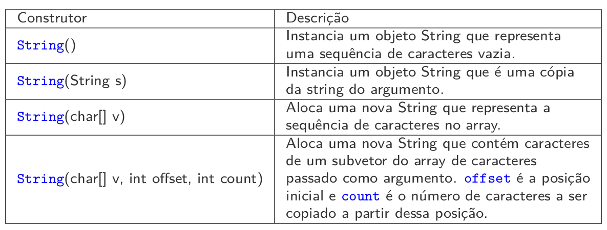
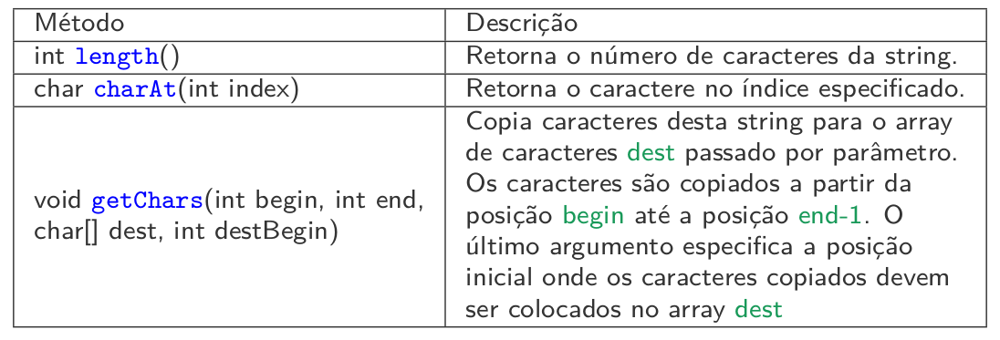
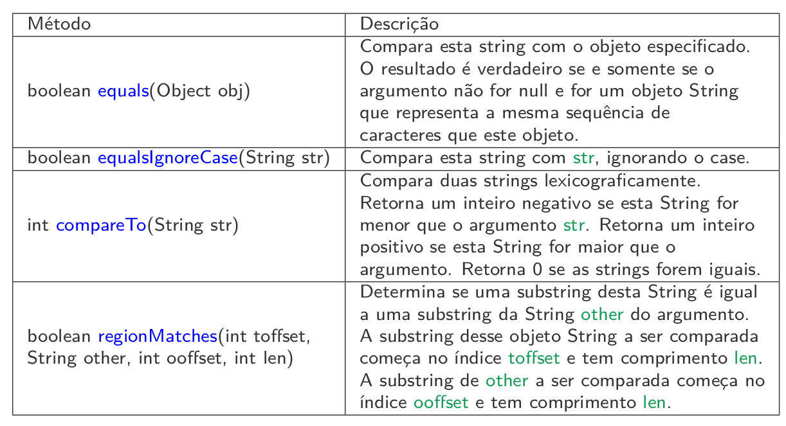
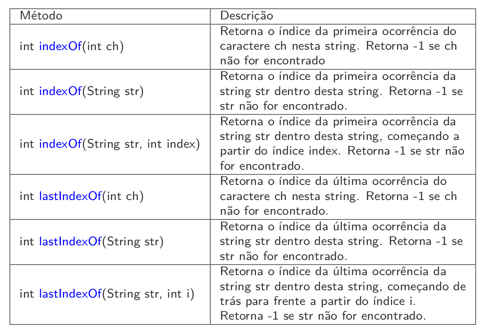
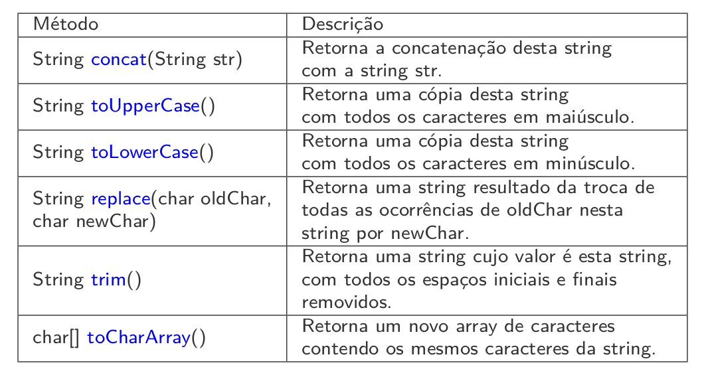
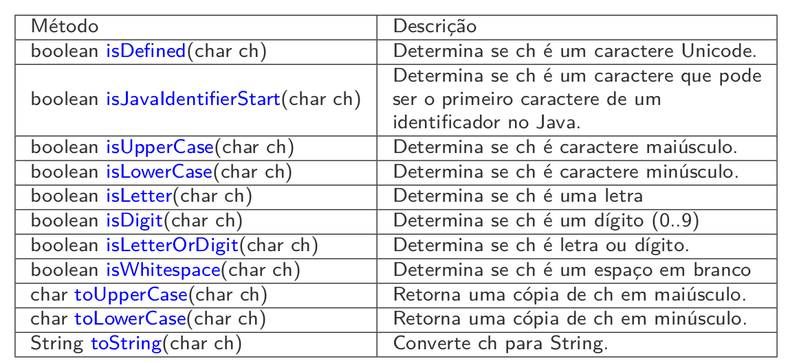
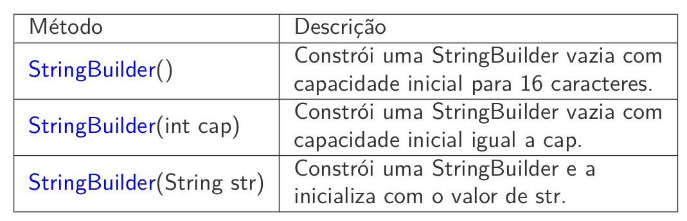
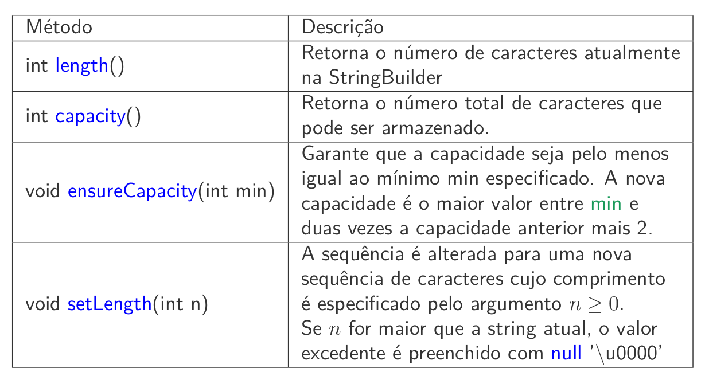

# String

* Strings são sequências de caracteres, que podem conter letras, dı́gitos e caracteres especiais.
* No Java, uma string é um objeto da classe String.
* String literais são sequências de caracteres no código escritas entre aspas duplas. Ex.: ”Amanda Costa”.
* São armazenadas na memória como objetos da classe String
* No Java, strings são imutáveis: o seu valor não pode ser mudado depois que elas são criadas.
* A fim de conservar memória, o Java trata todas as string literais que possuem o mesmo conteúdo como um único objeto String.

## Classe String – Construtores

A classe String provê diversos construtores, alguns dos quais estão listados abaixo.




## Classe String – Métodos




### Comparando Strings

Instâncias da classe String não podem ser comparadas com o operador
de igualdade ==



### Substrings



## Métodos Diversos




## Tokenização de strings
*  Tokens são palavras individuais que transmitem um significado dentro de um texto.
* Os tokens são separados entre si por delimitadores, em geral caracteres de espaçamento como espaço, tabulação e nova linha. Porém, outros caracteres também podem ser utilizados como delimitadores para separar tokens.

* Em Java, uma string pode ser dividida em tokens usando o método
split da classe String

```Java
import java.util.Scanner;

public class TokenTest {
    public static void main(String[] args) {
        Scanner scanner = new Scanner(System.in);
        System.out.println("Enter a sentence and press Enter: ");
        String sentence = scanner.nextLine();

        // process usar sentence
        String[] tokens = sentence.split(" ");
        System.out.printf("Number of elements: %d%nThe tokens are:%n", tokens.length);

        for(String token : tokens) {
            System.out.println(token);
        }
    }
}
```

## A classe empacotadora Character
* A maioria dos métodos da classe Character são métodos estáticos
projetados para processar valores char individuais.
* Esses métodos aceitam pelo menos um argumento caractere e realizam um teste ou uma manipulação do caractere.
* [Consulte a API](https://docs.oracle.com/en/java/javase/17/docs/api/java.base/java/lang/Character.html)
  

## Métodos estáticos da classe Character




## Classe StringBuilder
*  StringBuilder é uma string modificável. Toda StringBuilder possui uma
capacidade. Se sua capacidade for excedida, ela é expandida a fim de
acomodar os caracteres adicionais.
*  Se um programa executa muitas operações de concatenação, ou outras
modificações de strings, pode ser mais eficiente implementar essas
modificações com a classe StringBuilder.
* [Documentação StringBuilder](https://docs.oracle.com/en/java/javase/17/docs/api/java.base/java/lang/StringBuilder.html)

## Comparação temp

```Java
public class StringBuilderTeste {
    public static void main(String[] args) {
        String s = "";
        int size = 100000;
        long startTime, elapsedTime; 
        
        startTime = System.nanoTime();
        //startTime = System.currentTimeMillis();
        for(int i = 0; i < size; i++){
            s += i;
        }
        elapsedTime = System.nanoTime() - startTime;
        //elapsedTime = System.currentTimeMillis() - startTime;
        System.out.println("Total execution time  in millis: "
                + elapsedTime/1000000);
        //System.out.println("Total execution time  in millis: "
        //+ elapsedTime);
        StringBuilder s2 = new StringBuilder("");
        startTime = System.nanoTime();
        for(int i = 0; i < size; i++){
            s2.append(i);
        }
        elapsedTime = System.nanoTime() - startTime;
        
        System.out.println("Total execution time  in millis: "
                + elapsedTime/1000000);


        //System.out.println(s);


    }
}

/*
Output: 
Total execution time  in millis: 4109
Total execution time  in millis: 3
*/

```

## StringBuilder — Construtores

* StringBuilder fornece alguns construtores, três deles são exibidos
abaixo.



## StringBuilder — Métodos



## StringBuilder — Método append
* A classe StringBuilder fornece versões sobrecarregadas do método
append, que recebe um único valor como argumento e anexa a string
representante deste valor à StringBulder atual. Este método retorna a
StringBuilder resultante.

* Versões do método append são fornecidas para os tipos nativos, arrays de
caracteres, Strings e Objects.

## StringBuilder — Método insert
* StringBuilder fornece versões sobrecarregadas do método insert.
* Este método recebe dois argumentos: o primeiro é o ı́ndice em que o
valor deve ser inserido e o segundo argumento é o valor a ser inserido.
    * O ı́ndice deve ser maior ou igual a 0 e menor ou igual ao comprimento da sequência.

## StringBuilder — Removendo
* StringBuilder fornece os métodos delete e deleteCharAt para deletar
caracteres em qualquer posição de uma StringBuilder.
* StringBuilder delete(int start, int end)
    * A substring a ser excluı́da começa na posição start e termina na posição end-1 ou vai até o fim desta sequência se essa posição não existir. Se start == end, nenhuma modificação é feita.
* StringBuilder deleteCharAt(int index)
  * Remove o char na posição especificada no argumento.

```Java
public class StringBuilderInsertDelete {
    public static void main(String[] args) {
        Object objectRef = "hello"; 
        String string = "goodbye";
        char[] charArray = {'a', 'b', 'c', 'd', 'e', 'f'};
        boolean booleanValue = true;
        char characterValue = 'Z';
        int integerValue = 7;
        long longValue = 10000000000L; 
        float floatValue = 2.5f; 
        double doubleValue = 33.333;

        StringBuilder buffer = new StringBuilder();
        buffer.insert(0, objectRef);
        buffer.insert(0, "  ");
        buffer.insert(0, string);
        buffer.insert(0, "  ");
        buffer.insert(0, charArray);
        buffer.insert(0, "  ");
        buffer.insert(0, booleanValue);
        buffer.insert(0, "  ");
        buffer.insert(0, characterValue);
        buffer.insert(0, "  ");
        buffer.insert(0, integerValue);
        buffer.insert(0, "  ");
        buffer.insert(0, longValue);
        buffer.insert(0, "  ");
        buffer.insert(0, floatValue);
        buffer.insert(0, "  ");
        buffer.insert(0, doubleValue);

        System.out.printf("buffer after inserts:%n%s%n%n", buffer.toString());

        buffer.deleteCharAt(10); // delete 5 in 2.5
        buffer.delete(2, 6); // delete .333 in 33.333

        System.out.printf("buffer after deletes:%n%s%n", buffer.toString());
    }
}
```