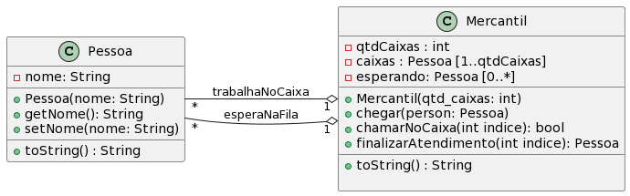

# Budega & Gerenciando uma fila de espera e um vetor de nulos


[](toc)

- [Budega & Gerenciando uma fila de espera e um vetor de nulos](#budega--gerenciando-uma-fila-de-espera-e-um-vetor-de-nulos)
  - [Intro](#intro)
  - [Guide](#guide)
  - [Shell](#shell)
[](toc)

Nosso objetivo no trabalho é modelar uma fila de atendimento de um Mercatil.

## Intro
- Quando o mercantil é incializado, é definido a quantidade de caixas que ele terá.
- Os caixas são modelados como um vetor de clientes de tamanho fixo. Uma posição do caixa ou terá o valor
null para indicar que o caixa está vazio ou terá um objeto cliente.
- A fila de espera é uma lista de clientes de tamanho variável. Todo cliente que chega é inserido no final da fila.
- As operações são entrar, chamarNoCaixa e finalizarAtendimento.

- Em Java
    - Os caixas devem ser implementados com um ArrayList e a fila de espera como um LinkedList.
- Em C++
    - Os caixas devem ser implementados com um vector e a fila de espera como um list.
    - Os clientes devem ser criados dinamicamente e gerenciados por um shared_ptr.

***
## Guide



***
## Shell


```sh
#__case iniciar
$init 2
$show
|0:-----|1:-----|
Espera: []
$call 0
fail: fila vazia
$call 1
fail: fila vazia
$arrive joao
$arrive maria
$arrive ana
$show
|0:-----|1:-----|
Espera: [joao, maria, ana]
$call 0
$show
|0:joao|1:-----|
Espera: [maria, ana]
$call 1
$show
|0:joao|1:maria|
Espera: [ana]
$finish 1
$show
|0:joao|1:-----|
Espera: [ana]
$call 1
$show
|0:joao|1:ana|
Espera: []
$finish 0
$show
|0:-----|1:ana|
Espera: []
$finish 1
$show 
|0:-----|1:-----|
Espera: []
$end
```

