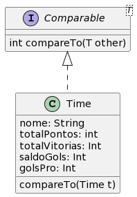

# Campeonato Brasileiro 


## Intro

Você recebeu uma lista de informações dos clubes que estão disputando o campeonato brasileiro: nome do clube, número de pontos, número de vitórias, saldo de gols, número de gols pró. Sua tarefa é montar a tabela de classificação do campeonato brasileiro. No campeonato brasileiro, as equipes são classificadas em ordem decrescente pelo total de pontos. Em caso de empate entre dois ou mais clubes, os critérios de desempate são os seguintes: maior número de vitórias; maior saldo de gols; maior número de gols pró. Persistindo o empate, são usados outros critérios de desempate como: confronto direto; menor número de cartões vermelhos recebidos; menor número de cartões amarelos recebidos. No nosso caso, persistindo o empate, seu programa deve imprimir uma mensagem "Informações insuficientes".

## Guide



Na linguagem Java, um array de objetos pode ser ordenado utilizando o método Arrays.sort() quando o objeto implementa a interface Comparable. 

A interface Comparable consiste no seguinte método:
```Java
public interface Comparable<T> {
    public int compareTo(T o);
}
```

O método compareTo compara o objeto de recebido com o objeto que chama o método e retorna um inteiro negativo, 0 ou um inteiro positivo, dependendo se o objeto de recebido é menor, igual ou maior que o objeto que chama o método. Se o objeto que chama o método não puder ser comparado ao objeto recebido, o método lançará uma ClassCastException.


## Entrada 

**Exemplo de Entrada**
> 6
> FLAMENGO      31 9  16 30
> ATHLETICO-PR  20 5   -6 17  
> FORTALEZA     30 9   9 19
> INTERNACIONAL 34 10 15 25
> PALMEIRAS     35 10 19 28
> GOIÁS         20 5   -2 16

## Saída

**Exemplo de Saída**
> Equipe [nome=PALMEIRAS, totalPontos=35, totalVitorias=10, saldoGols=19, golsPro=28]
> Equipe [nome=INTERNACIONAL, totalPontos=34, totalVitorias=10, saldoGols=15, golsPro=25]
> Equipe [nome=FLAMENGO, totalPontos=31, totalVitorias=9, saldoGols=16, golsPro=30]
> Equipe [nome=FORTALEZA, totalPontos=30, totalVitorias=9, saldoGols=9, golsPro=19]
> Equipe [nome=GOIÁS, totalPontos=20, totalVitorias=5, saldoGols=-2, golsPro=16]
> Equipe [nome=ATHLETICO-PR, totalPontos=20, totalVitorias=5, saldoGols=-6, golsPro=17]
 

## Solver 

```Java
import java.util.Scanner;
import java.lang.Comparable;
import java.util.Arrays;

class Equipe implements Comparable<Equipe> {
}

class Solver {
    public static void main(String[] args) {
        Scanner sc = new Scanner(System.in);

        int n = sc.nextInt();
        Equipe[] equipes = new Equipe[n];

        String nome;
        int totalPontos, totalVitorias, saldoGols, golsPro;

        for (int i = 0; i < n; i++) {
            nome = sc.next();
            totalPontos = sc.nextInt();
            totalVitorias = sc.nextInt();
            saldoGols = sc.nextInt();
            golsPro = sc.nextInt();
            equipes[i] = new Equipe(nome, totalPontos, totalVitorias, saldoGols, golsPro);
        }

        Arrays.sort(equipes);

        for (int i = 0; i < n; i++) {
            System.out.println(equipes[i]);
        }

    }
}
```