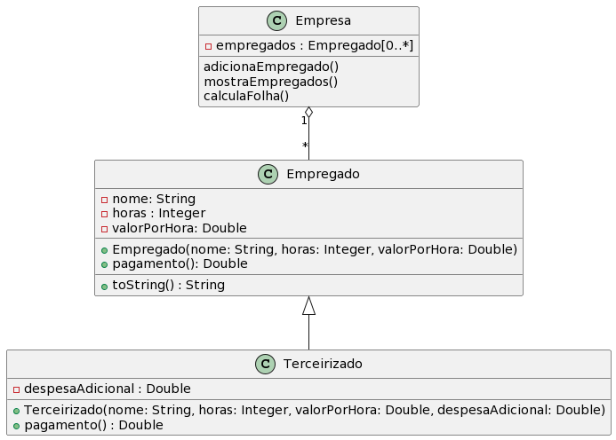

## Empresa

[](toc)

- [Empresa](#empresa)
- [Intro](#intro)
- [Diagrama](#diagrama)
- [Shell](#shell)
[](toc)

Nosso objetivo no trabalho é modelar em empresa com empregados e terceirizados.

## Intro 


Uma empresa possui funcionários próprios e
terceirizados. Para cada funcionário, deseja-se
registrar nome, horas trabalhadas e valor por hora.
Funcionários terceirizados possuem ainda uma
despesa adicional.

O pagamento dos funcionários corresponde ao
valor da hora multiplicado pelas horas trabalhadas,
sendo que os funcionários terceirizados ainda
recebem um bônus correspondente a 110% de sua despesa adicional.

## Diagrama



## Shell

```
$addEmpregado wladimir 40 40
$addEmpregado jose 40 100
$addEmpregado manoel 20 80
$addTerceirizado joaquim 8 100 200
$mostra
Empresa: 
Nome: wladimir, horas trabalhadas: 40, valor por hora: 40.00
Nome: jose, horas trabalhadas: 40, valor por hora: 100.00
Nome: manoel, horas trabalhadas: 20, valor por hora: 80.00
Nome: joaquim, horas trabalhadas: 8, valor por hora: 100.00, Despesa adicional: 200.0
$calculaFolha
Folha de pagamento: 8220.00
$end 
```