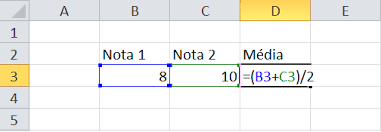
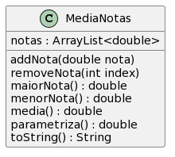

# MediaNotas



[](toc)

- [MediaNotas](#medianotas)
  - [Descrição](#descrição)
  - [Diagrama](#diagrama)
  - [Shell](#shell)
  - [Esqueleto](#esqueleto)
[](toc)

## Descrição

A classe MediaNotas armazena um conjunto de notas com os seguintes atributos e métodos:

Atributos:

* ```ArrayList <Double> notas```

Métodos:

* addNota(double nota): adiciona uma nova nota 
* removeNota(int index) : remove a nota com índice index, caso o index seja inválido, a mensagem `falha: indice invalido`
* maiorNota() : devolve a maior nota, caso a quantidade de notas seja zero imprimir uma mensagem `falha: quantidade de notas insuficiente `
* menorNota(): devolve a menor nota, caso a quantidade de notas seja zero, a mensagem `falha: quantidade de notas insuficiente ` deve ser impressa.
* double media() devolve a média das notas
* double parametriza(): todas as notas devem ser divididas pela maior nota e multiplicadas por 10.


## Diagrama



## Shell

```bash
$addNota 8
$addNota 9
$addNota 7
$show
[8.00, 9.00, 7.00]
$media
8.00
$parametriza
$show
[8.89, 10.00, 7.78]
$media
8.89
$addNota 7
$addNota 6
$show
[8.89, 10.00, 7.78, 7.00, 6.00]
$media
7.93
$parametriza
$show
[8.89, 10.00, 7.78, 7.00, 6.00]
$media
7.93
$end
```


## Esqueleto
<!--FILTER Solver.java java-->
```java
import java.util.Scanner;
import java.util.Locale;


import java.util.Scanner;
import java.util.ArrayList;
import java.util.Locale;


class MediaNotas{

    private ArrayList<Double> notas = new ArrayList<Double>();

    public void addNota(double nota){
        
    }

    public void removeNota(int index){
        
    }

    public void mudaNota(int index, double valor){
        
    }

    public double maiorNota(){
        
    }

    public double menorNota(){
        
    }

    double media(){
        
    }

    void parametriza(){
        
    }

    public String toString(){
        
    }

    
    
    
}


class Solver{
    public static void main(String[] args) {
        Scanner scanner = new Scanner(System.in);
        MediaNotas m = new MediaNotas();

        while(true) {
            String line = scanner.nextLine();
            String ui[] = line.split(" ");
            System.out.println("$" + line);
            if(ui[0].equals("end")) {
                break; 
            } else if(ui[0].equals("addNota")) {
                m.addNota( Double.parseDouble( ui[1]) );
            } else if(ui[0].equals("removeNota")) {
                m.removeNota( Integer.parseInt( ui[1]) ); 
            } else if(ui[0].equals("maiorNota")) {
                System.out.println( m.maiorNota() );
            } else if(ui[0].equals("menorNota")) {
                System.out.println( m.menorNota() );
            } else if(ui[0].equals("media")) {
                System.out.printf( Locale.US, "%.2f\n",  m.media() );
            }else if(ui[0].equals("parametriza")) {
                m.parametriza(); 
            }else if(ui[0].equals("show")) {
                System.out.println( m );
            }else{
                System.out.println("fail: comando invalido");
            }
        }
        scanner.close();
    }
}


```
<!--FILTER_END-->