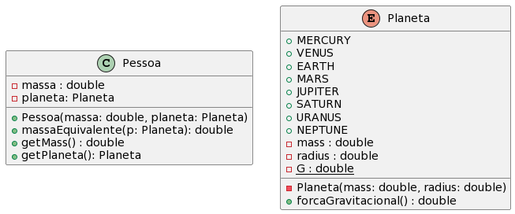

# Calculando seu peso


[](toc)

- [Calculando seu peso](#calculando-seu-peso)
  - [Descrição](#descrição)
  - [Shell](#shell)
  - [Esqueleto](#esqueleto)
[](toc)

## Descrição

A força gravitacional em um planeta depende da massa do planeta e da distância entre seu núcleo e a superfície.

$$g = \frac{G*mass}{radius^2}$$

onde 

$$G = 6.67300E-11$$

Na tabela abaixo,temos os dados de cada planeta:

| Planet   | mass      | radius    |
|----------|-----------|-----------|
| MERCURY  | 3.303e+23 | 2.4397e6  |
| VENUS    | 4.869e+24 | 6.0518e6  |
| EARTH    | 5.976e+24 | 6.37814e6 |
| MARS     | 6.421e+23 | 3.3972e6  |
| JUPITER  | 1.9e+27   | 7.1492e7  |
| SATURN   | 5.688e+26 | 6.0268e7  |
| URANUS   | 8.686e+25 | 2.5559e7  |
| NEPTUNE  | 1.024e+26 | 2.4746e7  |


O peso é a força que a gravidade exerce sobre um corpo devido a sua massa. A massa se mantém constante em todo o universo, por outro lado o peso varia dependendo da força gravitacional do planeta.

Se uma pessoa de 68 kilos viajasse para Marte, quando ela chegasse lá ela iria sentir igual a uma pessoa de 25.75 kilos da Terra.


Cada pessoa possui dois atributos: massa e planeta.

O planeta deve ser implementado como uma enumeração de oitos planetas. Cada planeta possui os atributos mass e radius. A variável G é atributo estático. A enumeração Planeta tem um construtor e um método forcaGravitacional.





## Shell

```bash
$init Jefferson 68 EARTH
$show
nome: Jefferson mass: 68.00 planeta: EARTH
$massaEquivalente MARS
A forca gravitacional no planeta MARS é 3.71
25.75
$massaEquivalente JUPITER
A forca gravitacional no planeta JUPITER é 24.81
172.08
$end
```


## Esqueleto
<!--FILTER Solver.java java-->
```java
import java.util.Scanner;
import java.util.ArrayList;
import java.util.Locale;

enum Planeta {
  MERCURY (),
  VENUS   (),
  EARTH   (),
  MARS    (),
  JUPITER (),
  SATURN  (),
  URANUS  (),
  NEPTUNE (1.024e+26, 2.4746e7);
  private final double mass;   // in kilograms
  private final double radius; // in meters
  Planeta(double mass, double radius) {
     
  }
  
  public static final double G ;
  double forcaGravitacional() {
      
  }
  double pesoSuperficie(double otherMass) {
      
  }
}

class Pessoa{
  private String nome;
  private double mass;
  private Planeta p;

  Pessoa(String nome, double mass, Planeta p){
    
  }

  public double massaEquivalente(Planeta otherPlanet){
    
  }

  public String toString(){
    
  }

}


class Solver{
    public static void main(String[] args) {
        Scanner scanner = new Scanner(System.in);
        Pessoa p = new Pessoa("", 0, Planeta.EARTH);

        while(true) {
            String line = scanner.nextLine();
            String ui[] = line.split(" ");
            System.out.println("$" + line);
            if(ui[0].equals("end")) {
                break; 
            } else if(ui[0].equals("init")) {
                p = new Pessoa( ui[1], 
                      Double.parseDouble( ui[2]), 
                      Planeta.valueOf(ui[3]) );
            } else if(ui[0].equals("massaEquivalente")) {
                System.out.printf( Locale.US, "%.2f\n" ,p.massaEquivalente( Planeta.valueOf( ui[1])  ));  
            } else if(ui[0].equals("show")) {
                System.out.println( p );
            }else{
                System.out.println("fail: comando invalido");
            }
        }
        scanner.close();
    }
}


```
<!--FILTER_END-->

