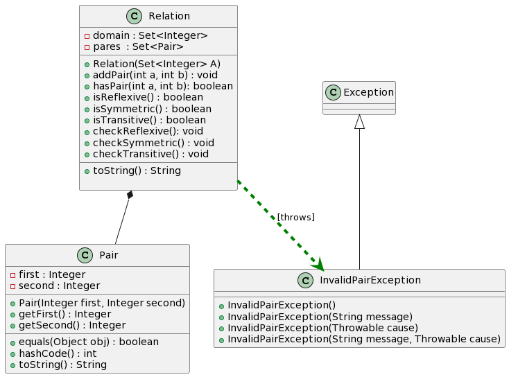

# Relação

# Intro

Na matemática, uma relação é uma correspondência entre elementos de dois conjuntos não-vazios. Formalmente, se $R$ uma relação definida do conjunto $A$ para o conjunto $B$. O conjunto $A$ é denominado conjunto de partidade e o conjunto $B$ é denominado conjunto de chegada. Então $R$ é qualquer subconjunto do $A \times B$. Por exemplo, se $A = \{2,3,4\}$ e $B  = \{$"bola", "carro"$\}$. 

* $\{ (2,$"bola"$)$, $(3,$ "bola"$)\}$ é uma relação de $A$ para $B$.

* $\{ ($"bola"$,2)$, $($"carro"$, 3)\}$ é uma relação de $B$ para $A$.

Um tipo de relação importante é a relação em que o conjunto de partida e chegada são iguais.

Por exemplo, a relaçaõ $\leq$ no conjunto $\mathbb{Z}$ possui vários pares como $(2,2),(2,3), (2,4), \ldots$. A relação $|$ (divide) no conjunto $\mathbb{Z}$ possui uma grande número de pares $(2,4)$,$(4,8)$,$(3,6)$, etc.

Neste exercício, vamos testar algumas propriedades das relações:

* Reflexiva: Uma relação $R$ em $A$ é dita reflexiva quando para todo $a \in A$, $(a,a) \in R$. 
* Simétrica: Uma relação $R$ em $A$ é dita simétrica quando para todo $a \in A$ para todo $b \in A$, $(a,b) \in R$, então $(b,a) \in R$. Observe que uma relação $R = \emptyset$ é simétrica, por vacuidade.
* Transitiva:Uma relação $R$ em $A$ é dita transitiva quando para todo $a \in A$ para todo $b \in A$, para todo $c \in A$ $(a,b) \in R$ e $(b,c) \in R$, então $(a,c) \in R$. Observe que uma relação $R = \emptyset$ é transitiva, por vacuidade.

A classe TestRelation cria uma instância da classe Relation. Em seguida, recebe mensagens e enviar essas mensagens para a instância da classe Relation.

## Guide



## Shell

```bash
createRelation 1 2 3  
$createRelation 1 2 3
addPair 1 2
$addPair 1 2
checkReflexive
$checkReflexive
hasPair(1,1) = false
Relation is not reflexive
addPair 1 1
$addPair 1 1
checkReflexive
$checkReflexive
hasPair(1,1) = true
hasPair(2,2) = false
Relation is not reflexive
addPair 2 2
$addPair 2 2
checkReflexive
$checkReflexive
hasPair(1,1) = true
hasPair(2,2) = true
hasPair(3,3) = false
Relation is not reflexive
addPair 3 3
$addPair 3 3
checkReflexive
$checkReflexive
hasPair(1,1) = true
hasPair(2,2) = true
hasPair(3,3) = true
Relation is reflexive
show
$show
domain : [1, 2, 3], pairs : {(1,1),(2,2),(3,3),(1,2)}
checkSymmetric
$checkSymmetric
hasPair(1,1) = true, hasPair(1,1) = true
hasPair(1,2) = true, hasPair(2,1) = false
Relation is not symmetric
addPair 2 1
$addPair 2 1
checkSymmetric
$checkSymmetric
hasPair(1,1) = true, hasPair(1,1) = true
hasPair(1,2) = true, hasPair(2,1) = true
hasPair(1,3) = false, hasPair(3,1) = false
hasPair(2,1) = true, hasPair(1,2) = true
hasPair(2,2) = true, hasPair(2,2) = true
hasPair(2,3) = false, hasPair(3,2) = false
hasPair(3,1) = false, hasPair(1,3) = false
hasPair(3,2) = false, hasPair(2,3) = false
hasPair(3,3) = true, hasPair(3,3) = true
Relation is symmetric
addPair 2 3
$addPair 2 3
checkSymmetric
$checkSymmetric
hasPair(1,1) = true, hasPair(1,1) = true
hasPair(1,2) = true, hasPair(2,1) = true
hasPair(1,3) = false, hasPair(3,1) = false
hasPair(2,1) = true, hasPair(1,2) = true
hasPair(2,2) = true, hasPair(2,2) = true
hasPair(2,3) = true, hasPair(3,2) = false
Relation is not symmetric
addPair 3 2
$addPair 3 2
checkSymmetric
$checkSymmetric
hasPair(1,1) = true, hasPair(1,1) = true
hasPair(1,2) = true, hasPair(2,1) = true
hasPair(1,3) = false, hasPair(3,1) = false
hasPair(2,1) = true, hasPair(1,2) = true
hasPair(2,2) = true, hasPair(2,2) = true
hasPair(2,3) = true, hasPair(3,2) = true
hasPair(3,1) = false, hasPair(1,3) = false
hasPair(3,2) = true, hasPair(2,3) = true
hasPair(3,3) = true, hasPair(3,3) = true
Relation is symmetric
checkTransitive
$checkTransitive
hasPair(1,1) = true, hasPair(1,1) = true, hasPair(1,1) = true
hasPair(1,1) = true, hasPair(1,2) = true, hasPair(1,2) = true
hasPair(1,1) = true, hasPair(1,3) = false, hasPair(1,3) = false
hasPair(1,2) = true, hasPair(2,1) = true, hasPair(1,1) = true
hasPair(1,2) = true, hasPair(2,2) = true, hasPair(1,2) = true
hasPair(1,2) = true, hasPair(2,3) = true, hasPair(1,3) = false
Relation is not transitive
addPair 1 3
$addPair 1 3
checkTransitive
$checkTransitive
hasPair(1,1) = true, hasPair(1,1) = true, hasPair(1,1) = true
hasPair(1,1) = true, hasPair(1,2) = true, hasPair(1,2) = true
hasPair(1,1) = true, hasPair(1,3) = true, hasPair(1,3) = true
hasPair(1,2) = true, hasPair(2,1) = true, hasPair(1,1) = true
hasPair(1,2) = true, hasPair(2,2) = true, hasPair(1,2) = true
hasPair(1,2) = true, hasPair(2,3) = true, hasPair(1,3) = true
hasPair(1,3) = true, hasPair(3,1) = false, hasPair(1,1) = true
hasPair(1,3) = true, hasPair(3,2) = true, hasPair(1,2) = true
hasPair(1,3) = true, hasPair(3,3) = true, hasPair(1,3) = true
hasPair(2,1) = true, hasPair(1,1) = true, hasPair(2,1) = true
hasPair(2,1) = true, hasPair(1,2) = true, hasPair(2,2) = true
hasPair(2,1) = true, hasPair(1,3) = true, hasPair(2,3) = true
hasPair(2,2) = true, hasPair(2,1) = true, hasPair(2,1) = true
hasPair(2,2) = true, hasPair(2,2) = true, hasPair(2,2) = true
hasPair(2,2) = true, hasPair(2,3) = true, hasPair(2,3) = true
hasPair(2,3) = true, hasPair(3,1) = false, hasPair(2,1) = true
hasPair(2,3) = true, hasPair(3,2) = true, hasPair(2,2) = true
hasPair(2,3) = true, hasPair(3,3) = true, hasPair(2,3) = true
hasPair(3,1) = false, hasPair(1,1) = true, hasPair(3,1) = false
hasPair(3,1) = false, hasPair(1,2) = true, hasPair(3,2) = true
hasPair(3,1) = false, hasPair(1,3) = true, hasPair(3,3) = true
hasPair(3,2) = true, hasPair(2,1) = true, hasPair(3,1) = false
Relation is not transitive
addPair 3 1
$addPair 3 1
checkTransitive
$checkTransitive
hasPair(1,1) = true, hasPair(1,1) = true, hasPair(1,1) = true
hasPair(1,1) = true, hasPair(1,2) = true, hasPair(1,2) = true
hasPair(1,1) = true, hasPair(1,3) = true, hasPair(1,3) = true
hasPair(1,2) = true, hasPair(2,1) = true, hasPair(1,1) = true
hasPair(1,2) = true, hasPair(2,2) = true, hasPair(1,2) = true
hasPair(1,2) = true, hasPair(2,3) = true, hasPair(1,3) = true
hasPair(1,3) = true, hasPair(3,1) = true, hasPair(1,1) = true
hasPair(1,3) = true, hasPair(3,2) = true, hasPair(1,2) = true
hasPair(1,3) = true, hasPair(3,3) = true, hasPair(1,3) = true
hasPair(2,1) = true, hasPair(1,1) = true, hasPair(2,1) = true
hasPair(2,1) = true, hasPair(1,2) = true, hasPair(2,2) = true
hasPair(2,1) = true, hasPair(1,3) = true, hasPair(2,3) = true
hasPair(2,2) = true, hasPair(2,1) = true, hasPair(2,1) = true
hasPair(2,2) = true, hasPair(2,2) = true, hasPair(2,2) = true
hasPair(2,2) = true, hasPair(2,3) = true, hasPair(2,3) = true
hasPair(2,3) = true, hasPair(3,1) = true, hasPair(2,1) = true
hasPair(2,3) = true, hasPair(3,2) = true, hasPair(2,2) = true
hasPair(2,3) = true, hasPair(3,3) = true, hasPair(2,3) = true
hasPair(3,1) = true, hasPair(1,1) = true, hasPair(3,1) = true
hasPair(3,1) = true, hasPair(1,2) = true, hasPair(3,2) = true
hasPair(3,1) = true, hasPair(1,3) = true, hasPair(3,3) = true
hasPair(3,2) = true, hasPair(2,1) = true, hasPair(3,1) = true
hasPair(3,2) = true, hasPair(2,2) = true, hasPair(3,2) = true
hasPair(3,2) = true, hasPair(2,3) = true, hasPair(3,3) = true
hasPair(3,3) = true, hasPair(3,1) = true, hasPair(3,1) = true
hasPair(3,3) = true, hasPair(3,2) = true, hasPair(3,2) = true
hasPair(3,3) = true, hasPair(3,3) = true, hasPair(3,3) = true
Relation is transitive
show
$show
domain : [1, 2, 3], pairs : {(1,1),(2,2),(3,3),(2,3),(3,2),(1,3),(3,1),(1,2),(2,1)}
addPair 2 5
$addPair 2 5
InvalidPairException: 5 is not in domain
addPair 5 3
$addPair 5 3
InvalidPairException: 5 is not in domain
```

## Esqueleto

```Java
public class TestRelation {

    public static void main(String[] args) {
        Relation r = null;
        Scanner sc = new Scanner(System.in);
        while (true) {
            String line = sc.nextLine();
            System.out.println("$" + line);
            String ui[] = line.split(" ");
            if (line.equals("end")) {
                break;
            } else if (ui[0].equals("createRelation")) {
                Set<Integer> domain = new HashSet<>();
                for (int i = 1; i < ui.length; i++) {
                    domain.add(Integer.parseInt(ui[i]));
                }
                r = new Relation(domain);

            } else if (ui[0].equals("addPair")) {

                int a = Integer.parseInt(ui[1]);
                int b = Integer.parseInt(ui[2]);
                try {
                    r.addPair(a, b);
                } catch (InvalidPairException e) {
                    System.out.println(e);
                }
            } else if (ui[0].equals("hasPair")) {
                int a = Integer.parseInt(ui[1]);
                int b = Integer.parseInt(ui[2]);
                System.out.println(r.hasPair(a, b));
            } else if (ui[0].equals("isReflexive")) {// value value
                

            } else if (ui[0].equals("checkReflexive")) {// value value
               

            } else if (ui[0].equals("isSymmetric")) {// value value
               

            } else if (ui[0].equals("checkSymmetric")) {// value value
                

            } else if (ui[0].equals("isTransitive")) {// value value
                

            } else if (ui[0].equals("checkTransitive")) {// value value
                

            } else if (ui[0].equals("show")) {// value value
                
            } else {
                System.out.println("fail: comando invalido");
            }
        }
        sc.close();

    }

}
```


