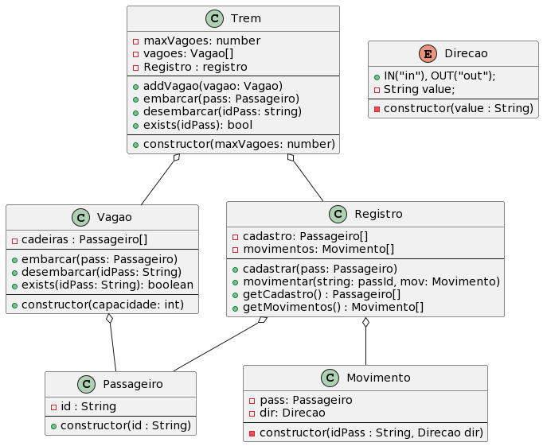

# Trem


[](toc)

- [Trem](#trem)
  - [Funcionalidades](#funcionalidades)
    - [Parte 1 - Trem e Vagões](#parte-1---trem-e-vagões)
    - [Parte 2 - Embarque e Desembarque](#parte-2---embarque-e-desembarque)
    - [Parte 3 - Cadastro de Passeiros e Registro de Embarque](#parte-3---cadastro-de-passeiros-e-registro-de-embarque)
  - [Exemplos](#exemplos)
  - [Diagrama](#diagrama)
  - [Solver](#solver)

O objetivo desta atividade é implementar um sistema que aloca passageiros em vagões de um trem. O trem é formado por uma série de vagões. É possível embarcar, desembarcar passageiros, ver quem está embarcado e a lista de passageiros que já passaram pelo nosso trem.

## Funcionalidades

### Parte 1 - Trem e Vagões

- Inicie um novo trem com a quantidade limite de vagões máxima que ele pode carregar.
  - Se já houver trem, inicie um novo trem.

- Adicionar um novo vagão.
    - Ao adicionar, observe o número máximo de vagões suportados pela locomotiva.
    - O vagão possui uma capacidade que define quantos lugares ele possui.
    - O vagão é adicionado ao final do trem.

- Mostrar o trem.
    - Cada cadeira vazia deve ser mostrada por um -. Cada vagão deve ser delimitado por [ ].

### Parte 2 - Embarque e Desembarque

- Embarcar um novo passageiro.
    - Ao tentar embarcar, o trem vai procurar a primeira cadeira livre a partir do primeiro vagão em ordem crescente.
    - Se não houver espaço livre em nenhum vagão então não haverá embarque.
    - Passageiros possuem apenas um passId e ele deve ser único no sistema.
    - Não deve ser possível embarcar duas vezes o mesmo passageiro no trem.
- Desembarcar um passageiro
    - Se o passageiro estiver no trem, ele sai do trem liberando sua cadeira.

### Parte 3 - Cadastro de Passeiros e Registro de Embarque

- Mostrar a lista de passageiros cadastrados.
    - Quando um passageiro tenta embarcar, ele é cadastrado no sistema, independente de conseguir ou não embarcar.
    - Mostre a lista ordenada pelo id do passageiro.
- Mostrar a sequência de embarque e desembarque.


## Exemplos

```python
$init 2
$nwvag 2
$la
Trem [ - - ]
$nwvag 3
$la
Trem [ - - ][ - - - ]
$nwvag 1
fail: limite de vagões atingido
$entrar goku
$la
Trem [ goku - ][ - - - ]
$entrar kate
$entrar sara
$entrar goku
fail: goku já está no trem
$la
Trem [ goku kate ][ sara - - ]
$entrar tina
$entrar james
$entrar rufus
fail: trem lotado
$la
Trem [ goku kate ][ sara tina james ]
$sair kate
$sair sara
$sair rufus
fail: rufus nao esta no trem
$la
Trem [ goku - ][ - tina james ]
$entrar alex
$la
Trem [ goku alex ][ - tina james ]
$cadastro
goku
kate
sara
tina
james
rufus
alex
$movimentacao
goku in
kate in
sara in
tina in
james in
kate out
sara out
alex in
$end
```

***

## Diagrama



## Solver

```Java
import java.util.Arrays;
import java.util.Scanner;

public class Solver {
    public static void main(String[] args) {
        Scanner sc = new Scanner(System.in);
        Trem trem = new Trem(0);

        while (true) {
            String line = sc.nextLine();
            String[] input = line.split(" ");
            String cmd = input[0];
            String[] param = Arrays.copyOfRange(input, 1, input.length);

            System.out.println("$" + cmd);

            if (cmd.equals("init")) {
                int maxVagoes = Integer.parseInt(param[0]);
                trem = new Trem(maxVagoes);
            } else if (cmd.equals("nwvag")) {
                int capacidade = Integer.parseInt(param[0]);
                trem.add(new Vagao(capacidade));
            } else if (cmd.equals("la")) {
                System.out.println(trem);
            } else if (cmd.equals("entrar")) {
                trem.embarcar(new Passageiro(param[0]));
            } else if (cmd.equals("sair")) {
                trem.desembarcar(param[0]);
            } else if( cmd.equals("cadastro") ){
                trem.cadastro();
            } else if( cmd.equals("movimentacao") ){
                trem.movimentos();
            }

        }
    }
}

```